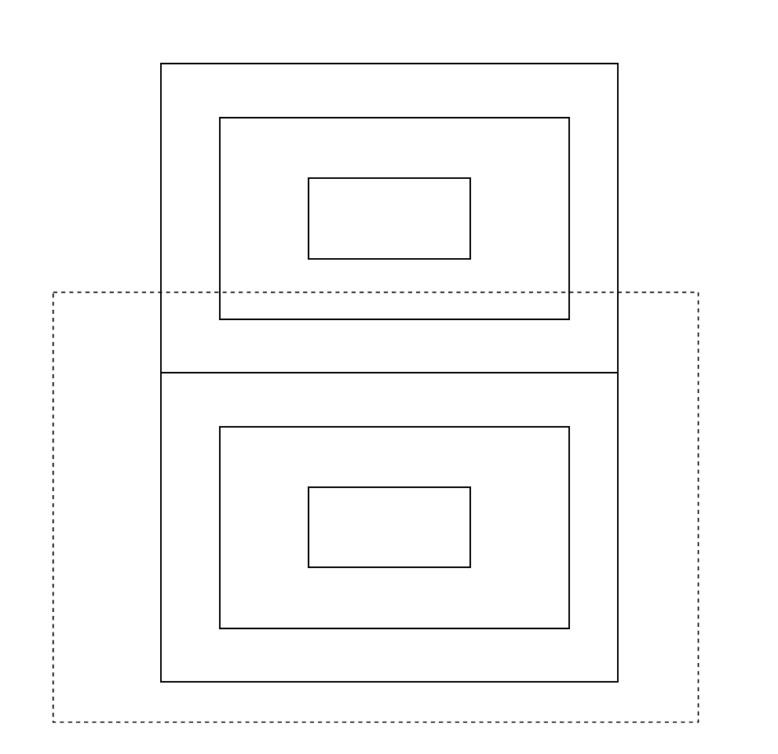

{:toc}

## 概述

html 是一种标记语言，换句话说，是一种按照某种格式来书写的文本，这种格式可以被浏览器所解析。css 是对 html 的补充，用于规定文本的渲染方式，即呈现出来的视觉效果，如果不使用 css，html 可以直接对每个元素设定 `style` 来做到这一点，但将样式独立为一个单独的文件可以将内容与显示格式分离，起到解耦的效果，而 css 文件本身也不过是一种配置文件，用于指定显示格式。javascript 是对 html 的补充，使得用户可以对页面进行操作与交互。可以将 javascript 的内容直接写在 `html` 的 `script` 标签中，但与 css 类似，将其独立为一些单独的文件便于维护，而 javascript 本身是一种编程语言。

注释方式：

- html：`<!-- comment -->`
- css：`/* comment */`
- javascript：`// comment`

## 资料推荐

MDN Docs: [https://developer.mozilla.org](https://developer.mozilla.org)
CheatSheet: [https://htmlcheatsheet.com/](https://htmlcheatsheet.com/)

## 前端知识查漏补缺

### CORS: (Cross-Origin Resource Sharing)

- FastAPI 的解释: [https://fastapi.tiangolo.com/tutorial/cors/](https://fastapi.tiangolo.com/tutorial/cors/)
- MDN: [https://developer.mozilla.org/en-US/docs/Web/HTTP/CORS](https://developer.mozilla.org/en-US/docs/Web/HTTP/CORS)

以下是一段 javascript 发请求的例子

```js
const data = {
  key1: 'value1',
  key2: 'value2',
  key3: 'value3'
};

// 假设说当前的网页地址是 https://example.com/page.html, 那么可以简单改为:
// fetch('/endpoint')
fetch('https://example.com/endpoint', {
  method: 'POST',
  headers: {
    'Content-Type': 'application/json',
  },
  body: JSON.stringify(data),
})
.then(response => {
  if (!response.ok) {
    throw new Error('Network response was not ok');
  }
  return response.json();
})
.then(data => {
  console.log('Success:', data);
})
.catch(error => {
  console.error('Error:', error);
});
```

Cross-Origin Resource Sharing: 所谓 Origin, 它由网络协议, IP 与端口构成的三元组确定, 例如下面几个都是不同的源:

- `http://localhost`
- `https://localhost`
- `http://localhost:8080`

它们虽然 IP 相同, 但是协议或端口号不同, 视为不同的源. 浏览器在处理这类跨源访问时, 会引入一种机制叫做 CORS: 自动添加额外的 header 来对其他的源发送请求, 而其他的源可以设置一些策略来阻止或允许访问(例如只允许某些源的来访问自己).

**例子**

假设当前的 javascript 脚本部署在 `https://for.example` 下

```js
const fetchPromise = fetch("https://bar.other");

fetchPromise
  .then((response) => response.json())
  .then((data) => {
    console.log(data);
  });
```

浏览器发送的请求格式如下: 特别注意 `Origin: https://foo.example` 这一部分表明了自己的源

```
GET /resources/public-data/ HTTP/1.1
Host: bar.other
User-Agent: Mozilla/5.0 (Macintosh; Intel Mac OS X 10.14; rv:71.0) Gecko/20100101 Firefox/71.0
Accept: text/html,application/xhtml+xml,application/xml;q=0.9,*/*;q=0.8
Accept-Language: en-us,en;q=0.5
Accept-Encoding: gzip,deflate
Connection: keep-alive
Origin: https://foo.example
```

而 `https://bar.other` 服务器返回的数据类似这样, 特别注意 `Access-Control-Allow-Origin: *` 表明允许任意源的访问

```
HTTP/1.1 200 OK
Date: Mon, 01 Dec 2008 00:23:53 GMT
Server: Apache/2
Access-Control-Allow-Origin: *
Keep-Alive: timeout=2, max=100
Connection: Keep-Alive
Transfer-Encoding: chunked
Content-Type: application/xml

[…XML Data…]
```

更复杂的机制例如先发请求头给目标源, 目标源返回允许的操作, 然后请求方再发送真正的请求, 目标源再返回数据. 此处从略, 请参考: [MDN](https://developer.mozilla.org/en-US/docs/Web/HTTP/CORS), 而 FastAPI 中怎么使用这一机制参考 [FastAPI](https://fastapi.tiangolo.com/tutorial/cors/).

## HTML

### tutorial

```html
<!doctype html>
<html>
  <head>
    <meta charset="utf-8">
    <!-- This is comment -->
    <title> This is page's name</title>
  </head>
  <body>
      <h1>This is title showed in the page</h1>
      <p>This is a paragraph</p>
  </body>
</html>
```

规范的写法里没有内容的元素须使用 `<{tagname} />` 格式，例如：`<br />` 表示换行。标签的属性值必须用双引号括起来。

```html
<{tagname}>{content}</{tagname}>
<{tagname} />
<{tagname} {attrname1}="xxx" {attrname2}="yyy">{content}</{tagname}>
```

```

```

通用的几个属性有：

- class：用于css中，一个元素的class标签中可以填入多个
- id：元素的唯一id
- style：指定文本样式，例如文字颜色
- title: 鼠标悬停显示 title 的属性值

标签罗列

- `<br />` 表示换行，`<hr />` 表示画一条水平线

- `h1` - `h6` 表示标题，`p` 表示段落，`a` 表示超链接，`cite` 表示引用

- `b` 表示加粗，`i` 表示斜体，`sup` 表示上标，`sub` 表示下标，`del` 表示删除字，`ins` 表示在文字加上底线

- `code`、`kbd`、`samp`、`var`、`tt` 这几个标签常用于显示计算机相关的文本

- `<abbr title="World Wide Web">WWW</abbr>`，鼠标悬停时会显示 title 中的内容

- 样式

  ```html
  <head>
  
  <!-- 直接使用style标签进行定义 -->
  <style type="text/css">
  	body {background-color:yellow}
  	p {color:blue}
  </style>
  
  <!-- 使用css文件 -->
  <link rel="stylesheet" type="text/css" href="mystyle.css">
  </head>
  ```

- `div` 为块级容器，`span` 为内联容器

注意事项

- HTML 源代码中多个连续的空格或空行都将被视为一个空格

### 代码规范

参考：[菜鸟教程](https://www.runoob.com/html/html5-syntax.html)

### Liquid【待补充】

## CSS

### tutorial

放在 html 的 head 标签中

```css
<style type="text/css">
p {color:blue}
#para
{
	text-align:center;
    color:red;
}
/*comment*/
.center {text-align:center;}
p.center {text-align:center;}
</style>
```

`#para` 表示 html 标签中元素 `id` 属性为 `para` 的标签内容采用此样式

`.center` 表示 html 标签中元素 `class` 属性为 `center` 的标签内容采用此样式

`p` 表示 html 的 `p` 标签采用此样式

`p.center` 表示 html 的 `p` 标签且 `class` 属性为 `center` 的标签采用此样式

目录结构如下

```
ROOT/
  - main.html
  - style.css
```

`main.html` 文件内容如下

```html
<!doctype html>
<html>
  <head>
    <meta charset="utf-8">
    <title>abc</title>
    <link rel="stylesheet" type="text/css" href="styles.css" />
  </head>
  <body>
     <a href="/" class="current"> 111 </a>
  </body>
</html>
```

`style.css` 文件内容如下

```css
.current {
	color: red;
}
```

实际作用等效于 `main.html` 中的 `a` 标签变为

```html
<a href="/" style="color: red;"> 111 </a>
```

### 基本概念及参考资料

**长度单位**

我们看到的屏幕实际上的最小单位是像素, 例如一块分辨率为 2560x1440 的屏幕 (2K 屏幕), 指的是长与高方向被分为 2560 和 1440 小段, 共 2560x1440 个小色块. 而屏幕的实际大小譬如说长度为 54cm, 宽度为 30cm. 顺带补充一点, 平时买显示器所说的尺寸例如 24 寸指的是对角线的英寸数, 例如这个例子里按勾股定理算出的对角线长度就约为 24.3 英寸. 由于不同设备的一个像素点的实际尺寸不一样 (实际上像素点不一定是正方形, 也可以是矩形, 甚至可以是六边形等), 因此产生一个概念叫 dpi (dots per inch), 指一英寸长度上的像素点个数, 拿前面的例子来说, 在长度方向上, 实际长度为 54cm x 0.3937inch/cm = 21.26inch, 因此 dpi 为 2560 / 21.26 = 120.4

CSS 中的默认长度单位为像素 (px), 长度单位一般分为绝对长度单位与相对长度单位:

- 绝对长度单位: 这种长度单位进行度量是在任何设备上看都是一样的, cm, in
- 像素: px, 这个实际上是相对于屏幕的, 例如在 A 设备上像素点间距是 0.02cm, B 设备上是 0.01cm, 那么 12px 呈现出来的大小分别是 0.24cm 和 0.12 cm.
- 相对长度单位:
  - em: 假设当前字体是 12px, 那么 0.5em 就是 12px


**字体**

我们平时说的“字体”在广义上包含如下几个相互“垂直”的方面：

- 字体类别 (Font Family): 有如下几种通用字体族, 在写 CSS 时, 字体一般会设置多个备选, 一般最后会以这几种通用字体族结尾, 代表使用系统上默认的该字体族字体进行显示.
  - 衬线字体 (Serif), 例如: Times New Roman, Georgia
  - 无衬线字体 (Sans-serif), 例如: Arial
  - 等宽字体 (Monospace), 例如: Courier New, Lucida Console
  - 草书字体 (Cursive), 例如: Brush Script MT
  - 幻想字体 (Fantasy), 例如: Copperplate
- 样式 (Style): 包括正常 (normal) 与斜体 (italic)
- 粗细 (Weight): 包括正常 (normal, 即: 400)、粗体 (bold, 即: 700)、加粗 (bolder), 细体 (lighter). 用数字精确衡量的化, 字体粗细的取值范围一般是 1~1000 之间
- 大小/字号 (Font Size): 一般使用像素 (px) 来衡量, 一些预设的字号与像素的对应关系例如: 小四 (12px), 注意: 这里的大小实际上指的是字的高度, 我们平时所说的 2K 显示屏实际上指的是屏幕的长与高分别为 2560 和 1440 个像素 (2560x1440), 所以如果将字体设置为 20px, 且行间距设置为 0, 理论上应该能恰好看到 1440/20=72 行文字
- 颜色 (Color): 一般有几种表示方式: 
  - 预设的名称: red, green 等
  - RGB 值: 例如: `#FF0000` 从左到右两位一组, 分别表示红绿蓝的亮度值
  - RGBA 值: 另外增加一个 0~1 的值表示不透明度, 也就是值越小越透明

**行距**

字号 20px, 指的是在不包含任何顶端空白的情况下是 20px (即使在设置 1 倍行距时, 字的上下端实际上还是会留下一些空白), 假设实际上一行字真正占用 30px, 即上下各留 5px 空白, 于是 30px 代表着 1 倍行距, 现在将行距设置为 1.8 指的是, 总高度为 30x1.8=54px, 字占的高度为 20px, 上下各留 17px. 在使用鼠标选中高亮这一行字时, 一般是会选中总共的 54px (如果行间距小于 1, 那么鼠标选中一行仍然是高亮 30 px 的范围)

**CSS 框模型**

所有 HTML 元素都可以视为方框。在 CSS 中，在谈论设计和布局时，会使用术语“盒模型”或“框模型”。

CSS 框模型实质上是一个包围每个 HTML 元素的框。它包括：外边距、边框、内边距以及实际的内容。

注意: 上下边框在某些情况下会有合并规则

需要区分这几个概念: **元素高宽, 内边距, 边框, 轮廓, 外边距**

下图是两个紧邻的元素 (不考虑外边框合并规则), 以下面的元素为例, 即从内到外共 4 个矩形, 其中最内部的矩形为元素的实际内容, 其高和宽通过 (width/height) 来设定, 往外一层是内边距 (padding), 内边距所代表的矩形框是边框 border, 再外面一层是外边距 (margin), 再外面一层是轮廓 (outline), 注意:

- 相邻元素的外边 (margin) 相互紧挨着, 无视各自的轮廓 (outline)
- 除边框外, 其余的矩形框线实际上都是虚拟的, 显示时并不存在, 并且边框线的粗细是其自身的, 不含在内外边距里, 也就是说一个元素的总高度这么计算: 总高度=上外边距+上边框高度+上内边距+元素高度+下内边距+下边框高度+下外边框
- 实际上轮廓还能有偏移效果: 即不是在最外的矩形与第二外面的矩形间做填充颜色之类的效果, 而是可以在最外的矩形之外添加效果



参考资料: [https://www.w3school.com.cn/css/css_boxmodel.asp](https://www.w3school.com.cn/css/css_boxmodel.asp)

**伪元素**

```css
.element::before {
  content: "►";
  padding-right: 8px;
}

.element::after {
  content: "◄";
  padding-left: 8px;
}
```

当它应用于 html 中时

```html
<div class="element">这是一个元素</div>
```

呈现的结果类似于

```
►这是一个元素◄
```

上面的 `::after` 和 `::before` 语法就是伪元素, 相当于在每个 `class="element"` 的**元素内**的所有内容之前和之后各添加了一个元素.

**浮动元素与clear**

参考: [https://developer.mozilla.org/en-US/docs/Web/CSS/float](https://developer.mozilla.org/en-US/docs/Web/CSS/float)

```html
<section>
  <div class="left">1</div>
  <div class="left">2</div>
  <div class="right">3</div>
  <p>
    Lorem ipsum dolor sit amet, consectetur adipiscing elit. Morbi tristique
    sapien ac erat tincidunt, sit amet dignissim lectus vulputate. Donec id
    iaculis velit. Aliquam vel malesuada erat. Praesent non magna ac massa
    aliquet tincidunt vel in massa. Phasellus feugiat est vel leo finibus
    congue.
  </p>
</section>
```

```css
section {
  box-sizing: border-box;
  border: 1px solid blue;
  width: 100%;
  float: left;
}

div {
  margin: 5px;
  width: 50px;
  height: 150px;
}

.left {
  float: left;
  background: pink;
}

.right {
  float: right;
  background: cyan;
}
```

首先, class 为 left 或 right 的元素被设置为了浮动, 被设置为 `float: left` 的元素会尽可能往左移动, 直到它触碰到块的左边缘或另一个浮动元素的边缘. 同理, 被设置为了 `float: right` 的元素会尽可能向右移动, 直到触碰到另一个浮动元素的边缘. 而其他非浮动元素利用剩余的空间进行排版.

特殊情况: 假设在原始的 html 代码里增加若干个 `<div class="right">3</div>` 直至其碰到 `<div class="left">2</div>`, 这种情况下, “装不下的” right 元素不会于 left 元素重叠, 而是另起一行继续排布在右侧.

上面的代码如果去掉 section 中设置的 `float: left;`, 可能会导致 section 的蓝色边框装不下 left 和 right. 这是因为**父元素的高度是由非浮动子元素的高度决定**的, 在这个例子中, section 的非浮动子元素只有 p 元素, 假设 p 元素的高度不超过 left 和 right 的话, 就会导致 section 的蓝色边框无法包裹住 left 和 right.

如果不设置 section `float: left;`, 还可以在 css 中增加一个伪元素达到效果:

```css
section {
  box-sizing: border-box;
  border: 1px solid blue;
  width: 100%;
}

section::after {
  content: "";
  display: table;
  clear: both;
}
```

这里的 `section::after` 表示这是一个伪元素, 这样便形成了类似于 `<section>...<div style="content: ''; display: table; clear: both;"></div></section>` 的结果 (注意这只是便于理解, 实际上不等同), 而 `clear: both` 的作用是清除左右的浮动, 因此保证这个伪元素会位于所有浮动元素的下面, 而伪元素本身不是浮动的, 因此可以决定父元素的高度.

要理解 clear 的含义, 可以将 `p` 标签增加属性 `style="clear: left"`, 然后调整 css 中 `.left` 选择器的 `height`, 会发现 `p` 标签会位于 left 元素的下方开始排版, 而不是在 left 元素的右侧排版. 实际上, 不加 `style="clear: left"` 的 `p` 标签, 实际上是 `clear: none`.


## SASS (TODO)

由于 css 文件中可能会存在许多冗余，例如同样的样式对于多个标签具有公共性，这样需要做统一修改时会变得麻烦且容易出错，sass 可以解决这一问题。具体的做法是：sass 定义了一套”语言“，而 sass 是一个转换工具，可以将 sass 这套语言转换为标准的 css 文件。引用 sass 官方的介绍词：

> Sass is the most mature, stable, and powerful professional grade CSS extension language in the world.

### hello world

sass 工具的输入是一个 scss 文件，输出是一个 css 文件，例如：

`test.scss` 的文件内容如下

```
$font-stack: Helvetica, sans-serif;
$primary-color: #333;

body {
  font: 100% $font-stack;
  color: $primary-color;
}
```

执行命令：`sass test.scss test.css`，将生成转换后的 `test.css` 文件。

```
body {
  font: 100% Helvetica, sans-serif;
  color: #333;
}
```

备注：旧版本定义的文件格式为 `.sass` 文件，与 `.scss` 文件定义的语法格式区别不大，主要区别在于 scss 文件使用了花括号与分号进行代码块的限定（有点像 C 语言风格），而 sass 文件则依赖于缩进（有点像 Python 语言风格）。就目前来说，推荐使用 scss 文件格式，因此转换命令会稍显诡异，例如：`sass xxx.scss xxx.css`。

### tutorial

[Sass 官网](https://sass-lang.com/guide)

## JavaScript

### tutorial

```html
<!DOCTYPE html>
<html>
    <head> 
        <meta charset="utf-8"> 
        <title>This is Title</title> 
    </head>
    <body>
    	<h1>My JavaScript Code</h1>
    	<p id="demo">
    		JavaScript 能改变 HTML 元素的内容。
    	</p>
        
        <button type="button" onclick="myFunction()">点击这里</button>
    </body>
    <script>
    // 注释
    function myFunction()
    {
        x=document.getElementById("demo");  // 找到元素
        x.innerHTML="Hello JavaScript!";    // 改变内容
    }
    </script>
</html>
```

javascript 指的是 `script` 标签中的内容，上例中 `botton` 标签相当于是调用者，当用户点击时，这个事件对应于 `botton` 的 `onclick` 属性，此时触发 `onclick` 的属性内容 `myFunction()`，调用 `script` 中定义的函数。

`script` 标签的位置：参考 [CSDN](https://www.cnblogs.com/xiangkejin/p/6411792.html)。

### 函数与导入

```js
// Shapes.js
// export 表示这个函数可以被其他模块导入, 类似于 C 语言里的 extern
// 一个文件最多只能有一个 default
export default function Square() {
  return <button className="square">X</button>;
}

export function Circle() {
  return <button className="circle">O</button>;
}
```

在另一个 js 脚本中, 可以使用这种方法来导入上面模块中的函数

```js
// S 指向 Square, MyCircle 指向 Circle
import S, { Circle as MyCircle } from './Shapes.js';
```

## node

### npm 相关

假设 `package.json` 中包含如下内容

```json
{
  "scripts": {
    "start": "npm run make-i18n && vite",
    "make-i18n": "node scripts/make-i18n-translations.cjs",
  }
}
```

使用这条启动命令

```bash
npm run start -- --port 5000
```

第一个 `--` 的作用表示后面的 `--port 5000` 不是 `npm run` 的参数, 也就是说上面的命令会被转化为

```bash
npm run make-i18n && vite --port 5000
# 根据进一步转化为
node scripts/make-i18n-translations.cjs && vite --port 5000
```

## React (TODO)

官方教程: [井字棋游戏](https://zh-hans.react.dev/learn/tutorial-tic-tac-toe)
