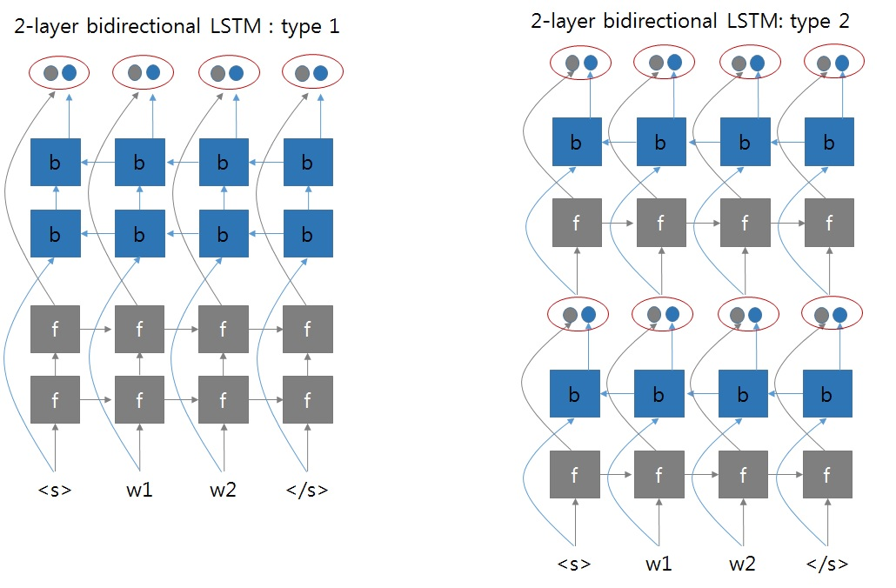

## 动机、参考资料、涉及内容

涉及内容

不限CV、NLP、语音

- 一些即插即用的小组件，例如：SENetBlock、FPN、ResNetBlock等
- 一些复杂的层或API，例如：CTCLoss，RoIAlign
- 一些容易混淆的层或API，例如：NLLLoss

不包含内容

- 一些特定的API：[eniops](https://github.com/arogozhnikov/einops)、scatter、gather

## CTCLoss

手动实现 `CTCLoss` 的前向过程：参考[blog](https://distill.pub/2017/ctc/)
```python
import numpy as np
def ctc_manual(P, y):
    # P (float): (V, T), V为字母表的大小(含<blank>), T为输入序列的长度, 且P的每列列和为1
    # y (int): L, L为输出序列的长度, 每个元素的取值为[1, V-1]
    z = [0]*(len(y)*2+1)
    for i in range(len(y)):
        z[2*i+1] = y[i]
    table = np.zeros((len(y)*2+1, P.shape[1]), dtype=float)
    table[0][0] = P[0][0]
    table[1][0] = P[z[1]][0]
    T = P.shape[1]
    S = len(z)
    for t in range(1, T):
        for s in range(S):
            if z[s] == 0 or (z[s]!=0 and s>=2 and z[s]==z[s-2]):
                table[s][t] = table[s][t-1]
                if s >= 1:
                    table[s][t] += table[s-1][t-1]
            else:
                table[s][t] = table[s][t-1]
                if s >= 1:
                    table[s][t] += table[s-1][t-1]
                if s >= 2:
                    table[s][t] += table[s-2][t-1]
            table[s][t] *= P[z[s]][t]

    prob = table[-1][-1] + table[-2][-1]
    loss = - np.log(prob) / len(y)  # torch的实现里loss需要除以输出序列的长度
    return loss
```

对比pytorch的实现
```python
import numpy as np
# P = np.array([
#     [0.2, 0.1, 0.3, 0.1, 0.6, 0.3, 0.1],
#     [0.7, 0.2, 0.1, 0.4, 0.2, 0.6, 0.8],
#     [0.1, 0.7, 0.6, 0.5, 0.2, 0.1, 0.1]
# ])
# y = [1, 1, 2]
# x_length = 7
# y_length = 3

x_length, V = 10, 5
y_length = 3
P = np.random.rand(V, x_length)
P = np.exp(P)
P =  P / np.sum(P, axis=1, keepdims=True)
y = np.random.randint(1, V, size=(y_length,))
loss_manual = ctc_manual(P, y)

import torch
loss_fn = torch.nn.CTCLoss(blank=0)
# pytorch要求输入形状为(T, B, C), 且输入为log_softmax的形式
input = torch.tensor(P, dtype=torch.float32).transpose(0, 1).unsqueeze(1).log().detach().requires_grad_()
input_lengths = torch.full(size=(1,), fill_value=x_length, dtype=torch.long)
target =  torch.tensor([y], dtype=torch.long)
target_lengths = torch.full(size=(1,), fill_value=y_length, dtype=torch.long)
loss = loss_fn(input, target, input_lengths, target_lengths).item()

# loss_manual == loss  # yes
```

## GRU/LSTM

### torch API: GRU

参考[官方文档](https://pytorch.org/docs/stable/generated/torch.nn.GRU.html?highlight=gru#torch.nn.GRU)。

```python
import torch
import torch.nn as nn
vocab_size=12
B = 3
L = 4
hidden_size = 2
embedding = nn.Embedding(vocab_size, hidden_size)
gru = nn.GRU(hidden_size, hidden_size, num_layers=3, bidirectional=True)
# inputs.shape: (L=4, B=3)
inputs = torch.tensor([[1, 2, 0],[2, 1, 0], [0, 0, 1], [0, 0, 2]])
inputs = embedding(inputs)
# output.shape: (L=4, B=3, hidden_size=2), h_n.shape: (num_layer*D=3*2, B=3, hidden_size=2)
output, h_n = gru(inputs)
```
备注：
- 默认情况下，`torch.nn.GRU` 层的输入应该是 `(L, B, C)` 形状的，其中 `B` 为批量大小，`L` 为序列长度，`C` 为每个 token 的特征维数。
- 对于多层双向GRU，pytorch的计算逻辑参考：[pytorch论坛](https://discuss.pytorch.org/t/bidirectional-gru-with-multilayers-what-are-the-inputs-to-the-2nd-layer/51568)，pytorch的实现方式为第二种



- 对于输出层，`h_n` 代表隐层的最终输出，其排布方式参考[pytorch论坛](https://discuss.pytorch.org/t/how-can-i-know-which-part-of-h-n-of-bidirectional-rnn-is-for-backward-process/3883)，为：
    ```python
    [
        layer_0_forward,  # 正向GRU第1层的hidden状态: (B, hidden_size)
        layer_0_backward,  # 反向GRU第1层的hidden状态: (B, hidden_size)
        layer_1_forward,  # 正向GRU第2层的hidden状态: (B, hidden_size)
        layer_1_backward,  # 反向GRU第2层的hidden状态: (B, hidden_size)
        layer_2_forward,  # 正向GRU第3层的hidden状态: (B, hidden_size)
        layer_2_backward  # 反向GRU第3层的hidden状态: (B, hidden_size)
    ]
    ```
    `output` 为最后一层的输出，其排布方式为：
    ```python
    [
        L,
        B,
        [
            layer_2_forward,  # 正向GRU最后一层的输出: (hidden_size,)
            layer_2_backward  # 反向GRU最后一层的输出: (hidden_size,)
        ]
    ]
    ```

### torch API: GRUCell

这个 API 是 1 层且时间步为 1 的GRU。

```python
import torch
import torch.nn as nn
gru_cell = torch.nn.GRUCell(2, 2)
# inputs.shape: (L=4, B=3)
inputs = torch.tensor([[1, 2, 0],[2, 1, 0], [0, 0, 1], [0, 0, 2]])
inputs = embedding(inputs)  # (L=4, B=3, hidden_size=2)
hidden = torch.zeros(3, 2)
for i in range(4):
    hidden = gru_cell(inputs[i], hidden)
```

### GRUCell 计算过程详解与手动实现(正向计算)

```python
def manual_gru_cell(input, hidden, weight_ih, weight_hh, bias_ih, bias_hh):
    """
    Args:
        input: (B, d_in)
        hidden: (B, d_h)
        weight_ih: (3*d_h, d_in)
        weight_hh: (3*d_h, d_h)
        bias_ih: (3*d_h,)
        bias_hh: (3*d_h,)
    Returns:
        hidden: (B, d_h)
    """
    d_in = input.shape[-1]
    d_h = hidden.shape[-1]
    ih = torch.matmul(input, weight_ih.T) + bias_ih  # (B, d_in), (d_in, 3*d_h)
    hh = torch.matmul(hidden, weight_hh.T) + bias_hh # (B, d_h), (d_h, 3*d_h)
    ih1, ih2, ih3 = torch.chunk(ih, 3, dim=1)
    hh1, hh2, hh3 = torch.chunk(hh, 3, dim=1)
    r = torch.sigmoid(ih1 + hh1)  # (B, d_h)
    z = torch.sigmoid(ih2 + hh2)  # (B, d_h)
    n = torch.tanh(ih3 + r*hh3)  # (B, d_h)
    hidden = (1-z)*n + z*hidden
    return hidden
input_size = 4
hiiden_size = 2
B = 3
input = torch.rand(3, input_size)
hidden = torch.rand(3, hiiden_size)
gru_cell = nn.GRUCell(input_size=input_size, hidden_size=hiiden_size, bias=True)
manual_result = manual_gru_cell(
    input,
    hidden, 
    *[gru_cell.state_dict()[key] for key in ["weight_ih", "weight_hh", "bias_ih", "bias_hh"]]
)
torch_result = gru_cell(input, hidden)
# manual_result == torch_result  # True
```

### GRU 计算过程详解与手动实现(正向计算)

```python
def manual_gru(input, hidden, gru):
    """
    Args:
        input: (L, B, d_in)
        hidden: (num_directions*num_layer, B, d_h)
        gru (GRU):
    Returns:
        output: (L, B, num_directions*d_h)
        h_n: (num_directions*num_layer, B, d_h)
    """
    num_layers = gru.num_layers
    num_directions = 2 if gru.bidirectional else 1
    B, d_h = hidden.size()[1:]
    L = input.size(0)
    h_n = torch.zeros(num_directions*num_layers, B, d_h)
    
    if gru.bidirectional:
        x = [_.squeeze(0) for _ in torch.chunk(input, L, dim=0)]
        x_reverse = list(reversed(x))

        for i in range(0, num_layers):
            names = [f"weight_ih_l{i}", f"weight_hh_l{i}", f"bias_ih_l{i}", f"bias_hh_l{i}"]
            parameters = [gru.state_dict()[key] for key in names]
            h = hidden[2*i]  # (B, d_h)
            for l in range(L):
                h = manual_gru_cell(x[l], h, *parameters)
                x[l] = h
            h_n[2*i] = h

            names = [name + "_reverse" for name in names]
            parameters = [gru.state_dict()[key] for key in names]
            h = hidden[2*i+1]
            for l in range(L):
                h = manual_gru_cell(x_reverse[l], h, *parameters)
                x_reverse[l] = h
            h_n[2*i+1] = h
            output = torch.cat([torch.stack(x, dim=0), torch.stack(list(reversed(x_reverse)), dim=0)], dim=-1)
            x = [_.squeeze(0) for _ in torch.chunk(output, L, dim=0)]
            x_reverse = list(reversed(x))
    else:
        x = [_.squeeze(0) for _ in torch.chunk(input, L, dim=0)]
        for i in range(0, num_layers):
            names = [f"weight_ih_l{i}", f"weight_hh_l{i}", f"bias_ih_l{i}", f"bias_hh_l{i}"]
            parameters = [gru.state_dict()[key] for key in names]
            h = hidden[i]  # (B, d_h)
            for l in range(L):
                h = manual_gru_cell(x[l], h, *parameters)
                x[l] = h
            h_n[i] = h
        output = torch.stack(x, dim=0)
    return output, h_n

L = 6
B = 2
input_size = 4
hidden_size = 2
num_layers = 2
bidirectional = True
num_directions = 2 if bidirectional else 1
gru = nn.GRU(
    input_size=input_size,
    hidden_size=hidden_size,
    num_layers=num_layers,
    bidirectional=bidirectional)
inputs = torch.rand(L, B, input_size)
h_0 = torch.rand(num_directions*num_layers, B, hidden_size)
gru(inputs, h_0)
manual_result = manual_gru(inputs, h_0, gru)
torch_result = gru(inputs, h_0)
# manual_result == torch_result  # True

output, h_n = manual_result
# output[0, :, hidden_size:] = h_n[-1]  # True, 第一个元素的reverse output
# output[-1, :, :hidden_size] = h_n[-2]  # True, 最后一个元素的output
```