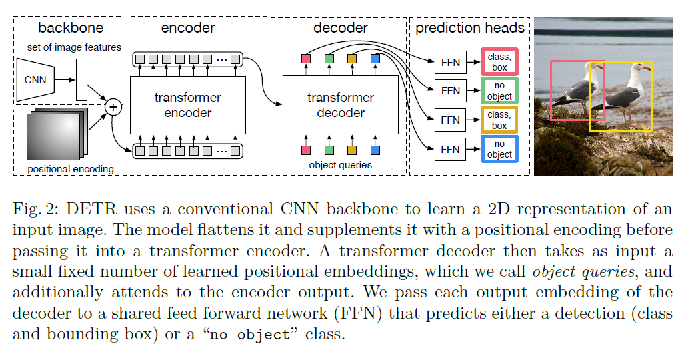

## 动机、参考资料、涉及内容

见下文

## DETR

- [视频讲解](https://www.bilibili.com/video/BV1GB4y1X72R)
- [DETR 论文: End-to-End Object Detection with Transformers](https://arxiv.org/pdf/2005.12872.pdf)

DETR 是一种做目标检测的全新架构，将目标检测问题直接当作集合预测问题来解，其模型结构如原论文图所示：

具体来说，训练阶段运作方式为：假设在 Coco 数据集上，某张输入图片大小为 (3, 1280, 800)。上图中 backbone 虚线框的 CNN 部分将图片转换为 (256, 40, 25) 大小的特征图，positional encoding 对应于 transformer 中的可学的 postional embedding。接下来将特征图的特征拉直为 (256, 40\*25) 与 positional encoding 相加后进入一个 transformer encoder 中，得到的输入依然为 (256, 40\*25)，接下来将 $N=100$ 个可学的形状为 (256,) 的 object queries 作为 transformer decoder 每步的输入。进行并行解码，最终 decoder 虚线框的输出形状为 (100, 256)。

最后对 decoder 的输出加上两个输出维数分别为 91, 4 的全连接层，分别预测是哪一类物体，预测框的位置。

在训练阶段，定义一个预测框与一个真实的框的损失：

$$
loss((gt\_label, gt\_bbox), (pred\_label\_probs, pred\_bbox))\\
=loss(gt\_label, pred\_label\_probs)+loss(gt\_bbox,pred\_bbox)
$$

假设真实一共有 4 个物体框，则计算出一共 $100\times4$ 个损失（不要计算梯度），找到预测结果最优 4 个输出与真实的 4 个框进行匹配，使得他们的损失最小。用这四个损失的平均做为损失函数，进行梯度回传进行学习。

在推理阶段，对 100 个输出结果的类别概率部分，卡一个阈值，例如说 0.7，类别概率超过 0.7 的认为是物体框。

DETR 的亮点在于“端到端”的处理方式：
- 没有了 anchor 这种先验信息
- 推理时不需要进行非极大抑制(NMS)这种后处理操作

实验结果：
- 在 Coco 数据集上能和 Faster-rcnn 打平手
- 论文中有许多可视化的分析实验结果的部分
- 能将实验扩展到全景分割任务上，具体做法参考原始论文
