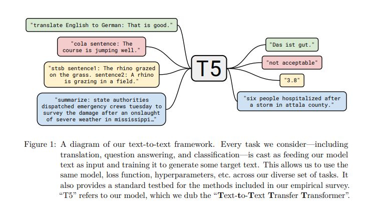
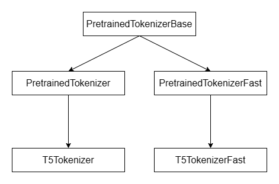
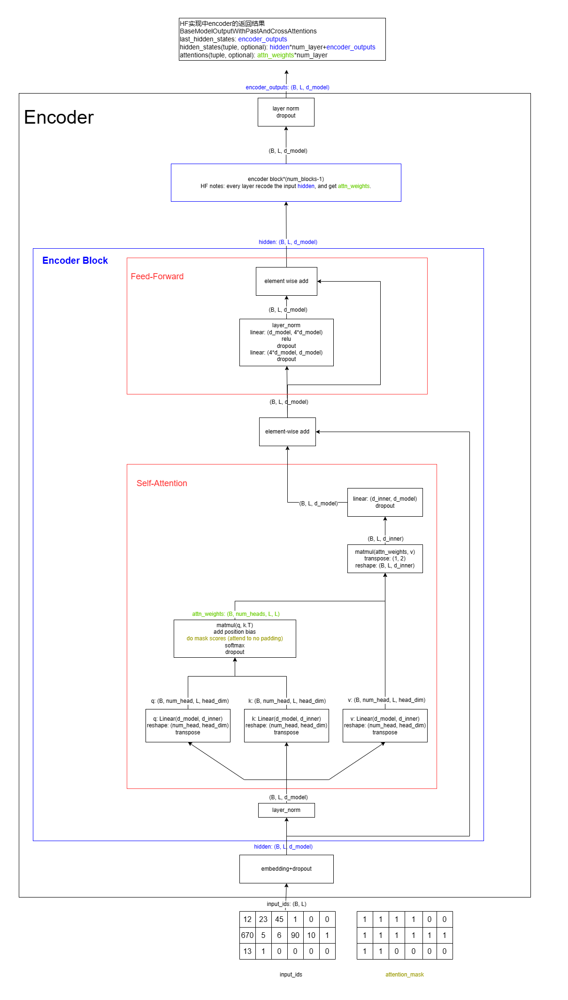
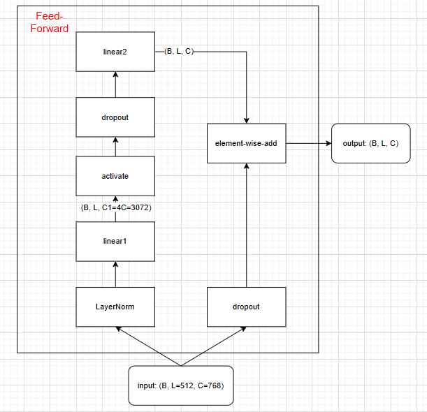
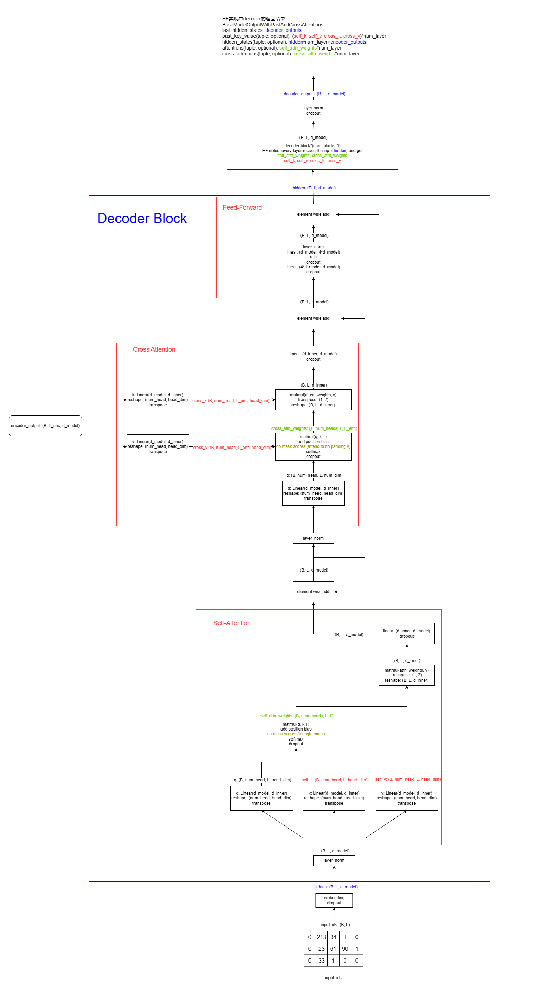
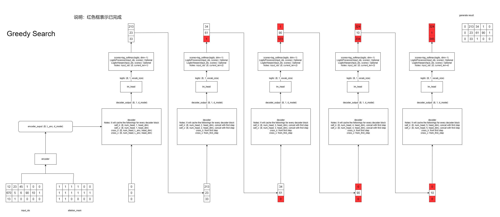

<style>
h2:after {
  content: "# ";
  color: gray;
}
h3:after {
  content: "## ";
  color: gray;
}
h4:after {
  content: "### ";
  color: gray;
}
h5:after {
  content: "#### ";
  color: gray;
}
.alert-red {
    padding: 1em;
    border: 1px solid #f44336;
    background-color: #ffebee;
    color: #f44336;
    /* font-weight: bold; */
    margin-top: 1em;
    margin-bottom: 1em
}
</style>

## 动机、参考资料、涉及内容

动机

- 熟悉 🤗 Transformers 的相关 API 与源码
- 熟悉 🤗 Tokenizers 的相关 API 与源码
- 深入理解 T5 的训练与推理步骤，包括每一步的计算过程
- 适当补充相关知识

参考资料

- 🤗 Transformers 4.26.1 源代码
- 🤗 Transformers 官方文档
- T5原始论文
  - 论文地址：https://arxiv.org/pdf/1910.10683.pdf
  - 标题：Exploring the Limits of Transfer Learning with a Unified Text-to-Text Transformer
  - 机构：Google

注意事项

主要从两个视角来写这篇博客：

- 原理视角：主要是论文里描述为主，但缺点是某些地方可能会有一定的模糊
- 实现视角：以 🤗 Transformers 的实际实现为准

## Overview: T5

T5 模型尝试将所有的 NLP 任务做了一个统一处理，即：将所有的 NLP 任务都转化为 Text-to-Text 任务。如原论文下图所示：


绿色的框是一个翻译任务（英文翻译为德文），按照以往标准的翻译模型的做法，模型的输入为：`That is good.`，期望模型的输出为：`Das ist gut.`，而 T5 的做法是将输入转化为：`translate English to German: That is good.`，期望的输出依然维持原样。也就是将 NLP 任务的描述也加在了模型输入里。原文中附录 D 中给出了更多的例子。

在模型结构上，T5 模型采用了 Encoder-Decoder 的架构，从大体上说，对于训练过程，伪代码如下：

```python
x, y = "translate English to German: That is good.", "Das ist gut."
x = tokenizer(x)  # [0, 23, 45, 89, 1230, 4, 9], 其中0代表<BOS>, 在实现中<PAD>也是0
y = tokenizer(y)  # [0, 44, 156, 4, 1], 其中1代表<EOS>
x_embedding = encoder.embed_layer(x)  # 将token转换为embedding, x_embedding的形状为(7, 768)
encoded_x = encoder.other_layer(x_embedding)  # 经过encoder后encoded_x的形状为(7, 768)

input_y = y[:-1]  # [0,  44,  156, 4]
# 将token转化为emdedding, input_y_emdedding的形状为(4, 768)
input_y_emdedding = decoder.embed_layer(input_y)  # 在T5的设计中，encoder.embed_layer与decoder.embed_layer共享参数
target_y = y[1:]  # [44, 156, 4,   1]

# decoder_output的形状为(4, 768)
decoder_output = decoder.other_layer(encoded_x, input_y_emdedding)

# logits 的形状为(4, vocab_size=32128)
logits = linear_layer(decoder_output)  # 在T5的设计中，decoder.embed_layer与linear_layer共享参数

# 接下来使用 softmax 与普通的交叉熵计算损失
loss = loss_fn(logits, target_y)
```


## Overview: 🤗 Transformers
对于 🤗 Transformers 的源码阅读而言，本文主要的关注点在于以下部分，首先 🤗 Transformers github 项目的目录结构如下（节选）

```
examples                         # 一些示例代码, 可供学习, 但不确保能与当前版本兼容
  - flax/language-modeling/t5_tokenizer_model.py  # t5 tokenizer 训练参考
  - flax/language-modeling/run_t5_mlm_flax.py     # t5 mask-LM 预训练参考
  - pytorch/summarization                         # t5 生成式模型训练参考
src/transformers
  - generation/
    - beam_constraints.py        # constraint_beam_search 辅助方法/类: Constraint, ConstraintListState
    - beam_search.py             # beam_search 辅助方法/类: BeamSearchScorer, ConstrainedBeamSearchScorer, BeamHypotheses
    - configuration_utils.py     # 生成式模型的统一配置文件, 用来控制生成算法及各类超参数, 例如生成长度惩罚
    - logit_process.py           # 生成过程时对log-softmax score的后处理：LogitsProcessor, LogitsWarpper
    - stopping_criteria.py       # 生成中止条件：StoppingCriteria
    - streamer.py                # transformers 4.28.0 版本新增, 用于生成字符时流式逐词输出
    - utils.py                   # GenerationMixin 的实现
    ...
  - models/  # 每个模型为一个单独的文件夹, 每个文件夹的文件结构比较固定, 参考t5子文件夹
    - t5/
      - __init__.py
      - convert_t5_original_tf_checkpoint_to_pytorch.py  # 有些模型原始官方仓库的权重需要通过转换得到 🤗 Transformers 中模型定义下模型载入的格式, 这种情况下会维护一个转换脚本
      - modeling_flax_t5.py      # flax版本的模型结构代码, 本文不涉及
      - modeling_tf_t5.py        # tensorflow版本的模型结构代码, 本文不涉及
      - modeling_t5.py           # pytorch版本的模型结构代码
      - configuration_t5.py      # 每个模型都有一个自己的模型结构参数配置文件
      - tokenization_t5.py       # 每个模型的slow/python版本的tokenizer实现, 速度相对较慢
      - tokenization_t5_fast.py  # 每个模型的fast版本的tokenizer实现, 速度较快, 依赖于 🤗 Tokenizers
      - ...
    - ...
  - pipelines/                   # 封装tokenizer与model, 简化使用, 本文不涉及
  - modeling_outputs.py          # 模型输出结果的数据结构
  - modeling_utils.py            # 所有模型的基类: PreTrainedModel
  - tokenization_utils_base.py   # 所有tokenizer的基类: PreTrainedTokenizerBase
  - tokenization_utils.py        # 所有slow版本tokenizer的基类: PreTrainedTokenizer
  - tokenization_utils_fast.py   # 所有fast版本tokenizer的基类: PreTrainedTokenizerFast
  - trainer.py                   # Trainer类, 本文不涉及
  - trainer_callback.py          # Trainer类中使用到的 TrainerCallback/TrainerState/TrainerControl/CallbackHandler
  - integrations.py              # 高级日志记录工具, 例如: TensorBoardCallback
  - ...
```

## 原理解析：Tokenizer

取决于不同的 tokenizer 实现, 🤗 Tokenizers 中的 Tokenizer 在encode阶段通常会进行如下几个步骤，具体实现细节见源码解析部分

```
# 以bert-base-uncased的fast版本为例
How are U today?
# Normalization
how are u today?
# Pre-tokenization
[how, are, u, today, ?]
# tokenize
[how, are, u, to, ##day, ?]
# Postprocess
[CLS, how, are, u, to, ##day, ?, SEP]
```

<div class="alert-red">
注意: 本节剩余部分的算法描述不保证与 🤗 Tokenizers 或 🤗 Transformers 中的 slow/fast 版中的实现完全吻合。原因是：
（1）🤗 Tokenizers 的确实现了以下的几种算法[参考官方文档](https://huggingface.co/docs/tokenizers/api/models)，但由于🤗 Tokenizers采用了 Rust 进行实现，笔者暂时无力理清准确的源码，所以没有深究
（2）🤗 Transformers 中的 slow/fast 版的 tokenizer 是为了对齐相应模型的原始实现，因此对于一个个具体的模型的 Tokenizer，有可能会对标准的 BPE/WordPiece/Unigram算法做些小改动。
</div>


### BPE

一个带有完整实现的教程：[🤗 NLP Course](https://huggingface.co/learn/nlp-course/chapter6/5?fw=pt)

BPE (Byte Pairwise Encoding) 算法的训练流程如下：
```
输入：句子列表，词表数量上限
（例子）：[" ".join(["hug"]*10), " ".join(["pug"]*5), " ".join(["pun"]*12)]
前处理：将句子列表转换为词列表，并统计词频。同时记录所有出现的字符作为base_vocab：最终得到的结果为：[(词语1, 词频1), ..., (词语N, 词频N)], base_vocab: [字符1, ..., 字符K]
（例子）：以空格作为分隔符进行切词，得到[("hug": 10), ("pug", 5), ("pun", 12)], base_vocab: ["h", "u", "g", "p", "n"]
训练流程：
  首先初始化所有词语的当前拆解方式：{词语1: ([字符1,...,字符k_1], 词频1), ..., 词语N: ([字符1,...,字符k_N], 词频N)}, 当前merge列表为: []
  （例子）：{hug: ([h, u, g], 10), pug: ([p, u, g], 5), pun: ([p, u, n], 12)}

  While True:
    根据当前词的拆解方式计算候选的merge列表及对应的频数, 候选的merge列表指的是所有词语当前拆解方式
    （例子-第1轮）：候选merge列表为：[(h, u): 10, (u, g): 15, (p, u): 17, (u, n): 12]
    （例子-第2轮）：候选merge列表为：[(h, u): 10, (u, g): 10, (pu, g): 5, (pu, n): 12]
    选出词频最大的merge方式, 加入至merge列表, 并对所有词语的拆解方式做更新
    （例子-第1轮）：将原始的词语拆解方式用 [p, u] -> pu更新，得到：{hug: ([h, u, g], 10), pug: ([pu, g], 5), pun: ([pu, n], 12)}, merge列表为: [(p, u)]
    （例子-第2轮）：将原始的词语拆解方式用 [pu, n] -> pun更新，得到：{hug: ([h, u, g], 10), pug: ([pu, g], 5), pun: ([pun], 12)}, merge列表为: [(p, u),(pu, n)]
    循环直至（merge列表长度+base_vocab长度）达到词表数量上限
```

推理流程如下
```
输入：句子，base_vocab与合并规则
（例子）：base_vocab与合并规则：[h, u, g, p, n, (p, u), (h, u), (hu, g)]
前处理：将句子拆解为词语列表
推理流程：
  tokens = []
  for word in sentence:
    word_split = [字符1, ..., 字符k]
    （例子）：word_split = [h,u,g,i,h,u]
    for merge in merges:
      尝试将merge应用于word上, 并更新word_split
      （例子-第1轮）：尝试使用(p, u)合并，word_split不变
      （例子-第2轮）：尝试使用(h, u)合并，word_split变为[hu, g, g, i, hu]
      （例子-第3轮）：尝试使用(hu, g)合并，word_split变为[hug, g, i, hu]
    tokens.extend(word_split)
```

### WordPiece

一个带有完整实现的教程：[🤗 NLP Course](https://huggingface.co/learn/nlp-course/chapter6/6?fw=pt)

WordPiece 算法是 Bert 所用的 tokenize 算法

<div class="alert-red">
正如[🤗 NLP Course](https://huggingface.co/learn/nlp-course/chapter6/6?fw=pt)指出的那样, Google 并未将 WordPiece 的训练算法进行开源，但推理算法是开源的，推理算法可参考[bert源码](https://github.com/google-research/bert/blob/master/tokenization.py)。因此严格地说，WordPiece 的训练算法只是猜测。
</div>

与 BPE 算法的主要区别在于：
- 中间字符采用 "##" 开头表示
- 训练阶段
  - 选取merge时，判断最大值的标准变为: 合并出现的次数/(piece1的次数*piece2的次数)
  - 不保留merge的二元组, 只保留最终结果
- 推理阶段
  - 贪心算法匹配每个词的剩余字符

WordPiece 算法的训练流程如下：

```
输入：句子列表，词表数量上限
（例子）：[" ".join(["hug"]*10), " ".join(["pug"]*5), " ".join(["pun"]*12)]
前处理：将句子列表转换为词列表，并统计词频。同时记录所有出现的字符作为vocab，包括出现在开头的字符与出现在中间的字符：最终得到的结果为：[(词语1, 词频1), ..., (词语N, 词频N)], vocab: [字符1, ..., 字符K]
（例子）：以空格作为分隔符进行切词，得到[("hug": 10), ("pug", 5), ("pun", 12)], vocab: ["h", "##u", "##g", "p", "##n"]
训练流程：
  首先初始化所有词语的当前拆解方式：{词语1: ([字符1,##字符k_2...,##字符k_1], 词频1), ..., 词语N: ([字符1,##字符2...,##字符k_N], 词频N)}
  （例子）：{hug: ([h, ##u, ##g], 10), pug: ([p, ##u, ##g], 5), pun: ([p, ##u, ##n], 12)}
  While True:
    根据当前词的拆解方式计算候选的merge列表及对应的分数(合并后出现的频数/合并前的频数之积), 候选的merge列表指的是所有词语当前拆解方式
    （例子-第1轮）：候选merge列表为：[(h, ##u): 10/(10*27), (##u, ##g): 15/(27*15), (p, ##u): 17/(17*27), (##u, ##n): 12/(27*12)]，这个例子比较特别，分数全部相同
    （例子-第2轮）：候选merge列表为：[(hu, ##g): 10/(10*15) , (p, ##u): 17/(17*17), (##u, ##g): 5/(17*15), (##u, ##n): 17/(17*12)]，最大分数的合并方式为(##u, ##n)
    选出词频最大的merge方式, vocab列表, 并对所有词语的拆解方式做更新
    （例子-第1轮）：将原始的词语拆解方式用 [h, ##u] -> hu更新，得到：{hug: ([hu, ##g], 10), pug: ([p, ##u, ##g], 5), pun: ([p, ##u, ##n], 12)}。vocab.append("hu")
    （例子-第2轮）：将原始的词语拆解方式用 [##u, ##n] -> ##un更新，得到：{hug: ([hu, ##g], 10), pug: ([p, ##u, ##g], 5), pun: ([p, ##un], 12)}。vocab.append("##un")
    循环直至vocab达到词表数量上限
```

推理流程如下（其实是简单的贪心策略，尽量匹配词表里最长的字串，如果某一步碰到OOV，则这个词的剩余部分被标记为UNK），准确代码可直接参考[Bert原始代码](https://github.com/google-research/bert/blob/master/tokenization.py)
```
输入：句子，vocab
前处理：将句子拆解为词语列表
推理流程：
  tokens = []
  for word in sentence:
    start=0, end=len(word)
    while start < len(word):
      while end > start:
        if word[start:end] in vocab:
          tokens.append(word[start:end])
          end -= 1
          start = end
          break
        if end == start:
          这种情况下把整个后续token都作为[unk]，不再进行进一步的分词
```

### Unigram

这里按照 [🤗 nlp course](https://huggingface.co/learn/nlp-course/chapter6/7?fw=pt) 中的描述对算法进行简要介绍。

训练流程：

- 前处理：将句子分割为词
- 首先将所有出现的单个字符作为base-vocab，然后使用一些方法获取到一个相对比较大的词表vocab（教程的代码里采用的是所有出现的词的子序列，并指出实际使用时可以采用BPE算法），其中vocab包含base-vocab。并且计算vocab中每个token出现的频率，供后续计算损失时使用。
- 对于vocab中的每个非base-vocab中的词，计算这个词从词表中排除后，整体损失的增长量，丢弃增长量最大的前20%的vocab。重复此步骤直至词表大小满足要求

给定一个词表，这个词表在数据集上的损失定义为数据集中所有词的损失按词频加权平均，而每个词的损失为：

$$
L(word)=\max_{\bold{x}\in S(word)}[-\sum_{i}log(p(x_i))]
$$

这里 $S(word)$ 表示的是按照 vocab，所有能拼凑成 $word$ 的 subword 序列。

推理流程：

(1) one-best-decoding: 即计算每个词的损失时找到的最优 subword 序列，这可以用动态规划（维特比算法）来解决，具体过程从略。
(2) k-best-decoding: [🤗 nlp course](https://huggingface.co/learn/nlp-course/chapter6/7?fw=pt) 没有涉及到，但原始论文中指出可以使用 Forward-DP Backward-A* 算法得到最优的 k 种subword 序列, 使用 Forward-Filtering and Backward-Sampling algorithm(FFBS) 可以按概率采样到 k 种 subword 序列


原始论文[Subword Regularization: Improving Neural Network Translation Models with Multiple Subword Candidates](https://arxiv.org/abs/1804.10959)中对 Unigram 算法的描述与上述基本一致，稍有不同的是在 $p(x_i)$ 的计算上，论文中描述用 EM 算法得到，而上述描述里直接使用频率得到。

对原始论文的理解以及一些实现细节可以参考这篇[博客](https://towardsdatascience.com/sentencepiece-tokenizer-demystified-d0a3aac19b15)

### SentencePiece

<div class="alert-red">
本小节的描述可能不准确，需进一步分辨
</div>

在 🤗 Transformers 中,  按[官方文档](https://huggingface.co/docs/transformers/tokenizer_summary)描述：SentencePiece 算法总是和 Unigram 配合使用, 因此可以认为在 🤗 Transformers 中, 这两者基本上可以划等号。（🤗 Transformers 中的 SentencePiece = 一些预处理 + Unigram）

在实现细节上，🤗 Transformers 中 fast tokenizer 依赖于 🤗 Tokenizers，而 🤗 Tokenizers 中对 sentencepiece 的处理方式是使用 protobuf 解析 sentencepiece 的词表存储格式, 然后再组合上 🤗 Tokenizers 自身实现的 Unigram, 详细内容可以参考[tokenizers/implementations/sentencepiece_unigram.py](https://github.com/huggingface/tokenizers/blob/main/bindings/python/py_src/tokenizers/implementations/sentencepiece_unigram.py)。即相当于 🤗 Tokenizers 重新实现了 sentencepiece。但需要注意的是： 🤗 Tokenizers 也实现了 SentencePieceBPETokenizer ，但并未在 🤗 Transformers 被使用到。

🤗 Transformers 中 slow tokenizer 则一般依赖于 sentencepiece 包


### T5 使用的 tokenizer

T5 使用 SentencePiece 作为 tokenizer，细节参考实现部分

## 源码解析: 🤗 Tokenizers

本节只介绍 🤗 Tokenizers 本身的使用，不涉及 🤗 Transformers 中 fast tokenizer 对 🤗 Tokenizers 的进一步封装

🤗 Tokenizers 的[官方文档-Getting Started](https://huggingface.co/docs/tokenizers/index)对使用的介绍已经足够充分，此处仅起一个浓缩的作用。

🤗 Tokenizers 代码库的核心类为 `tokenizers.Tokenizer`。

### 组成

```python
from tokenizers import Tokenizer
from tokenizers.models import BPE
# (component-3: model): 将词tokenize为token列表: List(str) -> List(Token)
tokenizer = Tokenizer(BPE(unk_token="[UNK]"))

# (component-1: normalizer): 对原始句子进行预处理: str -> str
from tokenizers.normalizers import NFD, StripAccents
tokenizer.normalizer = normalizers.Sequence([NFD(), StripAccents()])

# (component-2: pre_tokenizer): 将句子拆分为词列表: str -> List(str)
from tokenizers.pre_tokenizers import Whitespace
tokenizer.pre_tokenizer = Whitespace()

# (component-4: post-processor): 对token列表进行后处理, 例如增加EOS: List(Token) -> List(Token)
from tokenizers.processors import TemplateProcessing
tokenizer.post_processor = TemplateProcessing(
    single="[CLS] $A [SEP]",
    pair="[CLS] $A [SEP] $B:1 [SEP]:1",  # 这里的:1指的是将这部分的token_type_id标记为1
    special_tokens=[
        ("[CLS]", tokenizer.token_to_id("[CLS]")),
        ("[SEP]", tokenizer.token_to_id("[SEP]")),
    ],
)

# (component-5: decoder): 将token列表转换为句子: List(str) -> str
from tokenizers import decoders
tokenizer.decoder = decoders.WordPiece()
tokenizer.decode(output.ids)

# trainer
from tokenizers.trainers import BpeTrainer
trainer = BpeTrainer(special_tokens=["[UNK]", "[CLS]", "[SEP]", "[PAD]", "[MASK]"])
files = [f"data/wikitext-103-raw/wiki.{split}.raw" for split in ["test", "train", "valid"]]
tokenizer.train(files, trainer)

# tokenizer 的保存格式为一个单一的 json 文件
tokenizer.save("data/tokenizer-wiki.json")
tokenizer = Tokenizer.from_file("data/tokenizer-wiki.json")
tokenizer = Tokenizer.from_pretrained("bert-base-uncased")  # 与 🤗 Transformers 中 fast tokenizer 的使用类似

# 这种用法可能不常用? BertWordPieceTokenizer 的基类是BaseTokenizer, 而BaseTokenizer与Tokenizer类无关
from tokenizers import BertWordPieceTokenizer
tokenizer = BertWordPieceTokenizer("bert-base-uncased-vocab.txt", lowercase=True)
```

以 gpt2 为例简要看一下各个组成部分怎么单独被调用

<div class="alert-red">
注意: 一般情况下, 不要单独使用各个组成部分
</div>

```python
from tokenizers import Tokenizer
tokenizer = Tokenizer.from_pretrained("gpt2")

# (component-1: normalizer): 对原始句子进行预处理: str -> str
tokenizer.normalizer                              # None
# 不巧的是, gpt2并没有normalizer, 所以这里只好另外造一个例子
from tokenizers.normalizers import StripAccents, NFD, NFC, Sequence
normalizer = Sequence([NFD(), StripAccents()])    # StripAccents 需要与 NFD 配合使用
normalizer.normalize_str("é")                     # 输出: 'e'

text = "中国"

# (component-2: pre_tokenizer): 将句子拆分为词列表: str -> List(str)
tokenizer.pre_tokenizer                           # tokenizers.pre_tokenizers.ByteLevel
word_with_pos = tokenizer.pre_tokenizer.pre_tokenize_str("中国")
# word_with_pos: [('ä¸ŃåĽ½', (0, 2))], 切词的结果, 这个看起来乱码的东西实际上长度为6(在utf-8编码中汉字一般由3个字节构成)
print([ord(x) for x in word_with_pos[0][0]])      # [228, 184, 323, 229, 317, 189]
print(list(text.encode()))                        # [228, 184, 323, 229, 317, 189]

# (component-3: model): 将词tokenize为token列表: List(str) -> List(Token)
tokenizer.model                                   # tokenizers.models.ByteLevel
all_tokens = []
for word, (start, end) in word_with_pos:
    tokens = tokenizer.model.tokenize(word)       # tokens: List[tokenizers.Token]
    all_tokens.append(tokens)

# tokenizers.Token 主要方法为 as_tuple(), 主要属性是 value, id
print([token.as_tuple() for token in all_tokens[0]])
# 输出为: [(40792, 'ä¸Ń', (0, 6)), (32368, 'åĽ', (6, 10)), (121, '½', (10, 12))]
# 为什么是(0, 6), (6, 10), (10, 12)而不是(0, 3), (3, 5), (5, 6)？

# (component-4: post-processor): 对token列表进行后处理, 例如增加EOS: List(Token) -> List(Token)
tokenizer.post_processor                          # tokenizers.processors.ByteLevel

# 不巧的是, gpt2的post_processor没有追加任何token
# tokenizer = Tokenizer.from_pretrained("hfl/chinese-roberta-wwm-ext")
encoding = tokenizer.encode(text, add_special_tokens=False)
print(encoding.tokens)                            # ['中', '国']
encoding = tokenizer.post_processor.process(encoding)
print(encoding.tokens)                            # ['[CLS]', '中', '国', '[SEP]']

# (component-5: decoder): 将token列表转换为句子: List(str) -> str
tokenizer.decoder                                 # tokenizers.decoders.ByteLevel
token_strs = [token.value for tokens in all_tokens for token in tokens]  # ['ä¸Ń', 'åĽ', '½']
tokenizer.decoder.decode(token_strs)              # "中国"
```

### 使用【TODO】

本节为常见的使用方法
```python
# 构建方法1
from tokenizers import Tokenizer
from tokenizers.models import BPE
tokenizer = Tokenizer(BPE(unk_token="[UNK]"))
# tokenizer.normalizer = ...
# tokenizer.pre_tokenizer = ...
# tokenizer.post_processor = ...
# tokenizer.decoder = ...

# 构建方法2: 在 🤗 hub 中保存的 tokenizer.json 文件
tokenizer = Tokenizer.from_file("data/tokenizer-wiki.json")

# 构建方法3: 类似于 🤗 Transformers 的使用
tokenizer = Tokenizer.from_pretrained("bert-base-uncased")

# 保存
save_path = "tokenizer.json"
tokenizer.save(save_path)

# 补充: 🤗 Transformers 中使用 tokenizers.Tokenizer 构建 fast tokenizer
# 本质上: (1) PreTrainedTokenizerFast 的行为完全由 tokenizer_object 决定
# (2) PreTrainedTokenizerFast.save_pretrained 实际上调用了 Tokenizer.save
from transformers import PreTrainedTokenizerFast
fast_tokenizer = PreTrainedTokenizerFast(tokenizer_object=tokenizer)
fast_tokenizer = PreTrainedTokenizerFast(tokenizer_file=save_path)

【TODO】
tokenizer.encode
tokenizer.token_to_id
tokenizer.encode_batch
tokenizer.enable_padding(pad_id=3, pad_token="[PAD]")
tokenizer.add_special_tokens(tokens: List[Union[AddedToken, str]]) # -> int
tokenizer.add_tokens(tokens: List[Union[AddedToken, str]])
```

## 源码解析: sentencepiece【TODO：源码解析待后续另起一篇博客进行介绍】

🤗 Transformers 中每个具体的 slow tokenizer 的实现里, 如果 tokenizer 的类型为 BPE 或者是 WordPiece, 那么一般是在相应的 `xxx_tokenizer.py` 中使用 python 实现 BPE 和 WordPiece。因此会发现一些重复的代码，例如[tokenization_bert.py](https://github.com/huggingface/transformers/blob/main/src/transformers/models/bert/tokenization_bert.py)与[tokenization_distilbert.py](https://github.com/huggingface/transformers/blob/main/src/transformers/models/distilbert/tokenization_distilbert.py)，这符合 🤗 Transformers 代码库的[哲学](https://huggingface.co/docs/transformers/philosophy)。而 tokenizer 的类型为 SentencePiece 时，相应的 slow tokenizer 的实现会借助 [sentencepiece](https://pypi.org/project/sentencepiece/) 包。

sentencepiece包的使用方法请直接参考: [官方示例](https://github.com/google/sentencepiece/blob/master/python/sentencepiece_python_module_example.ipynb)


## 源码解析: 🤗 Transformers 中的 tokenizer

首先说明一下 🤗 Transformers 与 🤗 Tokenizers 之间的关系：🤗 Transformers 4.x 版本中每个模型都会尽量支持两种 tokenizer 的实现, slow版本的实现与fast版本的实现, 后者依赖于 🤗 Tokenzers 包, 而前者不依赖, 且为纯 python 实现，所以 slow 版本的 tokenizer 更方便阅读。

具体来说，🤗 Transformers 中 fast tokenizer 在实例初始化时有如下代码段：
```python
from .convert_slow_tokenizer import convert_slow_tokenizer
from tokenizers import Tokenizer as TokenizerFast

class PreTrainedTokenizerFast(PreTrainedTokenizerBase):
  vocab_files_names = VOCAB_FILES_NAMES
  slow_tokenizer_class: PreTrainedTokenizer = None
  can_save_slow_tokenizer: bool = True
  
  # 节选了一部分
  def __init__(self, *args, **kwargs):
    tokenizer_object = kwargs.pop("tokenizer_object", None)
    slow_tokenizer = kwargs.pop("__slow_tokenizer", None)
    fast_tokenizer_file = kwargs.pop("tokenizer_file", None)
    from_slow = kwargs.pop("from_slow", False)
    if from_slow and slow_tokenizer is None and self.slow_tokenizer_class is None:
        raise ValueError("...")
    if tokenizer_object is not None:
        fast_tokenizer = copy.deepcopy(tokenizer_object)
    elif fast_tokenizer_file is not None and not from_slow:
        # We have a serialization from tokenizers which let us directly build the backend
        fast_tokenizer = TokenizerFast.from_file(fast_tokenizer_file)
    elif slow_tokenizer is not None:
        # We need to convert a slow tokenizer to build the backend
        fast_tokenizer = convert_slow_tokenizer(slow_tokenizer)
    elif self.slow_tokenizer_class is not None:
        # We need to create and convert a slow tokenizer to build the backend
        slow_tokenizer = self.slow_tokenizer_class(*args, **kwargs)
        fast_tokenizer = convert_slow_tokenizer(slow_tokenizer)
    else:
        raise ValueError("...")
    self._tokenizer = fast_tokenizer
    # ...
```
fast tokenizer 的各类方法例如：`tokenize`、`convert_tokens_to_ids`、`get_vocab`、`decode` 最终都会直接转换为对 `self._tokenizer` 的相应方法的调用。从前面对于 🤗 Tokenizers 的介绍可以知道，`self._tokenizer` 封装了这些组成部分：`normalizer`、`pre_tokenizer`、`tokenizer`、`post_processor`、`decoder`。

🤗 Transformers 中的每个 slow tokenizer 需要逐一用python实现 `normalizer`、`pre_tokenizer`、`tokenizer`、`post_processor`、`decoder` 这些组成部分，其中 `tokenizer` 是 BPE 或是 WordPiece 时，则需手动实现 encode 的过程，如果是 SentencePiece 时，则一般借助 sentencepiece 包来实现主要逻辑。


🤗 Transformers 中, 每个模型都会对应于其特有的 tokenizer, 例如: t5 模型的 tokenizer 为 `T5Tokenizer` 和 `T5TokenizerFast`。继承关系如下：



<div class="alert-red">
注意: slow 版本的 tokenizer 与 fast 版本的 tokenizer 的行为未必能完全一致
</div>

### 使用【TODO: 需调整】

从一个疑惑引入：[issue](https://github.com/huggingface/transformers/issues/5087)

```python
from transformers import T5ForConditionalGeneration, T5Tokenizer
pretrained_name_or_path = "t5-small"
tokenizer = T5Tokenizer.from_pretrained(pretrained_name_or_path)

print(tokenizer.special_tokens_map_extended)
# {"eos_token": "</s>", "unk_token": "<unk>", "pad_token": "<pad>", "additional_special_tokens": ['<extra_id_0>', ..., '<extra_id_99>']}
print(tokenizer.eos_token, tokenizer.unk_token, tokenizer.pad_token)
# eos_token: 1, unk_token: 2, pad_token: 0

text = "abc __"
tokens = tokenizer.tokenize(text)  # ["__ab", "c", "__", "_", "_"]
ids = tokenizer.convert_tokens_to_ids(tokens)  # [703, 75, 3, 834, 834]

ids = tokenizer.encode(text)  # [703, 75, 3, 834, 834, 1]
```

由此可见，在 `T5Tokenizer` 的实现里，没有 `bos_token` 这个属性，并且每个 word 起始的 subword 会加上 `__` 的前缀。注意词表中既有以 `__` 开头的 token，例如 `__ab`，而 `__` 本身也在词表中。这种处理方式是因为 `T5Tokenizer` 使用了 SentencePiece Tokenizer。

tokenizer 的常用方法如下参考[笔记](https://buxianchen.gitbook.io/notes/note/dl/huggingface#pretrainedtokenizerbase)【后续考虑怎么合并/删减】，这里重点介绍 `__call__` 方法的返回结果做些特殊说明

### `BatchEncoding`

首先看一个使用示例：

```python
from transformers import AutoTokenizer  # AutoTokenizer总是尝试加载fast版本的tokenizer
tokenizer = T5Tokenizer.from_pretrained("t5-small")
encodings = tokenizer(["This is a sentence"])
```

此处的 `encodings` 的类型为 `BatchEncoding` 类型, 它继承自 `UserDict`，即继承自字典。除了字典的方法外，它还具备以下方法

```python
inputs = encoding.convert_to_tensors("pt")  # inplace操作, 将内部的value例如input_ids等转换为tensor
inputs = encoding.to("cuda:0")  # inplace操作, 改变设备
# 注: 以下方法仅使用于 fast 版本的 tokenizer 的情形
# 注: 以下方法对于特殊token例如[CLS], 返回结果会处理成None
encoding.tokens()                     # List[str], 所有的token字符串, 假设长度为N
# tokenize一个batch的数据时, 注意需要调整入参, encoding.tokens(i), i为第几个样本, 下同
encoding.word_ids()                   # List[int], 每个token所在的word_idx, 注意这里的word的概念通常取决于pre-tokenizer的定义
encoding.sequence_ids()               # List[int], 每个token所在的sequence_idx, 这里的sequence的概念取决于pre-tokenizer的定义
encoding.token_to_word(token_idx)     # 第token_idx个token所在的word_idx
encoding.token_to_sequence(token_idx) # 第token_idx个token所在的sequence_idx
start, end = encoding.word_to_chars(word_idx)      # 第word_idx个word对应的原始string的起始/结束位置
start, end = encoding.word_to_tokens(word_idx)     # 第word_idx个word对应的起始与结束的token_idx
start, end = encoding.token_to_chars(token_idx)    # 第token_idx个token对应的原始string的起始/结束位置
word_idx = encoding.char_to_word(i)                # 原始string中第i个字符对应的word_idx
token_idx = encoding.char_to_token(i)              # 原始string中第i个字符对应的token_idx
```

简单来说, fast 版本的 tokenizer 的 encode 过程保存了原始字符串中每个字符与token, word, sequence的对应关系, 而 slow 版本不具备


### add tokens / special tokens【TODO】

源码及官方文档中对特殊token有若干个相似的方法与命名，让人非常困惑。另外，`PretrainedTokenizerBase` 的 `add_tokens` 与 `add_special_tokens` 的这两个方法也让人困惑。因此有必要理清楚。

首先，这里引用 [SentencePiece 教程](https://github.com/google/sentencepiece/blob/master/python/sentencepiece_python_module_example.ipynb) 中的几个术语对 token 进行分类（在🤗 Transformers的文档中，笔者没有见到类似的术语）：

- normal symbols: 普通的 token, sentencepiece tokenizer 可能会将这种 token 切分开
- user defined symbols: 用户增加的特殊 token, 可以出现在原始文本中, sentencepiece tokenizer 保证不会对这种 token 进行切分
- control symbols: 对tokenizer的结果进行后处理时使用的 token, 例如：sentencepiece tokenizer 将句子 tokenize 后, 后处理加上 `"[CLS]"` 和 `"[SEP]"`, 如果在输入的句子中含有 `"[CLS]"`, sentencepiece tokenizer 有可能会将这种 token 切分开

从上面的例子推广开来, 对 tokenizer 增加 token 应该要包含这几种情形:

- 普通token,出现在原始文本, 不保证它不被切分开: 例如: 假设词表中已经有了 `"中国"` 和 `"人"` 这两个token，现在增加 `"中国人"` 到词表里, 目的是希望 tokenizer 有可能会将 `"中国人"` 当作一个整体, 当然也不排除 tokenizer 仍然会被切分为 `"中国"` 和 `"人"`。然而在 BPE、WordPiece、Unigram 这三类算法中，为了增加这种类型的token，
  - BPE 需要增加的是 merge 规则, 即 `("中国", "人")`, 甚至于需要调整这个 merge 的规则到合适的位置(优先级)
  - WordPiece 只需要将 `"中国人"` 加入到词表中即可
  - Unigram 需要将 `"中国人"` 以及相应的概率值加入至词表里, 甚至于需要调整已有词的概率值
  因此 🤗 Transformers 中不支持这种添加方式(slow tokenizer不支持, 不确定 fast tokenizer 的情况)
- 出现在原始文本中的token, 保证它不会被切分开（🤗 Transformers 支持）
- 后处理token, 主要用途用于后处理时追加。并且即使它出现在原始文本中, 也不会切分开（🤗 Transformers 的EOS等都有此性质）
- 后处理token, 主要用途用于后处理时追加。但如果它出现在原始文本中, 有可能会被切分开（🤗 Transformers 不支持）

【还需要总结一下跟special token相关的实例变量名】

有了上述认知，下面具体分析源代码

`PrtrainedTokenizerBase` 与 `add_tokens` 和 `add_special_tokens` 中有关的代码片段如下
```python
class SpecialTokensMixin:
    SPECIAL_TOKENS_ATTRIBUTES = [
        "bos_token",
        "eos_token",
        "unk_token",
        "sep_token",
        "pad_token",
        "cls_token",
        "mask_token",
        "additional_special_tokens",
    ]
    def add_special_tokens(self, special_tokens_dict: Dict[str, Union[str, AddedToken]], replace_additional_special_tokens=True) -> int:
        if not special_tokens_dict:
            return 0
        added_tokens = 0
        for key, value in special_tokens_dict.items():
            assert key in self.SPECIAL_TOKENS_ATTRIBUTES, f"Key {key} is not a special token"
            if key == "additional_special_tokens":
                assert isinstance(value, (list, tuple)) and all(isinstance(t, (str, AddedToken)) for t in value)
                if replace_additional_special_tokens:
                    setattr(self, key, value)
                else:
                    # This is a copy of `self._additional_special_tokens`
                    additional_special_tokens = getattr(self, key)
                    additional_special_tokens_set = set(additional_special_tokens)
                    to_add = []
                    for token in value:
                        if str(token) not in additional_special_tokens_set and str(token) not in to_add:
                            to_add.append(token)
                    # update the property
                    additional_special_tokens.extend(to_add)
                    self.additional_special_tokens = additional_special_tokens
                added_tokens += self.add_tokens(value, special_tokens=True)
            else:
                assert isinstance(value, (str, AddedToken))
                setattr(self, key, value)
                added_tokens += self.add_tokens([value], special_tokens=True)
        return added_tokens
    def add_tokens(self, new_tokens: Union[str, AddedToken, List[Union[str, AddedToken]]], special_tokens: bool = False) -> int:
        if not new_tokens:
            return 0
        if not isinstance(new_tokens, (list, tuple)):
            new_tokens = [new_tokens]
        return self._add_tokens(new_tokens, special_tokens=special_tokens)
    def _add_tokens(self, new_tokens: Union[List[str], List[AddedToken]], special_tokens: bool = False) -> int:
        raise NotImplementedError
```

由此可见:
- `add_special_tokens` 实际上只是用来操作 `[bos_token, eos_token, unk_token, sep_token, pad_token, cls_token, mask_token]` 以及 `additional_special_tokens` 这几个属性的, 从【其他】分析可以知道 `additional_special_tokens` 跟前面 6 种 token 并没有本质区别。而 `add_special_tokens` 的行为是给这 7 个实例变量赋新值, 然后再调用 `added_tokens`
- `add_tokens` 的行为完全由 `_add_tokens` 决定, 由基类实现

对于 slow tokenizer, `_add_tokens` 的实现如下

```python
def _add_tokens(self, new_tokens: Union[List[str], List[AddedToken]], special_tokens: bool = False) -> int:
    new_tokens = [str(tok) for tok in new_tokens]
    tokens_to_add = []
    for token in new_tokens:
        if not isinstance(token, str):
            raise TypeError(f"Token {token} is not a string but a {type(token)}.")
        if not special_tokens and hasattr(self, "do_lower_case") and self.do_lower_case:
            token = token.lower()
        if (
            token != self.unk_token
            and self.convert_tokens_to_ids(token) == self.convert_tokens_to_ids(self.unk_token)
            and token not in tokens_to_add
        ):
            tokens_to_add.append(token)
    added_tok_encoder = dict((tok, len(self) + i) for i, tok in enumerate(tokens_to_add))
    added_tok_decoder = {v: k for k, v in added_tok_encoder.items()}
    self.added_tokens_encoder.update(added_tok_encoder)
    self.added_tokens_decoder.update(added_tok_decoder)

    # Make sure we don't split on any special tokens (even they were already in the vocab before e.g. for Albert)
    if special_tokens:
        if len(new_tokens) == 1:
            _insert_one_token_to_ordered_list(self.unique_no_split_tokens, new_tokens[0])
        else:
            self.unique_no_split_tokens = sorted(set(self.unique_no_split_tokens).union(set(new_tokens)))
    else:
        # Or on the newly added tokens
        if len(tokens_to_add) == 1:
            _insert_one_token_to_ordered_list(self.unique_no_split_tokens, tokens_to_add[0])
        else:
            self.unique_no_split_tokens = sorted(set(self.unique_no_split_tokens).union(set(tokens_to_add)))
    self._create_trie(self.unique_no_split_tokens)
    return len(tokens_to_add)
```

因此 slow tokenizer `add_tokens` 方法的流程如下:

- 通过 `convert_tokens_to_ids(token)==convert_tokens_to_ids(self.unk_token)` 判断是否为新增词, 如果是, 则在 `self.added_tokens_encoder` 以及 `self.added_tokens_decoder` 中记录 token to idx 和 idx to token 的映射关系, 注意这两个实例变量是 slow tokenizer 独有的, fast tokenizer 无此实例变量【还需要在其他地方介绍这两个实例变量】
- 入参 `special_tokens=True`, 那么就不进行前一步筛选, 直接将入参 `new_tokens` 作为不可分割的 token 加入到词表中【还需要在其他地方介绍self.unique_no_split_tokens】。入参 `special_tokens=False`, 那么就需要经过前一步筛选再作为不可分割的 token 加入到词表中
- 调用 `self._create_trie`, 便于tokenize的时候先保证不可分割的词不被切开

因此, `add_tokens` 本质上是添加了不可分割的 token, `special_tokens` 这个入参显得不容易理解

对于 fast tokenizer, `_add_tokens` 的实现如下
```python
def _add_tokens(self, new_tokens: List[Union[str, AddedToken]], special_tokens=False) -> int:
    if special_tokens:
        return self._tokenizer.add_special_tokens(new_tokens)
    return self._tokenizer.add_tokens(new_tokens)
```
所以本质上回到了 🤗 Tokenizers 中 `tokenizers.Tokenizer` 的两个方法: `add_special_tokens`, `add_tokens`【需进一步搞清楚，并确定行为是否与slow版本的一致】

### `PretrainedTokenizerBase.__call__`【TODO】

官方建议不要直接调用 `batch_encode_plus`，`encode_plus` 方法，而是通过 `__call__` 方法来调用。这一过程实际起作用的“组件”函数为：`encode`、`convert_tokens_to_ids`、`prepare_for_model`。

不做说明的情况下，默认指的是`PretrainedTokenizerBase`的方法，首先对 `__call__` 方法的重要的输入参数做介绍

```python
def __call__(
    self,
    text: Union[TextInput, PreTokenizedInput, List[TextInput], List[PreTokenizedInput]] = None,
    text_pair: Optional[Union[TextInput, PreTokenizedInput, List[TextInput], List[PreTokenizedInput]]] = None,
    text_target: Union[TextInput, PreTokenizedInput, List[TextInput], List[PreTokenizedInput]] = None,
    text_pair_target: Optional[
        Union[TextInput, PreTokenizedInput, List[TextInput], List[PreTokenizedInput]]
    ] = None,
    add_special_tokens: bool = True,  # 是否需要在tokenize之后添加一些特殊token(例如起始结束token), 需具体的tokenizer实现，具体见后面说明
    padding: Union[bool, str, PaddingStrategy] = False,  # padding, truncation, max_length见后面说明
    truncation: Union[bool, str, TruncationStrategy] = None,
    max_length: Optional[int] = None,
    is_split_into_words: bool = False,  # 见后面说明
    return_overflowing_tokens: bool = False,  # 返回被截断的部分
    return_offsets_mapping: bool = False,  # 返回每个token_id对应于原始文本的起始位置(slow tokenizer不支持此特性)
    ...
) -> BatchEncoding:
    # 以下为大体逻辑, 有删改
    if text is not None:
        if not self._in_target_context_manager:
            self._switch_to_input_mode()
        encodings = self._call_one(text=text, text_pair=text_pair, **all_kwargs)
    if text_target is not None:
        self._switch_to_target_mode()
        target_encodings = self._call_one(text=text_target, text_pair=text_pair_target, **all_kwargs)
    self._switch_to_input_mode()
    if text_target is None:
        return encodings
    elif text is None:
        return target_encodings
    else:  # source和target都给的时候, 只把target encodings结果中的input_ids作为labels添加到source的encoding结果里
        encodings["labels"] = target_encodings["input_ids"]
    return encodings
# 注意 text_pair 指的是第2个句子, 而非句子对

# text/text_pair/text_target/text_pair_target的数据类型为以下4种情况:
TextInput = str  # 即整句话, 转为token序列
List[TextInput] = List[str] # batch版本, 多句话分别转为token序列
PreTokenizedInput = List[str]  # 已经预先切好"词"的序列, 这个时候会对每个小段进行token化, 最后拼接在一起
List[PreTokenizedInput] = List[List[str]]  # 多个已经且为小段的句子
# 一个 PreTokenizedInput 的使用例子是: ["紫禁城", "是xxx,坐落于", "北京"]
# 得到的序列会是 List[int] = tokenize("紫禁城") + tokenize(是xxx,坐落于) + tokenize("北京")
# 保证命名实体本身不会被切分开来
```

对输入参数做简要解释如下

**`text`, `text_pair`, `text_target`, `text_pair_target`**

需要被序列化为整数的“东西”，某些 tokenizer 对 source(输入) 和 target(输出) 的序列化方式可能有所不同, 所以留了

**`add_special_tokens`**

表示是否需要在tokenize之后添加一些特殊token(例如起始结束token), 默认值为True，这个参数在 `prepare_for_model` 中用到，不同的 tokenizer 需要通过重载如下几个方法进行实现：
  ```python
  def prepare_for_model(self, ...):
      # 前序处理省略, 主要包括truncate

      # Add special tokens
      if add_special_tokens:
          sequence = self.build_inputs_with_special_tokens(ids, pair_ids)  # 追加特殊token
          token_type_ids = self.create_token_type_ids_from_sequences(ids, pair_ids)  # 通常第1句话的位置为0，第2句的位置为1
      else:
          sequence = ids + pair_ids if pair else ids
          token_type_ids = [0] * len(ids) + ([0] * len(pair_ids) if pair else [])

      # Build output dictionary
      encoded_inputs["input_ids"] = sequence
      if return_token_type_ids:
          encoded_inputs["token_type_ids"] = token_type_ids
      if return_special_tokens_mask:
          if add_special_tokens:
              encoded_inputs["special_tokens_mask"] = self.get_special_tokens_mask(ids, pair_ids)
          else:
              encoded_inputs["special_tokens_mask"] = [0] * len(sequence)
      # 后续处理主要是pad
  
  # 上面几个方法的默认实现如下:
  def build_inputs_with_special_tokens(self, token_ids_0, token_ids_1):
      if token_ids_1 is None:
          return token_ids_0
      return token_ids_0 + token_ids_1
  def create_token_type_ids_from_sequences(self, token_ids_0, token_ids_1):
      if token_ids_1 is None:
          return len(token_ids_0) * [0]
      return [0] * len(token_ids_0) + [1] * len(token_ids_1)
  def get_special_tokens_mask(self, token_ids_0, token_ids_1, already_has_special_tokens=False):
      # 1 代表 special token, 0 代表普通的 token
      all_special_ids = self.all_special_ids  # cache the property
      special_tokens_mask = [1 if token in all_special_ids else 0 for token in token_ids_0]
      return special_tokens_mask

  ```
  例子: `BertTokenizer`，`T5Tokenizer` 均对 `build_inputs_with_special_tokens`、`create_token_type_ids_from_sequences`、`get_special_tokens_mask`做重载。并且也是这两个 tokenizer 除了必须实现的5个方法 `save_vocabulary`、`get_vocab`、`_tokenize`、`_convert_token_to_id`、`convert_id_to_token` 以外的全部重载方法。（对于decode过程，`T5Tokenizer`还重载了`convert_tokens_to_string`）

**`padding`、`truncate`、`max_length`、`is_split_into_words`**

is_split_into_words 与调用 `_batch_encode_plus` 还是调用 `_encode_plus` 是相关的【待补充】

备注：

- `truncation_side` 取值为 `"left"` 表示截断时去掉左边的字符，取值为 `"right"` 表示截断时去掉右边的字符

**`__call__`方法的调用流程**

`__call__` 方法的具体流程如下：首先将需要转换为 token 序列的输入分为两组 `text, text_pair` 和 `text_target, text_pair_target`，分别调用 `_call_one` 方法，然后将两部分进行合并。而 `_call_one` 方法根据 `text` 或 `text_target` 的变量类型以及 `is_split_into_words` 参数的取值确定进一步调用两者之一: `batch_encode_plus` 或是 `encode_plus`，此时注意这两个函数的函数签名如下:

```python
EncodedInput=List[int]
EncodedInputPair=Tuple[List[int], List[int]]

def batch_encode_plus(
    self,
    batch_text_or_text_pairs: Union[
        List[TextInput],  # List[str]
        List[TextInputPair],  # List[Tuple[str, str]]
        List[PreTokenizedInput],  # List[List[str]]
        List[PreTokenizedInputPair],  # List[Tuple[List[str], List[str]]]
        List[EncodedInput],  # 如果只看 __call__ 方法docstring, 在调用__call__方法时, 不可能以这种变量类型触发batch_encode_plus方法
        List[EncodedInputPair],  # 如果只看 __call__ 方法docstring, 在调用__call__方法时, 不可能以这种变量类型触发batch_encode_plus方法
    ],
    ...
) -> BatchEncoding:
    ...

def encode_plus(
    self,
    text: Union[TextInput, PreTokenizedInput, EncodedInput],  # 同理EncodeInput这种类型按理也不会触发
    text_pair: Optional[Union[TextInput, PreTokenizedInput, EncodedInput]] = None,
    ...
) -> BatchEncoding:
    ...
```

而这两个方法首先根据输入参数 `padding`、`truncate`、`max_length` 处理好（转换成相应的枚举类型，用户如果不传 max_length，这一步也会将其转换为一个确确实实的整数），然后继续调用 `_batch_encode_plus` 或 `_encode_plus` (这两个方法在子类 `PretrainedTokenizer` 和 `PretrainedTokenizerFast` 中分别实现) ，以 slow 版本的为例，它们实际做的事情可以参考如下简化版本的源代码实现：

```python
# 简化版本(只考虑text为str类型, 不考虑List[str]类型)
def _encode_plus(self, text, text_pair):
    # tokenize方法内部依次调用: 一次 prepare_for_tokenization 和多次 _tokenize 完成
    # _tokenize方法必须在具体的tokenizer中实现
    # tokenize的大体逻辑为: 把不可拆分的token抽出来, 其余的调用_tokenize来完成
    # 例如: "我在<extra_001>马路边" => ["我在", "<extra_001>", "马路边"]
    # => [_tokenize("我在"), 32001, _tokenize("马路边")] = [34, 567, 32001, 76, 98]
    first_tokens = self.tokenize(text, **kwargs)
    first_ids = self.convert_tokens_to_ids(first_tokens)
    second_tokens = self.tokenize(text_pair, **kwargs)
    second_ids = self.convert_tokens_to_ids(second_tokens)
    # prepare_for_model 需要做后处理: 首尾加特殊token, 获取
    return self.prepare_for_model(first_ids, second_ids, **kwargs)  # 这个方法定义在父类方法中, 见前面关于__call__的入参解释部分

# 简化版本(只考虑batch_text_or_text_pairs为List[tuple[str, str]]的情况)
def _batch_encode_plus(self, batch_text_or_text_pairs):
    input_ids = []
    for text_or_text_pair in batch_text_or_text_pairs:
        text, text_pair = text_or_text_pair
        first_tokens: List[str] = self.tokenize(text, **kwargs)
        first_ids: List[int] = self.convert_tokens_to_ids(first_tokens)
        second_tokens = self.tokenize(text_pair, **kwargs)
        second_ids = self.convert_tokens_to_ids(second_tokens)
        input_ids.append((first_ids, second_ids))
    return self._batch_prepare_for_model(input_ids, **kwargs)

def _batch_prepare_for_model(input_ids):
    batch_out = defaultdict(list)
    for first_ids, second_ids in input_ids:
        outputs: BatchEncoding = self.prepare_for_model(first_ids, second_ids)
        for key, value in outputs.items():
            batch_out[key].append(value)
    return BatchEncoding(self.pad(batch_out))
```

上面的源码中, 涉及到 `PretrainedTokenizer` 的 `tokenize`、`convert_tokens_to_ids`、`prepare_for_model` 方法，此处再做一些展开说明：
```python

```


### T5Tokenizer【TODO】

本节以 `T5Tokenizer` 为例, 介绍如何写一个 slow tokenizer

### T5TokenizerFast【TODO】

本节以 `T5TokenizerFast` 为例, 介绍如何写一个 fast tokenizer

### 训练一个 Tokenizer

在 🤗 Transformers 库中, fast 版本的 tokenizer 实际上利用了 🤗 Tokenizers 的一些内容, 因此 `PretrainedTokenizerFast` 是可以训练的，而 slow 版本的 tokenizer 不支持训练。使用方法如下：

```python
from transformers import AutoTokenizer
old_tokenizer = AutoTokenizer.from_pretrained("t5-small")
training_corpus: List[str] = ["sentence one", "sentence one"]
training_corpus = ([training_corpus[i*32: (i+1)*32]] for i in range(100))  # 迭代器即可
tokenizer = old_tokenizer.train_new_from_iterator(training_corpus, 52000)
tokenizer.save_pretrained("save-dir")
```

注意：这种做法适用于与现有的一个 tokenizer 一致的设定, 例如：BOS token等, 绝大多数情况下, 已经足够使用。如果确实需要做比较大的调整，则需要借助 🤗 Tokenizers 包（见前文介绍）。


### 杂项【TODO: 需调整】

fast 版本的 tokenizer 可以通过如下方式查看其背后的 tokenizer 类型：

```python
from transformers import AutoTokenizer
tokenizer = AutoTokenizer.from_pretrained("chinese-roberta-wwm-ext", use_fast=False)
json.loads(tokenizer._tokenizer.to_str())["model"]["type"]
```

## 原理解析：T5 训练过程的前向计算流程

### encoder

首先给出总体的结构图



T5 模型的 Encoder 部分由若干个 Block 构成，每个 Block 都具有相同的结构：一个 Self-Attention Layer 和一个 Feed-Forward Layer。这里也首先给出伪代码：

```python
class Encoder:
    def forward(self, x_token, x_attention_mask):
        # x_token: (B, L=512), long
        # x_attention: (B, L), 0/1 mask
        x_embedding = embedding_layer(x_token)
        hidden = dropout(x_embedding)  # (B, L, C=768)
        
        positional_bias = None
        for block in blocks:
            hidden_1 = block.layernorm_layer(hidden)  # LayerNorm层, hidden_1: (B, L, C)
            # Self-Attention层, attention_hidden: (B, L, C), postional_bias: (1, n_heads, L, L)
            # postional_bias在第一层被产生, 后面每一层都使用它(共享参数)
            attention_hidden, positional_bias = block.attention_layer(hidden_1, x_attention_mask, positional_bias)
            hidden = block.dropout(attention_hidden) + hidden  # 残差连接: hidden: (B, L, C)
            
            hidden = block.ff_layer(hidden)  # Feed-Forward层: hidden (B, L, C)
        
        hidden = layernorm_layer(hidden)  # hidden (B, L, C)
        hidden = dropout(hidden)  # hidden (B, L, C)
        return hidden
```

备注：在 🤗 Transformers 的实现中，将此处的 `block.layernorm_layer`, `block.attention_layer`、`block.dropout` 的计算逻辑包装在了一起，称为 `T5LayerSelfAttention`。而此处的 `block.ff_layer` 为 `T5LayerFF`。

#### LayerNorm Layer (Encoder)

```python
class LayerNorm(torch.nn.Module):
    def __init__(self, hidden_size, eps=1e-6):
        super().__init__()
        self.weight = nn.Parameter(torch.ones(hidden_size))
        self.variance_epsilon = eps

    def forward(self, hidden_states):
        # T5用的是简化版的layernorm对最后一维l2归一化后再每一维乘上一个权重, 不带偏置项
        # hidden_states: (B, L, C)
        # return: (B, L, C)
        variance = hidden_states.to(torch.float32).pow(2).mean(-1, keepdim=True)
        hidden_states = hidden_states * torch.rsqrt(variance + self.variance_epsilon)
        return self.weight * hidden_states
```

#### Self-Attention Layer (Encoder)

**relative positional embedding**

总共的 postional embedding 数目为 (num_bucket, n_head), T5 的 postional embedding 的 index 的取值范围为 [0, num_bucket)

双向 mask 的情况下, $n=num\_bucket, m=max\_distance$

$$
\begin{equation*}
index(i, j) = \frac{n}{2} * \mathbb{1}[i-j<0] + \left\{
\begin{aligned}
    &abs(i - j), &abs(i - j) < \frac{n}{4} \\
&\min(\frac{n}{2}-1, \frac{n}{4}\times(1+\frac{log(4\times abs(i - j)/n)}{log(4\times m/n)})), &abs(i - j) \ge \frac{n}{4}

\end{aligned}
\right.
\end{equation*}
$$

```python
def relative_position_bidirectional(i, j, num_buckets=32, max_distance=128):
    position = i - j
    abs_position = abs(position)
    num_buckets = num_buckets // 2
    max_exact = num_buckets // 2
    offset = num_buckets if position < 0 else 0
    if abs_position < max_exact:
        return abs_position + offset
    else:
        ratio = math.log(abs_position/ max_exact) / math.log(max_distance / max_exact)
        return min(int(max_exact*(1+ratio)), num_buckets - 1) + offset
```

casual mask 的情况下,

$$
\begin{equation*}
index(i, j) = 
\left\{
\begin{aligned}

&0, &i \ge j \\
&abs(i - j), &i < j\ and\ abs(i - j) < \frac{n}{2} \\
&\min(n-1, \frac{n}{2}\times(1+\frac{log(2\times abs(i - j)/n)}{log(2\times m/n)})), &i < j\ and\ abs(i - j) \ge \frac{n}{2}

\end{aligned}
\right.
\end{equation*}
$$

```python
def relative_position_onedirectional(i, j, num_buckets=32, max_distance=128):
    position = i - j
    if position <= 0:
        return 0
    elif position < (num_buckets // 2):
        return position
    else:
        ratio = math.log(2 * position / num_buckets) / math.log(2 * max_distance / num_buckets)
        return min(int(num_buckets // 2 * (1 + ratio)), num_buckets - 1)
```

在 T5 模型的实验设置中:

```python
num_bucket, max_distance = 32, 128
```

在 encoder 与 decoder 的第一层加上了 positional bias:

```python
bias = nn.Embedding(num_buckect, n_heads)
positional_idx = ...  # 即上面的公式, (L, L)
scores = q @ k.T  # (B, L, L, n_heads)
positional_bias = bias(positional_idx)  # (L, L, n_heads)
scores += positional_bias
# weights = softmax(scores)
```

**self-attention**

```python
class EncoderSelfAttention(torch.nn.Module):
    def __init__(self, d_model=768, d_qkv=64, n_heads=12,
        relative_attention_num_buckets=32, has_relative_bias=False, dropout_rate=0.1):
        """
        relative_attention_num_buckets: 见后面关于positional bias的说明
        has_relative_bias: 第1个EncoderBlock取值为True, 其余均为False
        """
        super().__init__()
        self.inner_dim = d_qkv * n_heads
        self.q, self.k, self.v = [nn.Linear(d_model, self.inner_dim) for i in range(3)]
        self.o = nn.Linear(self.inner_dim, d_model)
        self.dropout_rate = dropout_rate
        if has_relative_bias:
            self.relative_attention_bias = nn.Embedding(self.relative_attention_num_buckets, self.n_heads)

    def compute_bias(self, q_len=512, k_len=512):
        # q_len和k_len都是encoder输入的序列长度
        # 在decoder的self-attention的训练阶段, q_len和k_len都是decoder的输入长度
        
        # positions: (q_len, k_len) long tensor
        # 每个元素的取值范围都是[0, self.relative_attention_num_buckets=32)
        positions = get_relative_idx(q_len, k_len)
        
        bias = self.relative_attention_bias(positions).unsqueeze(0)  # (1, q_len, k_len, n_heads)
        bias = bias.transpose(0, 3, 1, 2)
        # bias: (1, n_heads, q_len, k_len), 其中第0维在计算中被广播, 即(B, n_heads, q_len, k_len)
        return bias
    
    def forward(self, hidden, attention_mask, bias=None):
        """
        Args:
            hidden: (B, L, d_model)
            attention_mask: (B, L) LongTensor, 有token的地方为1, pad处为0
            bias: 第1层输入为None, 后续层将第一层输出的bias作为输入
        """
        # q, k, v: (B, L, self.inner_dim)
        q, k, v = self.q(hidden), self.k(hidden), self.v(hidden)
        q = q.reshape(B, L, n_heads, d_qkv).transpose(1, 2)  # (B, n_heads, L=q_len, d_qkv)
        k = k.reshape(B, L, n_heads, d_qkv).transpose(1, 2)  # (B, n_heads, L=k_len, d_qkv)
        v = v.reshape(B, L, n_heads, d_qkv).transpose(1, 2)  # (B, n_heads, L=k_len, d_qkv)
        
        scores = torch.matmul(q, k.transpose(2, 3))  # (B, n_head, L, L)
        if bias is None:
            bias = self.compute_bias(L, L)  # (1, n_head, L, L)
            extended_mask = torch.where(attention_mask[:, None, None, :]==1, 0, -inf)  # (B, 1, 1, L)
            bias = bias + extended_mask  # (B, n_head, L, L)
        scores += bias
        attn_weights = nn.functional.softmax(scores, dim=-1)
        attn_weights = nn.functional.dropout(attn_weights, self.dropout_rate)
        hidden = torch.matmul(atten_weights, v)  # (B, n_heads, L, d_qkv)
        hidden = hidden.transpose(1, 2).view(B, L, self.inner_dim)  # (B, L, inner_dim)
        hidden = self.o(hidden)  # (B, L, d_model)
        return hidden, bias
```


#### Feed-Forward

见下图，含义自明




### decoder

首先给出总体的结构图



#### Self-Attention Layer (Decoder)

与 `Self-Attention Layer(Encoder)` 的计算过程一致, 但有如下两个区别：

- positional bias 使用单向的方式进行获取

- `mask` 有些变化:

  ```python
  bias = self.compute_bias(L, L)  # (1, n_head, L=trg_len, L=trg_len)
  mask = torch.triu(torch.ones((B, 1, L, L)))  # (B, 1, L, L), 下三角含对角线为1, 其余均为0
  extended_mask = torch.where(mask==1, 0, -inf)  # 下三角含对角线为0, 其余均为-inf
  bias = bias + extended_mask  # (B, n_head, L, L)
  ```

#### Cross-Attention Layer (Decoder)

```python
class DecoderCrossAttention(torch.nn.Module):
    def __init__(self, d_model=768, d_qkv=64, n_heads=12, dropout_rate=0.1):
        # 没有postion bias的计算
        super().__init__()
        self.inner_dim = d_qkv * n_heads
        self.q, self.k, self.v = [nn.Linear(d_model, self.inner_dim) for i in range(3)]
        self.o = nn.Linear(self.inner_dim, d_model)
        self.dropout_rate = dropout_rate
    
    def forward(self, decoder_hidden, encoder_hidden, encoder_attention_mask):
        """
        Args:
            decoder_hidden: (B, trg_len, d_model)
            encoder_hidden: (B, src_len, d_model)
            encoder_attention_mask: (B, L) LongTensor, 输入序列有token的地方为1, pad处为0
        """
        q, k, v = self.q(decoder_hidden), self.k(encoder_hidden), self.v(encoder_hidden)
        q = q.reshape(B, trg_len, n_heads, d_qkv).transpose(1, 2)  # (B, n_heads, q_len=trg_len, d_qkv)
        k = k.reshape(B, src_len, n_heads, d_qkv).transpose(1, 2)  # (B, n_heads, k_len=src_len, d_qkv)
        v = v.reshape(B, src_len, n_heads, d_qkv).transpose(1, 2)  # (B, n_heads, k_len=src_len, d_qkv)
        
        scores = torch.matmul(q, k.transpose(2, 3))  # (B, n_heads, trg_len, src_len)
        
        bias = torch.zeros(B, n_heads, trg_len, src_len)  # (1, n_heads, trg_len, src_len)
        extended_mask = torch.where(attention_mask[:, None, None, :]==1, 0, -inf)  # (B, 1, 1, src_len)
        bias = bias + extended_mask  # (B, n_heads, trg_len, src_len)
        scores += bias

        attn_weights = nn.functional.softmax(scores, dim=-1)
        attn_weights = nn.functional.dropout(attn_weights, self.dropout_rate)
        hidden = torch.matmul(atten_weights, v)  # (B, n_heads, trg_len, d_qkv) = (B, n_heads, trg_len, src_len) * (B, n_heads, src_len, d_qkv)
        hidden = hidden.transpose(1, 2).view(B, trg_len, self.inner_dim)  # (B, trg_len, inner_dim)
        hidden = self.o(hidden)  # (B, trg_len, d_model)
        return hidden, bias
```

## 源码解析：🤗 Transformers 中 T5 训练过程的前向计算流程

如果对T5的计算逻辑基本熟悉的话，这里给出 🤗 Transformers 中的模型层次，可以帮助快速理解源码的实现逻辑：

```yaml
# 注意: T5Attention 这个类同时实现了三类注意力机制
T5ForConditionalGeneration:
  - nn.Embedding  # A
  - encoder: T5Stack
    - nn.Embedding  # 与 A 是同一个
    - T5Block 
      - T5LayerSelfAttention
        - T5LayerNorm
        - T5Attention  # 全自注意力, 位于第一个T5Block中此模块含有一个nn.Embedding用于学习relative postional bias, 可学习参数形状:(num_bucket=32, num_heads=64)
        - nn.Dropout
      - T5LayerFF
    - T5Block
    ...
    - T5Block
    - T5LayerNorm
    - nn.Dropout
  - decoder: T5Stack
    - nn.Embedding  # 与 A 是同一个
    - T5Block
      - T5LayerSelfAttention
        - T5LayerNorm
        - T5Attention  # 因果自注意力, 位于第一个T5Block中此模块含有一个nn.Embedding用于学习relative postional bias, 可学习参数形状:(num_bucket=32, num_heads=64)
        - nn.Dropout
      - T5LayerCrossAttention
        - T5LayerNorm
        - T5Attention  # 与encoder的输出做注意力, 没有relative postional bias
        - nn.Dropout
      - T5LayerFF
    - T5Block
    ...
    - T5Block
    - T5LayerNorm
    - nn.Dropout
  - nn.Linear  # T5中的设计里与 A 共享参数
```

备注：在 🤗 Transformers 的源码实现里 `T5Attention` 比较复杂，它需要承担几项不同的工作：

- 训练阶段：
  - 在 encoder 中执行全自注意力机制
  - 在 decoder 中的 `T5LayerSelfAttention` 中执行因果自注意力机制（训练时因为可以并行计算整个decoder序列的各个隐层向量，不需要考虑decoder前序token的key和value的缓存）
  - 在 decoder 中的 `T5LayerCrossAttention` 中执行对encoder输出的注意力机制（训练时因为可以并行计算整个decoder序列的各个隐层向量，不需要考虑encoder最后一层的key和value的缓存）
- 推理阶段：
  - 在 encoder 中执行全自注意力机制，与训练时完全一致
  - 在 decoder 中的 `T5LayerSelfAttention` 中执行因果自注意力机制（推理时是串行解码，因此需要缓存decoder的之前所有token的key和value的缓存，计算当前token的隐层向量时也把当前token的key和value也缓存下来供后续计算）
  -  在 decoder 中的 `T5LayerCrossAttention` 中执行对encoder输出的注意力机制（推理时是串行解码，因此解码第一个字符时会缓存每一层针对encoder输出向量的key和value，解码后续字符时直接使用这些key和value缓存进行计算）

下面将不再按照 🤗 Transformers 的源码进行梳理，而是直接手写大部分层的实现来讲解，手写实现与 🤗 Transformers 实现的对应也在各小节给出。更为完整的对应关系可以参考：[../assets/code/t5](../assets/code/t5)


## 原理/源码解析：🤗 Transformers 中的文本生成策略

本节介绍 🤗 Transformers 里各种生成方式的详细算法

关于文本生成，🤗 Transformers 官方有如下几篇博客值得阅读：

- 基础篇-各类生成策略：[how-to-generate](https://huggingface.co/blog/how-to-generate)
- 4.24.0版本（发布时间2022/11/01）引入contrastive search：[contrastive-search](https://huggingface.co/blog/introducing-csearch)

使用 🤗 Transformers 生成文本，用法如下:

```python
from transformers import T5Tokenizer, T5ForConditionalGeneration
pretrained_name_or_path = "t5-small"
tokenizer = T5Tokenizer.from_pretrained(pretrained_name_or_path)
model = T5ForConditionalGeneration.from_pretrained(pretrained_name_or_path)
inputs = tokenizer(["I'm a student, ", "Deep learning"])
generated_ids = model.generate(
  input_ids=inputs["input_ids"],
  attention_mask=inputs["attention_mask"], 
  max_length=32, 
  num_beams=5,
  repetition_penalty=2.5, 
  length_penalty=1.0, 
  early_stopping=True
  )
```

这里的 `generate` 函数是实现在 `T5ForConditionalGeneration` 的基类 `PreTrainedModel` 中的，而 `generate` 方法会根据传入的参数(例如这个例子里的 `max_length`, `num_beams`, `repetition_penalty`, `length_penalty`, `early_stopping`)选择更为具体的生成方式进行生成, 这些生成方式也都是在基类 `PreTrainedModel` 中进行实现的, 由此可以看出在生成策略上其实对于不同的模型是统一的。这些更为具体的生成方式列举如下，后面再加以详细介绍：

- `greedy_search`：贪心策略
- `beam_search`：beam search
- `sample`：对每次得到的概率分布上进行采样
- `beam_sample`：对每次得到的概率分布上进行采样后再进行 beam search
- `group_beam_search`：对 beam_size 进行分组, 每组分别使用 beam search, 以提升 beam search 结果的多样性
- `constrained_beam_search`：带约束条件的 beam search, 例如生成结果里必须要包含特定的词
- `contrastive_search`：这篇[论文](https://arxiv.org/abs/2210.14140)里提出的一种生成方式，改善了 greedy search/beam search 生成结果经常出现重复句子（文献中成为 model degeneration）的情况, 也改善了 sample/beam sample 方法容易出现语义前后不一致的现象。

阅读 [how-to-generate](https://huggingface.co/blog/how-to-generate) 博客的读者，可能会疑惑于 top k sampling 与 top p sampling （top p）实现在哪里, 这里给出简要的解释：这两个被抽象为对抽样过程概率分布的调整，因此插在概率分布与采样之间。另外，目前为止比较公认的相对优秀生成方式为带有 top p/top k 的 beam sample 方式，并且需要适当调节 `length_penalty` 参数用以促进/抑制生成的序列长度，调节 `repetition_penalty` 等相关参数控制重复词组出现的次数。总的来说，调整这些参数对生成质量还是有一些影响的，因此在 decoder 的解码策略上也一直有论文进行研究（例如：contrastive search 是 2022 年的工作），不同的大模型在开发过程中也可能会探索出新的生成策略。

本节后续内容组织如下：

- 关于 generate 方法的简要介绍，涉及到 `PreTrainedModel` 的一些继承关系
- `GenerationConfig` 的简介：只简单介绍一部分参数，其余的参考官方文档。重点介绍跟生成策略强相关的参数
- 最简版本的 `greedy search` 介绍
- `LogitsProcessor`、`LogitsWarpper` 简介
- `beam_search`
- `sample`/`beam_sample`
- `group_beam_search`
- `constrained_beam_search`: 这个方法自成体系且实现上有些复杂, 需要额外介绍相关的实现细节
- `contrastive_search`


### `PreTrainedModel`, `GenerationMixin`, `generate`

本节主要按照 🤗 Transformers 的源码进行介绍，按照 🤗 Transformers 中的实现，`T5ForConditionalGeneration` 的继承关系如下：

```python
class T5ForConditionalGeneration(T5PreTrainedModel):
  # 用于 load 权重时可以忽略
  _keys_to_ignore_on_load_missing = [
        r"encoder.embed_tokens.weight",
        r"decoder.embed_tokens.weight",
        r"lm_head.weight",
  ]
  _keys_to_ignore_on_load_unexpected = [
      r"decoder.block.0.layer.1.EncDecAttention.relative_attention_bias.weight",
  ]
  # ...

class T5PreTrainedModel(PreTrainedModel):
  config_class = T5Config
  base_model_prefix = "transformer"  # 在 from_pretrained 函数中 load 权重时有用
  def _init_weights(self, module):
    ...
  # 其他一些方法和属性从略

class PreTrainedModel(nn.Module, ModuleUtilsMixin, GenerationMixin, PushToHubMixin):
  pass
```

而与生成相关的代码主要实现在 `GenerationMixin` 中，一般而言，通过这个类的 `generate` 方法进行使用，根据不同的参数设定，会实际上通过调用以下 7 种方法来完成实际的生成：

`generate` 方法如下:

```python
def generate(
  self,
  inputs: Optional[torch.Tensor] = None,
  generation_config: Optional[GenerationConfig] = None,
  logits_processor: Optional[LogitsProcessorList] = None,
  stopping_criteria: Optional[StoppingCriteriaList] = None,
  prefix_allowed_tokens_fn: Optional[Callable[[int, torch.Tensor], List[int]]] = None,
  synced_gpus: Optional[bool] = False,
  **kwargs):
  # 只摘录核心部分
  if generation_config is None:
    generation_config = self.generation_config

  generation_config = copy.deepcopy(generation_config)
  # 根据kwargs更新
  model_kwargs = generation_config.update(**kwargs)  # All unused kwargs must be model kwargs
  self._validate_model_kwargs(model_kwargs.copy())

  logits_processor = logits_processor if logits_processor is not None else LogitsProcessorList()
  stopping_criteria = stopping_criteria if stopping_criteria is not None else StoppingCriteriaList()
  inputs_tensor, model_input_name, model_kwargs = self._prepare_model_inputs(
    inputs, generation_config.bos_token_id, model_kwargs
  )
  # 再根据generation_config增加一部分logits_processor
  logits_processor = self._get_logits_processor(generation_config, input_ids_seq_length, encoder_input_ids,
    prefix_allowed_tokens_fn, logits_processor)
  # 再根据generation_config增加一部分stopping_criteria
  stopping_criteria = self._get_stopping_criteria(generation_config, stopping_criteria)
  # 根据不同的generation_config设置, 分别调用上述7种方法
  ...
```

备注：此处的 `generation_config` 变量的类型为 `GenerationConfig`, 而 `self.generation_config` 是 `PreTrainedModel` 实例化时得到的。

【此处需增加一个隐藏按钮】
```python
class PreTrainedModel(nn.Module, ModuleUtilsMixin, GenerationMixin, PushToHubMixin):
  def __init__(self, config, *inputs, **kwargs):
    # *inputs, **kwargs 在此处未被使用到
    super().__init__()  # nn.Module的__init__函数, 其余继承类均为Mixin, 没有__init__函数
    self.config = config
    self.name_or_path = config.name_or_path
    self.warnings_issued = {}
    self.generation_config = GenerationConfig.from_model_config(config) if self.can_generate() else None
  @classmethod
  def from_pretrained(self, pretrained_model_name_or_path, *model_args, **kwargs):
    # 只摘录重要的部分
    config = kwargs.pop("config", None)
    if not isinstance(config, PretrainedConfig):
      config_path = config if config is not None else pretrained_model_name_or_path
      config, model_kwargs = cls.config_class.from_pretrained(..., **kwargs)
    else:
      model_kwargs = kwargs
    model = cls(config, *model_args, **model_kwargs)  # 调用 __init__
    state_dict = load_state_dict(resolved_archive_file)
    model, ... = cls._load_pretrained_model(model, state_dict, ...)  # load权重至模型
    model.eval()  # 将模型设置为eval模式
    if model.can_generate():  # 如果pretrained_model_name_or_path目录下包含generation_config.json文件, 则按这个文件重新初始化model.generation_config
      model.generation_config = GenerationConfig.from_pretrained(pretrained_model_name_or_path, ..., **kwargs)
  def save_pretrained(self, save_directory, ...):
    # 只摘录重要的部分
    os.makedirs(save_directory, exist_ok=True)
    model_to_save = unwrap_model(self)
    if is_main_process:
      model_to_save.config.save_pretrained(save_directory)
      if self.can_generate():
          model_to_save.generation_config.save_pretrained(save_directory)
    if state_dict is None:
      state_dict = model_to_save.state_dict()
    # 某些参数在保存时可以忽略
    if self._keys_to_ignore_on_save is not None:
        for ignore_key in self._keys_to_ignore_on_save:
            if ignore_key in state_dict.keys():
                del state_dict[ignore_key]
    # 在正常情况下(模型参数不多), shard是一个只有一个键值对的字典, key为"pytorch_model.bin", value即为state_dict
    weights_name = SAFE_WEIGHTS_NAME if safe_serialization else WEIGHTS_NAME
    shards, index = shard_checkpoint(state_dict, max_shard_size=max_shard_size, weights_name=weights_name)
    for shard_file, shard in shards.items():
        if safe_serialization:
            safe_save_file(shard, os.path.join(save_directory, shard_file), metadata={"format": "pt"})
        else:
            save_function(shard, os.path.join(save_directory, shard_file))
    # 保存index
    ...
```


### `GenerationConfig` 的主要参数【TODO】


### greedy_search

图解如下




### `LogitsProcessor`、`LogitsWarpper`、`StoppingCriteria`【TODO】

### beam_search

- 当 beam_size 为 1 时退化为 greedy_search

```
logits_processor: 实际上是对当前预测的log-softmax分数进行后处理(例如重复出现的字做些score上的惩罚)
stopping_criteria: 判断是否应该结束, 返回True表示应该结束(最典型的是beam达到最大长度)

input_ids: 形状为(batch_size*beam_size, 1)  # 全部为decoder_satrt_token
beam_scores: 形状为(batch_size, beam_size)  # 其中每一行的第一个元素为0, 其余元素为-inf
beam_scores.view(-1, 1)
beam_hypotheses: batch_size个候选池
is_done: 初始化为batch_size个False

while True:

  截取最后一个input_ids得到input_tensor(batch_size*beam_size, 1)
  通过前向计算得到logits(batch_size*beam_size, vocab_size)后
  进行log_softmax之后得到next_token_scores
  next_token_scores_processed = logits_processor(input_ids, next_token_scores)  # (batch_size*beam_size, vocab_size)
  next_token_scores = beam_scores + next_token_scores_processed  # (batch_size*beam_size, vocab_size)

  next_token_scores.view(batch_size, beam_size*vocab_size)
  # 对于batch中的每一个, 都留下2*beam_size个可选项（注意根据此处的规则这些可选项里至多有beam_size个eos）
  next_token_scores, next_tokens = next_token_scores.topk(2*beam_size)

  # 这个过程的逻辑如下:
  对于每个样本
    如果is_done取值为True, 则为每个beam填充pad_token, continue
    从next_token_scores最大的开始
      如果对应的预测token为eos：
        如果此score是前beam_size大的score, 则将其加入该样本对应的候选集beam_hypotheses
          加入规则如下：
            如果候选池当前不足beam_size个样本, 则直接将其加入, 并计算score计算长度惩罚后，更新池子中的最差分数
            如果当前候选池已有beam_size个样本, 则对此score计算长度惩罚后与池子里的score进行比较，如果优于最差分数，则加入并剔除池子里最差的那个序列, 之后更新池子的最差分数
            备注: 池子中的score均为长度惩罚后的score
        如果此score不是前beam_size大的score, 则直接忽略这个样本
      如果对应的预测token不是eos：
        将其加入到beam_scores, beam_next_tokens中直到达到beam_size个
    判断beam_hypotheses是否完成，由此更新is_done
      判断规则如下：
        (1) 如果beam_hypotheses的模式为early_stop, 那么只要池子里有num_beam个样本, 就认为搜索结束
        (2) 非early_stop模式, 则根据beam_scores中的最大者是否在计算长度惩罚后比候选池中的最差分数大, 如果更大则继续搜索(is_done=False), 如果更小则认为搜索结束(is_done=True)

  beam_scores, beam_next_tokens = beam_scorer.process(input_ids, next_token_scores, next_tokens) # 逻辑见前面一大段的说明
  input_ids = cat(input_ids, beam_next_tokens)

  如果is_done均为True或者stopping_criteria(input_ids, scores)为True, 则跳出while True

最后做收尾:
  对于还没结束的beam, 尝试添加至beam_hypotheses中
  将输出序列使用pad_token补齐
```

### group_beam_search

group_beam_search与beam_search的区别在于, 将当前的beam分为若干组, 每组group_size个序列, 每次对这个序列做beam_search, 并留下group_size个序列, 这样总共仍留有beam_size个序列
- 当 group_size 与 beam_size 相等时, 退化为beam_search

### beam_sample/sample

beam_sample与beam_search的区别在于将这几行

```
next_token_scores_processed = logits_processor(input_ids, next_token_scores)  # (batch_size*beam_size, vocab_size)
next_token_scores = beam_scores + next_token_scores_processed  # (batch_size*beam_size, vocab_size)
next_token_scores.view(batch_size, beam_size*vocab_size)
next_token_scores, next_tokens = next_token_scores.topk(2*beam_size)
```

替换为

```
logit_warpper: 通常进行top-k/top-p修改分数/不修改分数, 影响后续的抽样结果

next_token_scores_processed = logits_processor(input_ids, next_token_scores)  # (batch_size*beam_size, vocab_size)
next_token_scores = beam_scores + next_token_scores_processed  # (batch_size*beam_size, vocab_size)
next_token_scores.view(batch_size, beam_size*vocab_size)

next_token_scores = logits_warper(input_ids, next_token_scores)
probs = nn.functional.softmax(next_token_scores, dim=-1)
next_tokens = torch.multinomial(probs, num_samples=2 * num_beams)
next_token_scores根据next_tokens的选择得到
```

### constrained_beam_search【TODO】

```
<<<第一项改动>>>
对于每个样本，进行正常的beam_size得到：

beam_scores: beam_size个分数
input_ids: (beam_size, cur_len)
next_tokens: (beam_size)

对每个input_id, 根据约束计算下一步可能的token，假设增加了 H 个新的可选项，得到
full_hypo: (beam_size+H, cur_len+1) 所有的假设
full_score: (beam_size+H,) 所有假设的分数
bank: (beam_size+H,) 整数值, 对beam_size+H中每个假设计算一个满足约束的分数: 所有约束条件的最大长度*已完成的约束+进行中的约束已完成的长度

zipped = bank * 100 + full_score  # 100是hf中写死的超参数

按照zipped进行从大到小排序得到indice, 并按照此顺序重排bank，得到sorted_bank，例如：

indice=[5, 4, 1, 2, 0, 3]  # 即zipped中下标为5的元素最大，相应的bank值为
sorted_bank=[2, 2, 1, 0, 2, 3]
由sort_bank计算dup_num = [0, 1, 0, 0, 0, 0]，dup_num为重复前一个bank值得次数

假设beam_size为3, 则最终得indice为[5, 1, 2]  # 按dup_num从小到大稳定排序, 因此会跳过indice[1]
<<<第二项改动>>>
添加至hyp时需要检查是否满足条件，满足则添加，不满足则不添加
```


constrained_beam_search相关


```python
class Constraint(ABC):
    def __init__(self):
        self.test()  # 测试子类的定义是否合法

    def test(self):
        counter = 0
        completed = False
        while not completed:
            if counter == 1:  # 如果需要至少2步才能完成,则可以测试reset是否能正常工作
                # self.reset函数语义(改变状态): 重新初始化内部的状态
                self.reset()
            # self.advance函数语义(不改变状态): 给出一个能满足下一步约束条件的token_id(如果有多个token_id能满足时则返回token_id列表)
            advance = self.advance()  # 得到一个能完成下一个步骤的token_id
            # self.does_advance语义(不改变状态): 判断输入的值是否满足下一步约束的条件
            if not self.does_advance(advance):  # 验证一定能走到下一步
                raise Exception(
                    "Custom Constraint is not defined correctly. self.does_advance(self.advance()) must be true."
                )
            # self.update语义: stepped表示当前输入是否能满足下一步的约束条件, completed为是否完全结束, reset表示是否需要重置
            # 并且根据各种情况改变状态, 例如修改内部的状态或者调用self.reset
            stepped, completed, reset = self.update(advance)
            counter += 1

            if counter > 10000:
                raise Exception("update() does not fulfill the constraint.")
        # self.remaining语义: 剩余步数
        if self.remaining() != 0:  # 在completed的时候, 剩余步数应该为0
            raise Exception("Custom Constraint is not defined correctly.")
    
    # 复制(复制当前状态/不复制当前状态)
    @abstractmethod
    def copy(self, stateful=False):
        pass

```

🤗 Transformers 4.26.1 版本中目前只实现了两类 `Constraint`

- `PhrasalConstraint`: 生成的结果里必须出现指定的 token_id 序列
  ```python
  constraint = PhrasalConstraint([1, 2, 5])  # 限制输出序列必须包含连续的token序列[1, 2, 5]
  ```
- `DisjunctiveConstraint`: 生成的结果里必须出现指定的 token_id 序列(满足其中之一即可)
  ```python
  constraint = PhrasalConstraint([[1, 2, 5], [3, 4]])  # 限制输出序列必须包含连续的token序列[1, 2, 5]或[3, 4]
  ```
- `ConstraintListState`
  ```python
  constraints = [PhrasalConstraint([1, 2, 5]), PhrasalConstraint([1, 3])]
  ConstraintListState(constraints)  # 限制输出序列必须满足多个限制条件
  ```


`DisjunctiveConstraint` 的实现依赖于一个辅助类, 本质上是将一个列表的列表转换为了一个字典(前缀树)

```python
class DisjunctiveTrie:
    def __init__(self, nested_token_ids: List[List[int]], no_subsets=True):
        ...

t = DisjunctiveTrie([[1, 2], [1, 3, 4], [1, 4, 5]])
t.trie
# {
#   1: {
#     2: {},
#     3: {4: {}},
#     4: {5: {}}
#   }
# }
```


```python
class ConstraintListState:
    def __init__(self, constraints: List[Constraint]):
        self.constraints = constraints

        # max # of steps required to fulfill a given constraint
        self.max_seqlen = max([c.seqlen for c in constraints])
        self.n_constraints = len(constraints)
        self.completed = False

        self.init_state()

    def init_state(self):
        # complete_constraints + inprogress_constraint + pending_constraints = 全部的constraint
        self.complete_constraints = []
        self.inprogress_constraint = None  # 只能为None或者其中一个constraint
        self.pending_constraints = [constraint.copy(stateful=False) for constraint in self.constraints]
    def advance(self) -> List[int]:
        ...
    def reset(self, token_ids: Optional[List[int]]):
        # 在传入token_ids参数时, 会调用self.add函数
        ...
    def add(self, token_id: int):
        # 如果inprogress_constraint为空, 则在pending_constraints找有没有能update的约束, 如果有, 就将它update并作为inprogress_constraint
        # 如果inprogress_constraint不为空, 则update inprogress_constraint直至这个约束达到完成状态
        return complete: bool, stepped: bool
```

### contrastive_search【TODO: 待补充】

Huggingface 官方博客（2022/10 引入）：https://huggingface.co/blog/introducing-csearch


算法伪代码如下：
```
首先初始化decoder的input_ids: (0,)*B
将其输入至decoder计算出 next_logits: (B, vocab_size), cur_hidden: (B, 1, d_model)
L = 1
while True:
  # input_ids: 已确定序列, next_logits: 已确定序列的logits, cur_hidden: 已确定序列的decoder的输出
  对next_logits进行后处理
  取出next_logits中前top_k个可能的token: (B, top_k), 拼接input_ids序列 possible_input_ids: (B*top_k, L)
  将possible序列作为decoder的输入, 得到 hidden: (B*top_k, d_model), new_next_logits: (B*top_k, vocab_size)
  根据contrastive search的评分规则根据 next_logits, cur_hidden, hidden 挑选出每个样本最优的下一个序列 input_ids: (B, L+1)
  根据input_ids挑选得到cur_hidden: (B, L+1, d_model), 挑选得到 new_next_logits: (B, vocab_size)
  next_logits = new_next_logits
  L += 1
  判断是否达到最大长度或其他中止条件是否成立：break
返回input_ids
```

## 主要参考资料【TODO】

- Huggingface 官方课程: [course](https://huggingface.co/learn/nlp-course)

- Transformer 模型结构
  - Huggingface 官方博客，介绍 encoder-decoder 架构：[encoder-decoder](https://huggingface.co/blog/encoder-decoder)
  - 图解 Transformer 的一篇博客(强力推荐)：[illustrated-transformer](http://jalammar.github.io/illustrated-transformer/)，[中文翻译版](https://blog.csdn.net/longxinchen_ml/article/details/86533005)
  - 代码实现 Transformer 的一篇博客(哈佛出品，强力推荐): [原版](https://nlp.seas.harvard.edu/2018/04/03/attention.html)，[更新版](http://nlp.seas.harvard.edu/annotated-transformer/)

- tokenizer
  - 🤗 Transformers 官方文档对各个模型所使用的 tokenizer 的概述：[官方文档](https://huggingface.co/docs/transformers/main/en/tokenizer_summary)
  - 🤗 nlp course: [chapter 6](https://huggingface.co/learn/nlp-course/chapter6/1?fw=pt)
  - BPE
    - BPE 算法详解博客：[博客](https://towardsdatascience.com/byte-pair-encoding-subword-based-tokenization-algorithm-77828a70bee0)
  - Unigram/SentencePiece:
    - 原始论文1: [Subword Regularization: Improving Neural Network Translation Models with Multiple Subword Candidates](https://arxiv.org/abs/1804.10959)
    - 原始论文2: [SentencePiece: A simple and language independent subword tokenizer and detokenizer for Neural Text Processing](https://arxiv.org/abs/1808.06226)
    - 博客: [sentencepiece tokenizer demystified](https://towardsdatascience.com/sentencepiece-tokenizer-demystified-d0a3aac19b15)
  - 杂项
    - 机器翻译里不能用 word 当作词表的原因及解决方法简介：[open vocabulary problem in neural machine translation(NMT)](https://homepages.inf.ed.ac.uk/rsennric/mt18/7_4up.pdf)