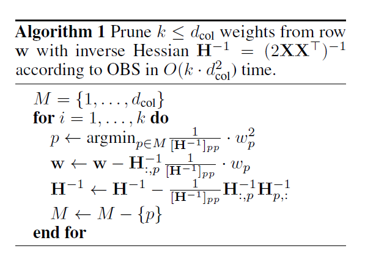
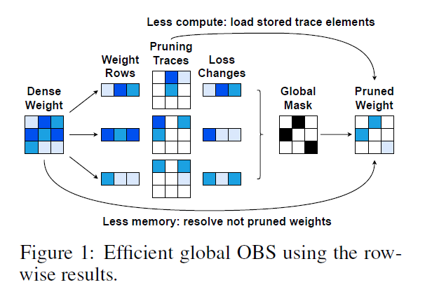

## 动机、参考资料、涉及内容

动机

- GPTQ 原理及源码解析: 理解一个具体的量化算法, 学习 torch cpp extension 的使用

参考资料

- 原始论文
- 原始代码仓库

涉及内容

- 原理解析: 只对论文的主体算法进行描述和补充, 更多细节还是参照原论文和代码

- 源码解析: 涉及到关于torch的cpp的部分直接就地进行说明, 涉及到 CUDA C 的部分也直接就地说明

不涉及内容

- 一般地量化方法介绍

## 前言

几个 repo 之间的联系

- GPTQ: 原始实现 [https://github.com/IST-DASLab/gptq](https://github.com/IST-DASLab/gptq)
- GPTQ-for-LLaMa: 应用于 Llama [https://github.com/qwopqwop200/GPTQ-for-LLaMa](https://github.com/qwopqwop200/GPTQ-for-LLaMa)
- AutoGPTQ: 更丰富的集成 [https://github.com/PanQiWei/AutoGPTQ.git](https://github.com/PanQiWei/AutoGPTQ.git)

本文主要研究原始实现 GPTQ

几篇论文间的关系, 参考 [知乎博客](https://zhuanlan.zhihu.com/p/616969812):

GPTQ 的原理来源于 OBC, 而 OBC 提出了对 OBS (一种经典的剪枝算法) 的改进算法, 并且将剪枝推广到量化场景的 OBQ 算法, 而 OBS 来源于 OBD (1990 年, 一作 Yann LeCun), 而 OBD 里更为详细的数学推导来源于 Yann LeCun 1987 年的博士论文

- [(2022.10 GPTQ) GPTQ: Accurate Post-Training Quantization for Generative Pre-trained Transformers](https://arxiv.org/abs/2210.17323)
- [(2022.08 OBC) Optimal Brain Compression: A Framework for Accurate Post-Training Quantization and Pruning](https://arxiv.org/abs/2208.11580v2)
- [(2022.03 oBERT) The Optimal BERT Surgeon Scalable and Accurate Second-Order Pruning for Large Language Models](https://arxiv.org/abs/2203.07259)
- [(1993 OBS) Optimal Brain Surgeon and general network pruning](https://www.babak.caltech.edu/pubs/conferences/00298572.pdf)
- [(1990 OBD) Optimal Brain Damage](https://proceedings.neurips.cc/paper/1989/file/6c9882bbac1c7093bd25041881277658-Paper.pdf)
- [(1987) Modeles connexionnistes de l'apprentissage](https://www.persee.fr/doc/intel_0769-4113_1987_num_2_1_1804)

备注: GPTQ 与 OBQ 的第一作者是相同的, 他也是 oBERT 的作者之一. OBQ 中引用了一些 oBERT 中的引理.

提示: 这篇论文的算法工程实现并不复杂, 理解难点主要在数学上, 因此本博客的前半部分不得不花大量篇幅说明论文提出的算法是怎么来的, 但为了尽量简单, 争取在论文原理描述结束后插入一节只描述最终算法流程的伪代码.

## 数学回顾

### 局部偏导, 二阶偏导

考虑如下形式
$$ z = g(\mathbf{y}), y_i=f_i(\mathbf{x}) $$

备注: 考虑上述形式的动机是, $f_i$ 是某一个 layer 的计算, 向量 $\mathbf{x}$ 是这一层的输入, 向量 $\mathbf{y}$ 是这一层的输出, 标量 $z$ 是整个网络最终计算的 loss.

根据链式法则, $z$ 对 $x_j$ 的偏导数有如下计算公式

$$
\frac{\partial{z}}{\partial{x_j}}=\sum_{i}{\frac{\partial{g}}{\partial{y_i}}\frac{\partial{f_i}}{\partial{x_j}}}
$$

备注: 这条公式对于自动微分局部导数的概念的理解比较重要, 这里暂不做深究

而 $z$ 对 $\mathbf{x}$ 的二阶偏导数为

$$
\begin{align*}
\frac{\partial^2{z}}{\partial{x_j}\partial{x_k}} &= \sum_{i}{
  \frac{\partial{\frac{\partial{g}}{\partial{y_i}}}}{\partial{x_k}}\frac{\partial{f_i}}{\partial{x_j}}+
  \frac{\partial{g}}{\partial{y_i}}\frac{\partial{\frac{\partial{f_i}}{\partial{x_j}}}}{\partial{x_k}}
}\\
&=\sum_{i,l}{\frac{\partial{f_i}}{\partial{x_j}}\frac{\partial{f_l}}{\partial{x_k}}\frac{\partial^2{g}}{\partial{y_i}{y_l}}} + \sum_{i}{\frac{\partial{g}}{\partial{y_i}} \frac{\partial^2{f_i}}{\partial{x_j}{x_k}}}
\end{align*}
$$

**例子**

$$
\begin{align*}
z=g(\mathbf{y})&=y_1y_2^2, \\
y_1=f_1(\mathbf{x})&=\sin(x_1)+x_1+x_2, \\
y_2=f_2(\mathbf{x})&=x_1x_2
\end{align*}
$$

因此, 直接计算 $z$ 对 $\mathbf{x}$ 的一阶、二阶偏导数如下

$$
\begin{align*}
z&=(\sin(x_1)+x_1+x_2)x_1^2x_2^2 \\
\frac{\partial{z}}{\partial{x_1}} &= 2x_1x_2^2\sin(x_1)+x_1^2x_2^2\cos(x_1)+3x_1^2x_2^2+2x_1x_2^3 \\
\frac{\partial{z}}{\partial{x_2}} &= 2x_1^2x_2\sin(x_1)+2x_1^3x_2+3x_1^2x_2^2 \\
\frac{\partial^2{z}}{\partial{x_1^2}} &= 2x_2^2\sin(x_1)+4x_1x_2^2\cos(x_1)-x_1^2x_2^2\sin(x_1)+6x_1x_2^2+2x_2^3\\
\frac{\partial^2{z}}{\partial{x_2^2}} &= 2x_1^2\sin(x_1)+2x_1^3+6x_1^2x_2\\
\frac{\partial^2{z}}{\partial{x_1}\partial{x_2}} &= 4x_1x_2\sin(x_1)+2x_1^2x_2\cos(x_1)+6x_1^2x_2+6x_1x_2^2\\
\end{align*}
$$

采用局部导数的方式计算如下:

$$
\begin{align*}
\frac{\partial{z}}{\partial{y_1}} &=y_2^2, \frac{\partial{z}}{\partial{y_2}} =2y_1y_2, \frac{\partial^2{z}}{\partial{y_1^2}} =0, \frac{\partial^2{z}}{\partial{y_2^2}} =2y_1, \frac{\partial^2{z}}{\partial{y_1}\partial{y_2}} =2y_2 \\

\frac{\partial{y_1}}{\partial{x_1}} &=\cos(x_1)+1, \frac{\partial{y_1}}{\partial{x_2}}=1, \frac{\partial^2{y_1}}{\partial{x_1^2}} = -\sin(x_1), \frac{\partial^2{y_1}}{\partial{x_2^2}} = 0, \frac{\partial^2{y_1}}{\partial{x_1}\partial{x_2}}=0 \\

\frac{\partial{y_2}}{\partial{x_1}} &=x_2, \frac{\partial{y_2}}{\partial{x_2}}=x_1, \frac{\partial^2{y_2}}{\partial{x_1^2}} = 0, \frac{\partial^2{y_2}}{\partial{x_2^2}} = 0, \frac{\partial^2{y_2}}{\partial{x_1}\partial{x_2}}=1
\end{align*}
$$

因此

$$
\begin{align*}
\frac{\partial{z}}{\partial{x_1}}&={\frac{\partial{z}}{\partial{y_1}}\frac{\partial{y_1}}{\partial{x_1}}}+{\frac{\partial{z}}{\partial{y_2}}\frac{\partial{y_2}}{\partial{x_1}}} = y_2^2(\cos(x_1)+1)+2y_1y_2x_2 \\
\frac{\partial{z}}{\partial{x_2}}&={\frac{\partial{z}}{\partial{y_1}}\frac{\partial{y_1}}{\partial{x_2}}}+{\frac{\partial{z}}{\partial{y_2}}\frac{\partial{y_2}}{\partial{x_2}}} = y_2^2+2y_1y_2x_1 \\

\frac{\partial^2{z}}{\partial{x_1^2}}&=(
  \frac{\partial^2{z}}{\partial{y_1^2}}\frac{\partial{y_1}}{\partial{x_1}}\frac{\partial{y_1}}{\partial{x_1}}
  +\frac{\partial^2{z}}{\partial{y_2^2}}\frac{\partial{y_2}}{\partial{x_1}}\frac{\partial{y_2}}{\partial{x_1}}
  +2\frac{\partial^2{z}}{\partial{y_1}\partial{y_2}}\frac{\partial{y_1}}{\partial{x_1}}\frac{\partial{y_2}}{\partial{x_1}}
  )
  +(
  \frac{\partial{z}}{\partial{y_1}}\frac{\partial^2{y_1}}{\partial{x_1^2}}
  + \frac{\partial{z}}{\partial{y_2}}\frac{\partial^2{y_2}}{\partial{x_1^2}}
  ) \\
  &=0+2y_1x_2^2+4y_2x_2(\cos(x_1)+1)-y_2^2\sin(x_1)+0 \\

\frac{\partial^2{z}}{\partial{x_2^2}}&=(
  \frac{\partial^2{z}}{\partial{y_1^2}}\frac{\partial{y_1}}{\partial{x_2}}\frac{\partial{y_1}}{\partial{x_2}}
  +\frac{\partial^2{z}}{\partial{y_2^2}}\frac{\partial{y_2}}{\partial{x_2}}\frac{\partial{y_2}}{\partial{x_2}}
  +2\frac{\partial^2{z}}{\partial{y_1}\partial{y_2}}\frac{\partial{y_1}}{\partial{x_2}}\frac{\partial{y_2}}{\partial{x_2}}
  )
  +(
  \frac{\partial{z}}{\partial{y_1}}\frac{\partial^2{y_1}}{\partial{x_2^2}}
  +\frac{\partial{z}}{\partial{y_2}}\frac{\partial^2{y_2}}{\partial{x_2^2}}
  ) \\
  &=0+2y_1x_1^2+4y_2x_1+0+0 \\

\frac{\partial^2{z}}{\partial{x_1}\partial{x_2}}&=(
  \frac{\partial^2{z}}{\partial{y_1^2}}\frac{\partial{y_1}}{\partial{x_1}}\frac{\partial{y_1}}{\partial{x_2}}
  +\frac{\partial^2{z}}{\partial{y_1}\partial{y_2}}\frac{\partial{y_1}}{\partial{x_1}}\frac{\partial{y_2}}{\partial{x_2}}
  +\frac{\partial^2{z}}{\partial{y_2}\partial{y_1}}\frac{\partial{y_2}}{\partial{x_1}}\frac{\partial{y_1}}{\partial{x_2}}
  +\frac{\partial^2{z}}{\partial{y_2^2}}\frac{\partial{y_2}}{\partial{x_1}}\frac{\partial{y_2}}{\partial{x_2}}
  )
  +(
  \frac{\partial{z}}{\partial{y_1}}\frac{\partial^2{y_1}}{\partial{x_1}\partial{x_2}}
  +\frac{\partial{z}}{\partial{y_2}}\frac{\partial^2{y_2}}{\partial{x_1}\partial{x_2}}
  ) \\
  &=0+2y_2(\cos(x_1)+1)x_1+2y_2x_2+2y_1x_2x_1+0+2y_1y_2

\end{align*}
$$

可以验证两种计算方式结果一致

### 拉格朗日乘子法

【TODO】

### Cholesky 矩阵分解

对于一个正定矩阵 $A$, 定义一系列 $n\times n$ 方阵: $A^{(1)},\ldots,A^{(n+1)}$, 其中 $A^{(1)}=A, A^{(n+1)}=\mathbf{I}$,

$$
A^{(i)}=\begin{bmatrix}
\mathbf{I}_{i-1} & 0 & \mathbf{0}^T \\
0 & a_{i, i} &  \mathbf{b}_i^T\\
\mathbf{0} &\mathbf{b}_i &B^{(i)}
\end{bmatrix}
$$

我们同样定义一系列下三角矩阵 $L^{(1)},\ldots L^{(n)}$

$$
L^{(i)}=\begin{bmatrix}
\mathbf{I}_{i-1} & 0 & \mathbf{0}^T \\
0 & \sqrt{a_{i, i} } &  \mathbf{0}^T\\
\mathbf{0} &\frac{1}{\sqrt{a_{i, i} } }\mathbf{b}_i & \mathbf{I}_{n-i}
\end{bmatrix}
$$

我们可以验证

$$
A^{(i)}=L^{(i)}A^{(i+1)}(L^{(i)})^T
$$

而

$$
A^{(i+1)} = \begin{bmatrix}
\mathbf{I}_{i-1} & 0 & \mathbf{0}^T \\
0 & 1 &  \mathbf{0}^T\\
\mathbf{0} &\mathbf{0} &B^{(i)}-\frac{1}{a_{i, i} }\mathbf{b}_i\mathbf{b}_i^T
\end{bmatrix}=

\begin{bmatrix}
\mathbf{I}_{i} & 0 & \mathbf{0}^T \\
0 & a_{i+1, i+1} &  \mathbf{b}_{i+1}^T\\
\mathbf{0} &\mathbf{b}_{i+1} &B^{(i+1)}
\end{bmatrix}
$$

如此, 我们最终会得到 $A=L^{(1)}L^{(2)}\cdots L^{(n)}\mathbf{I}(L^{(n)})^T\cdots (L^{(2)})^T(L^{(1)})^T$

即定义 $L=L^{(1)}L^{(2)}\cdots L^{(n)}$, 我们有 $A=LL^T$, 也就是 Cholesky 分解形式.

并且我们可以验证上述分解过程与最终得到的下三角矩阵 $L$ 有如下直接联系:

$$
L[i:, i] = L^{(i)}[i:, i],\quad i=1,...,n
$$

备注: 以上式子中的 $a_{i,i}$ 不是原始矩阵 $A$ 的 $(i,i)$ 元($a_{1,1}$ 除外)

## OBS: Optimal Brain Surgeon and general network pruning

此算法最初提出来用于做剪枝, 即将一个训练好的模型权重, 将其中的一部分置为 0 (同时也修改其余部分的参数值), 使得损失函数上升的尽可能地小.

假设模型权重为 $\mathbf{w}$, 假设参数总量为 $N$, 现在对 $\mathbf{w}$ 增加一个扰动 $\delta\mathbf{w}$, 那么损失 $E$ 的变化为:

$$
\delta E = (\frac{\partial{E}}{\partial{\mathbf{w}}})^T\delta\mathbf{w}+\frac{1}{2}(\delta\mathbf{w})^T\mathbf{H}\delta\mathbf{w}+O(\|\delta\mathbf{w}\|^3)
$$

我们假设参数已经优化完毕, 因此第一项的梯度都接近 0, 因此可以忽略, 第三项相比于第二项也可以忽略.

现在目标是希望**剪枝**, 即希望找到 $q\in\{1,...,N\}$ 以及最优的 $\delta\mathbf{w}$, 使得 $[\delta\mathbf{w}]_q=-[\mathbf{w}]_q$.

为此, 我们首先固定 $q$, 找到最优的 $\delta\mathbf{w}$, 即需要求解如下优化问题:

$$
\begin{align*}
&\min_{\delta\mathbf{w}}{\frac{1}{2}(\delta\mathbf{w})^T\mathbf{H}\delta\mathbf{w}}\\
s.t.\quad &e_q^T\delta\mathbf{w}+w_q=0
\end{align*}
$$

求解过程如下, 构造拉格朗日函数

$$
L(\delta\mathbf{w},\lambda)=\frac{1}{2}(\delta\mathbf{w})^T\mathbf{H}\delta\mathbf{w}+\lambda(\mathbf{e}_q^T\delta\mathbf{w}+w_q)
$$

因此需要求解如下方程组

$$
\begin{align*}
\mathbf{H}\delta{\mathbf{w}}+\lambda\mathbf{e}_q&=0\\
\mathbf{e}_q^T\delta\mathbf{w}+w_q&=0
\end{align*}
$$

由此计算可得:

$$
\begin{align*}
\delta\mathbf{w}&=-\mathbf{H}^{-1}\frac{w_q}{[H^{-1}]_{qq}}\mathbf{e}_q \\
L_{min}&=\frac{1}{2}\frac{w_q^2}{[H^{-1}]_{qq}}
\end{align*}
$$

因此 OBS 算法框架如下:

1. 首先对网络进行训练, 得到优化好的权重
2. 计算海塞矩阵的逆 $H^{-1}$
3. 根据 $L_{min}=\frac{1}{2}\frac{w_q^2}{[H^{-1}]_{qq}}$ 找出最小的 $q$, 如果由此得到的损失较小, 则进行第 4 步操作, 然后回到算法第 2 步继续; 否则进行第 5 步
4. 使用 $\delta\mathbf{w}$ 更新权重
5. 结束, 此时可能需要将剪枝部分的参数固定为 0, 重新训练整个网络

OBS 算法继续探讨了上述算法框架的一些细节, 例如计算海塞矩阵的逆等等, 因 GPTQ 算法没有采用这部分优化内容, 此处不再赘述. 这里只简单列出上述算法的几个重要缺陷:

- 每剪枝一个参数就需要计算一次海塞矩阵, 计算量极大, 并且对于参数量较大的情形, 存储海塞矩阵的逆本身就不可行
- 上述过程需要保证海塞矩阵的正定性, 基本上也无法保证
- 算法最后需要固定住剪枝部分的权重为 0 的情况下重新训练整个网络, 计算消耗较大

## OBC: Optimal Brain Compression: A Framework for Accurate Post-Training Quantization and Pruning

我们将模型的剪枝/量化问题重新定义为:

在训练好一个网络的权重后, 在给定一些校准样本的情况下, 对网络逐层进行权重的剪枝/量化, 我们假设只对全连接层的权重进行剪枝/量化, 即优化如下目标:

$$
\begin{equation}
\min_{\hat{W}_l}\|W_lX-\hat{W}_lX\|_2^2 \tag{OBC-1}
\end{equation}
$$

其中 $W_l$ 的形状为 $(d_{out}, d_{in})$, $X$ 为校准数据在第 $l$ 层的输入, 形状为 $(d_{in}, n)$, $n$ 为校准数据量, 我们的目标是对 $\hat W_l$ 增加“剪枝/量化约束”(即每个元素的取值是被剪枝/量化的), 使得上面定义的损失尽量小.

注意到, 在不进行剪枝/量化时, 即 $\hat W_l = W_l$ 时, 损失为 0, 因此此时为极小值点, 因此采用 OBS 的算法策略的前提条件得到满足, 因此可以用 OBS 算法进行权重剪枝, 然而正如前面所指出的, 每次裁剪一个权重分量都需要重新计算一次海塞矩阵的逆, 代价极大, 这里简单分析一下具体的计算量: 海塞矩阵的形状为 $(d=d_{in}\times d_{out}, d=d_{in}\times d_{out})$ ,

- 时间复杂度:
  - 计算海塞矩阵的计算量
  - 计算逆需要的时间复杂度为 $O(d^3)$, 剪枝可能要进行 $O(n)$ 次 (例如减去 20% 的权重), 因此总的计算量为 $O(d^4)$
- 空间复杂度: 存储海塞矩阵的逆需要 $(O(d^2))$ 空间
- 具体例子:
  - bert-base: hidden_size=768, intermediate_size=3072, 因此上面描述的 $d$ 约为 $2\times10^6$
  - llama 7B: hidden_size=4096, 最大的矩阵乘法发生在 feed-forward 处, intermediate_size=11008, 因此上面描述的 $d$ 约为 $4\times10^7$

因此, 对于剪枝, OBQ 论文提出了一些改进算法

### 剪枝: ExactOBS

首先考虑对上述优化的目标函数 \eqref{OBC-1}, 为简化符号, 我们之后省略掉下标 $l$, 损失函数可以进一步写为:

$$
\sum_{i=1,\ldots,d_{out}}{\|W_{i,:}X-\hat{W}_{i,:}X\|_2^2}
$$

我们可以断言: 按照 OBS 中的算法, 一旦我们确定了本次迭代中需要裁剪的参数为 $W_{i,j}$, 那么 $W$ 需要进行的变动只涉及到第 $i$ 行. 这一点可以从两个角度理解:

角度一: 从最小化损失的角度看, 损失的求和项是互相独立的, 因此最小化损失等价于最小损失每一项

角度二: 从 OBS 框架的每一步的更新公式看(注意这里的海塞矩阵是 $(d=d_{in}\times d_{out},d)$ 形状的), 每一步更新只会影响 $W$ 的第 $i$ 行.

因此我们的总体算法逻辑可以简化为如下:

每次迭代对每一行依据 OBS 更新公式计算损失下降的最小值 (注意到每一行有一个海塞矩阵, 一共只要存储 $d_row$ 个海塞矩阵及它的逆即可, 并且初始阶段实际上每一行的海塞矩阵都是相同的), 然后由这 $d_{out}$ 个最小值再取最小值决定本轮需要裁剪的参数 $W_{i,j}$. 然后更新 $W$ 的第 $i$ 行的参数 $W_{i,:}$ 及第 $i$ 行的海塞矩阵以及海塞矩阵的逆. 然后进行下一次迭代...

这样, 到目前为止, 有如下两点还能继续优化:

- (1) 我们需要 $O(d_{out}d_{in}^2)$ 的空间存储这些海塞矩阵
- (2) 对于每次迭代, 主要计算量是最后需要更新一行权重的海塞矩阵的逆, 时间复杂度为 $O(d_{col}^3)$, 所以整个剪枝完成总共需要 $O(d_{row}\times d_{col}^4)$ 的计算复杂度. 

我们首先考察第 (2) 点, 注意到, 每次迭代后更新海塞矩阵实际上可以简单通过一个 mask 然后取出子矩阵来完成: 例如对于第一轮迭代决定裁剪 $W_{i,j}$, 那么裁剪完后需要更新第 $i$ 行权重的海塞矩阵, 因为恰好海塞矩阵与 $W$ 无关, 所以只需要简单地将海塞矩阵 $H$ 的第 $j$ 行与第 $j$ 删除即可得到更新后的海塞矩阵 (形状减少1, 变为 $d_{in}-1$ ), 假设第 $k$ 轮继续决定裁剪第 $i$ 行的参数, 那么用同样的方法更新海塞矩阵, 海塞矩阵的形状变为 $d_{in}-2$. 然而对于求逆操作却只能重新计算


为清晰起见, 这里给出上述算法的实现代码【待补充, 未经进一步优化的剪枝算法】

```python
```

为了得到能快速更新海塞矩阵的逆的算法, 论文证明了如下引理

给定一个可逆且对角元素不为 0 的矩阵 $H$, 删除 $H$ 的第 $p$ 行与第 $p$ 列之后的矩阵 $H_{-p}$ 的逆为

$$
(H_{-p})^{-1}=[H^{-1}-\frac{1}{[H^{-1}]_{p,p}}(H^{-1})_{:,p}(H^{-1})_{p,:}]_{-p} \tag{OBC-2}
$$

于是, 每次迭代我们只需要 $O(d_{col}^2)$ 的时间复杂度就能更新海塞矩阵的逆, 避免了之前所指出的 $O(d_{col}^3)$.

原论文中关于此引理的证明有些含糊, 这里结合自己的理解给出证明, 首先, 假设 $A$ 是方阵, 且对角线元素 $a_{i, i}\neq 0$, 那么如下矩阵的第 $i$ 行与第 $i$ 列均为 $0$

$$
A-\frac{1}{a_{i,i}}A_{:,i}A_{i,:}
$$

这里用 $H^{-1}$ 取代上式中的 $A$, 用 $p$ 取代 $i$, 并定义:

$$
A = H^{-1}-\frac{1}{[H^{-1}]_{p,p}}(H^{-1})_{:,p}(H^{-1})_{p,:}
$$

因此, 矩阵 $A$ 的第 $p$ 行及第 $p$ 列均为 $0$, 那么

$$
\begin{align*}
\mathbf{I}&=H^{-1}H=(A+\frac{1}{a_{p,p}}A_{:,p}A_{p,:})H\\
&=AH+\mathbf{E}_{p,p}
\end{align*}
$$

这里用分块矩阵对上述等式进行拆分

$$
AH=
\begin{bmatrix}
A_1&\mathbf{0} &A_2 \\
\mathbf{0}^T &0 & \mathbf{0}^T \\
A_4&\mathbf{0} &A_3 \\
\end{bmatrix}
\begin{bmatrix}
H_1&\mathbf{h}_1 &H_2 \\
\mathbf{h}_4^T &h & \mathbf{h}_2^T \\
H_4&\mathbf{h}_3 &H_3 \\
\end{bmatrix}
=\begin{bmatrix}
\mathbf{I}     &\mathbf{0} &\mathbf{0} \\
\mathbf{0}^T   &0          &\mathbf{0}^T \\
\mathbf{0}     &\mathbf{0} &\mathbf{I} \\
\end{bmatrix}
$$

由此可得

$$
\begin{bmatrix}
A_1 &A_2 \\
A_4 &A_3
\end{bmatrix}
\begin{bmatrix}
H_1&H_2 \\
H_4&H_3
\end{bmatrix}
=\mathbf{I}
$$

注意到此时左边第 1 项为引理中的右式, 左边第 2 项恰巧为 $H_{-p}$, 所以引理得证.

备注: 原始论文中描述引理中的右式里的第 $p$ 行第 $p$ 列的元素除了第 $(p, p)$ 不为 0 其余均为 0, 实际上这里推导出来的结果是第 $p$ 行第 $p$ 列元素实际上全为 0. 

```python
# 验证引理的正确性
import torch

d, B = 32, 128
X = torch.randn((d, B))
H = 2 * X @ X.T / B  # 初始化一个正定矩阵
H_inv = torch.cholesky_inverse(torch.linalg.cholesky(H))  # 对初始正定矩阵求逆
i = 10  # 假设需要求删除了第 10 行, 第 10 列之后的矩阵的逆

def submatrix(A, i):
    A1 = torch.concat([A[:i, :], A[i+1:, :]], axis=0)
    A1 = torch.concat([A1[:, :i], A1[:, i+1:]], axis=1)
    return A1

# 直接求逆, 计算量为 O(d^3)
H1 = submatrix(H, i)
H1_inv = torch.cholesky_inverse(torch.linalg.cholesky(H1))

# 使用引理求逆, 计算量为 O(d^2)
H1_inv_whole = H_inv - 1 / H_inv[i, i] * (H_inv[:, i].unsqueeze(1) @ H_inv[i, :].unsqueeze(0))
H1_inv_cal = submatrix(H1_inv_whole, i)

# 验证两种方法求逆结果一致
torch.allclose(H1_inv, H1_inv_cal, atol=1e-6)
torch.allclose(H1_inv_whole[i], torch.zeros(d), atol=1e-6)
torch.allclose(H1_inv_whole[:, i], torch.zeros(d), atol=1e-6)
```

我们接下来, 我们回到第 (1) 条优化点: 如何避免 $O(d_{out}d_{in}^2)$ 的存储空间 (用于存储每一行的海塞矩阵的逆), 首先观察到, 每次我们需要在 $O(d_{row}, d_{col})$ 个参数中进行选择来剪枝, 但每次做出选择后, 只需要更新该行的参数及海塞矩阵的逆, 这表明参数更新的顺序是可以适当打乱的:

这里用一个例子进行说明可能会更直观一些, 假设我们要剪枝的矩阵是一个 $4\times 5$ 的矩阵 $W$, 我们现在对每行使用 OBS 算法(即不考虑其他行参数, 逐行进行剪枝), 剪枝过程明细如下:

```python
order = [
  [3, 1, 2, 0, 4],  # 表示按照OBS的贪心策略, 按W[0][3],W[0][1],W[0][2],W[0][0], W[0][4]顺序剪枝
  [1, 2, 3, 4, 0],
  [1, 2, 0, 3, 4],
  [3, 1, 0, 2, 4]
]
# 注意: loss中的损失增加量为迭代到该步骤时的最小的损失增加量数值
# 例如对于第一行的第一步, 按照order的顺序, 第一个被剪枝的权重为W[0][order[0][0]]=W[0][3]
# loss[0][3]=0.15, 表明此时如果对W[0][3]进行剪枝, 损失增加量为0.15, 但如果剪枝W[0,:]的其余参数, 损失均大于0.15
loss = [
  [0.01, 0.10, 0.04, 0.15, 0.20],
  [0.11, 0.02, 0.08, 0.07, 0.19],
  [0.06, 0.03, 0.05, 0.14, 0.17],
  [0.13, 0.12, 0.09, 0.16, 0.18]
]

global_order = []
nrows = 4  # W 的行数
ncols = 5  # W 的行数
next_idx = [0 for i in range(nrows)]

total_step = 6  # 假设总共进行 6 次剪枝
cur_step = 0
while cur_step < total_step:
  candidates = [((i, order[i][next_idx[i]]), loss[i][order[i][next_idx[i]]]) for i in range(nrows) if next_idx[i] < ncols]
  (i, j), min_loss_this_step = min(candidates, key=lambda item: item[1])
  # print(candidates)
  # print((i, j), min_loss_this_step)
  # W[i][j] = 0, update W[i], 此处从略
  next_idx[i] += 1
  global_order.append((i, j))
  cur_step += 1

# global_order = [(1, 1), (2, 1), (2, 2), (2, 0), (1, 2), (1, 3)]
```

其中 `loss` 的每一行代表该行参数按 OBS 算法剪枝过程中每一步的损失增加量, 而 `order` 代表每次剪枝的参数的下标. 例如: 在不考虑其他行的情况下, 只对 $W$ 的第一行进行剪枝, 剪枝顺序为 3, 1, 2, 0, 4. 注意到最终结果 `global_order` 里, 只看其中一行的结果, 例如第 2 行的相对顺序为 `[(2, 1), (2, 2), (2, 0)]`, 即 `[1, 2, 0]`, 它与 `order` 的第 2 行 `order[1] = [1, 2, 0, 3, 4]` 是完全一致的.

于是, 我们只需要预先逐行进行剪枝, 得到上面代码中的 `order` 和 `loss`, 这样我们只需要 $O(d_{col}, d_{col})$ 的存储空间来存储海塞矩阵的逆 (不必在内存中同时保存全部的 $d_{row}$ 个海塞矩阵), 得到 `order` 和 `loss` 需要的时间复杂度为:

$$
O(N\times d_{col}^2) + O(d_{col}^3)+O(d_{row}\times d_{col}\times d_{col}^2) = O(N\times d_{col}^2) + O(d_{row}\times d_{col}^3)
$$

其中第 1, 2 项为计算初始的海塞矩阵 $H$ 及其逆 $H^{-1}$ 所需要的计算复杂度, 第 3 项为总共进行 $d_{col}\times d_{row}$ 次剪枝所需要的计算复杂度. 接下来, 假设我们总共只需要进行 `step` 次剪枝, 则只需要根据 `global_order` 取出前 `step` 次, 然后进行剪枝, 这一剪枝过程有如下几个选项:

- 逐行重跑一遍剪枝过程, 重跑过程时间复杂度总共为 $O(d_{row}\times d_{col}^3 + \text{step}\times d_{col}^2)$
- 如果内存空间足够, 在记录 `order` 和 `loss` 的同时, 也可以记录 $W$ 的更新过程, 但这需要 $O(d_{row}\times d_{col}^2)$ 的存储空间, 这样可以避免重跑剪枝过程, 但这需要的存储空间实质上与出发点避免存储 $d_{row}$ 个海塞矩阵的逆就冲突了.
- 我们现在实际上已知了每一行需要剪枝的全部参数, 所以可以通过解一个优化问题直接得到这一行的最终权重, 这样子的时间复杂度为 $O(d_{row}\times d_{col}^3)$, 通过这种方式一般来说会更快些?

关于上面提到的最后一个选项, 作者引用了 oBERT, 但 oBERT 中的记号与 OBQ 论文中有一定的区别, 这里按照 OBQ 论文的记号重述一遍, 我们需要求解如下优化问题:

$$
\begin{align*}
&\min_{\delta\mathbf{w}}{\frac{1}{2}(\delta\mathbf{w})^T\mathbf{H}\delta\mathbf{w}}\\
s.t.\quad &e_q^T\delta\mathbf{w}+w_q=0, q\in Q
\end{align*}
$$

其中 $Q$ 是 $\{1,...,d_{col}\}$ 的子集, 对应于我们已经知道要对哪些参数进行剪枝, 同样使用拉格朗日乘子法, 首先引入记号 $E_Q$ 为一个 $(d_{col}, \lvert Q \rvert)$ 的矩阵, 且 $E_Q$ 除去 $(1, Q_1), (2, Q_2), ..., (\lvert Q \rvert, Q_{\lvert Q \rvert})$ 元为 $1$ 外, 其余位置皆为 $0$ 元, 而 $\mathbf{w}_Q$ 是一个 $\lvert Q \rvert$ 维向量, 表示取出 $\mathbf{w}$ 中下标在 $Q$ 中的元素, 这样我们可以将约束条件用如下方程来表达

$$
E_Q^T\delta\mathbf{w}+\mathbf{w}_Q=\mathbf{0}
$$

由拉格朗日乘子法, 引入 $\lvert Q \rvert$ 维向量拉格朗日乘子 $\boldsymbol{\lambda}$, 得到方程组

$$
\begin{align*}
\mathbf{H}\delta{\mathbf{w}}+E_Q\boldsymbol{\lambda}&=0\\
E_Q^T\delta\mathbf{w}+\mathbf{w}_Q&=\mathbf{0}
\end{align*}
$$

由此得到:

$$
\begin{align*}
\delta_{\mathbf{w}}&=-H^{-1}E_Q(E_Q^TH^{-1}E_Q)^{-1}\mathbf{w}_Q \notag \\
&=-(H^{-1})_{:,Q}[(H^{-1})_{Q,Q}]^{-1}\mathbf{w}_Q \tag{oBERT-1} \\
L_{min}&=\frac{1}{2}\mathbf{w}_Q^T[(H^{-1})_{Q,Q}]^{-1}\mathbf{w}_Q \notag
\end{align*}
$$

这里 $H_{:,Q}^{-1}$ 是一个 $d_{col}\times\lvert Q \rvert$ 的矩阵, $(H^{-1})_{Q,Q}$ 表示 $H^{-1}$ 取出 $Q$ 中的行和列构成的 $\lvert Q \rvert \times \lvert Q \rvert$ 方阵.

这样便可以通过 \eqref{oBERT-1} 来直接计算出最终每一行的 $\mathbf{w}$ 了. 使用这种方式进行计算, 每一行只需要进行一次计算就可以得到结果, 避免了循环, 但时间复杂度上从阶的概念上说应该是与重新逐个参数迭代是相同的

备注: 在已知 $Q$ 的情况下, 上述优化目标与逐次剪枝一个个的参数得到的结果是一样的


### 剪枝: 补充及总结

对于一行的剪枝过程, 原论文中的 Algorithm 1 如下:



需要补充说明的是, 这个算法里并没有持续地缩减 $H^{-1}$ 的大小, 但因为每次迭代都会把 $H^{-1}$ 的第 $p$ 行及第 $p$ 列变为 0, 可以验证这里的算法的正确性

针对显存不够用于存储 $d_{row}$ 个 $d_{col}\times d_{col}$ 大小的 $H^{-1}$ 矩阵的情况, 补充算法如原论文中的 Figure 1 所示



这张图有必要做一些的注解:

- 左数第一列是待剪枝的稠密矩阵 $W$, 形状为 $(d_{row}=d_{out}=3, d_{col}=d_{in}=3)$
- 左数第二列表示将其按行拆分, 准备逐行进行操作
- 左数第三和第四列表示逐行按照 Algorithm 1 进行剪枝, Pruning Traces 表示每一行每个迭代步骤结束后的剪枝结果, 以第一行的 Pruning Traces 矩阵为例, 矩阵的形状为 $d_{col}, d_{col}$, 其中矩阵的第一行表示第一次迭代的结果, 按图中表示, 先剪枝了 $W_{1,1}=0$ (Pruning Traces 矩阵的第一行第一列为白色表示被剪枝), 然后再剪枝 $W_{1,3}=0$ (Pruning Traces 矩阵的第二行第三列变为白色), 最后再剪枝 $W_{1,2}=0$, 并记录下这三步操作时每一步 loss 的增加量(Loss Changes, 颜色越深表示损失越大), 注意这张图里 Loss Changes 中的第一行的第二个元素表示的是剪枝 $W_{1,2}$ 时的损失增量, 这对应于第三步操作.
- 左数第五列表示根据前一步骤得到 Loss Changes 确定最终需要修剪的权重, 在图中需要将 6 个权重置为 0, 即白色框代表该位置的权重需要被剪枝
- Less compute: load stored trace elements, 表示如果存储了 Pruning Traces 时(论文中表示如果 CPU 内存足够大时可以这么干), 可以不用重新跑剪枝过程. 注意: 在这个例子中, 根据 Global Mask 可以看出, 每一行最终都剪枝了 2 个元素, 所以最终的 Pruned Weight 由每个 Pruning Traces 矩阵的第 2 行拼成
- Less memory: resolve not pruned weights, 表示如果没有足够空间可以存储 Pruning Traces 时, 可以决定了 Global Mask 之后, 在逐行重跑一遍剪枝过程或者直接进行一次参数更新就能得到这一行的剪枝结果

总的来说, Global OBS 的计算时间复杂度为:

$$
O(N^2 d_{in})+O(d_{in}^3)+O(d_{out}\times d_{in}\times d_{in}^2) \tag{OBC-2}
$$

其中第一项是使用样本矩阵 $X$ 计算海塞矩阵, 第二项是对海塞矩阵求逆, 第三项是为了计算 Global Mask 所需的时间复杂度, 得到 Global Mask 后, 重新计算剪枝后结果的时间复杂度至多也为第三项.

其他补充:

- 前面的算法都要求海塞矩阵 $H$ 是正定的, 由目标函数可以看出, 海塞矩阵是半正定的, 实现上可以加一个 $\epsilon I$ 来保证其正定性, 数值上溢或下溢问题可以考虑采用 float64 存储海塞矩阵
- 论文中还考虑了要求剪枝后的权重矩阵满足 N:M Sparse 条件和 Block Sparse 条件, 这两种情况下本论文的算法做适当改变都能处理, 但在这里就不多加赘述

### 量化: OBQ

假设给定一个量化函数(单变量实值函数) $\text{quant}$, 例如: $\text{quant}(x)= \arg\min_{k\Delta}{\lvert x-k\Delta \rvert}, k\in\mathbb{Z}$, 在量化的情形, OBS 框架的优化问题转化为:

$$
\begin{align*}
&\min_{\delta\mathbf{w}}{\frac{1}{2}(\delta\mathbf{w})^T\mathbf{H}\delta\mathbf{w}}\\
s.t.\quad &e_q^T\delta\mathbf{w}=\text{quant}(w_q)-w_q
\end{align*}
$$

同样使用拉格朗日乘子法得到:

$$
\begin{align*}
\delta\mathbf{w}&=-\mathbf{H}^{-1}\frac{w_q-\text{quant}(w_q)}{[H^{-1}]_{qq}}\mathbf{e}_q \\
L_{min}&=\frac{1}{2}\frac{ {(w_q-\text{quant}(w_q))}^2}{[H^{-1}]_{qq}}
\end{align*}
$$

备注: 剪枝实际上可以看作特殊的量化, 即量化函数 $\text{quant}(x)=0$, 并且注意用这个特殊的量化函数代入上式之后, 实际上也就回到了 OBS 框架的结果.

上面的算法也引出了 GPTQ 相比于普通的量化算法的显著不同之处, 一般的量化过程分为两步:

- 设计一个量化函数, 确定好量化函数后独立应用于每一个权重分量
- 将原本的权重与输入的计算在量化空间内进行
- 将结果反量化

例如对于矩阵乘法的量化, 通常的做法是先将输入及权重量化到整数, 然后用整数矩阵乘法代替原本的浮点数计算, 然后在反量化得到计算结果.

前面关于剪枝的算法可以直接用于量化场景, 算法是类似的

### 量化: 补充【待完善】

这里有些关于量化函数的选择, outliner 的处理细节, 可能需要看代码理解


### 实现细节备注

本博客不对 OBC 算法的实现进行太细致的分析, 只简要提几点:

- 初始的海塞矩阵的计算在实现上是通过 pytorch 的 `torch.nn.Module.register_forward_hook` 来实现的. 在实现中是一次性算好了全部层的海塞矩阵的, 个人认为从浅层开始一层一层计算可能更好(第二层的海塞矩阵应该在第一层量化后, 校准数据使用第一层量化后的权重来计算作为第二层的输入, 从而得到第二层的海塞矩阵)

## GPTQ

本节正式介绍 GPTQ 的原理, 首先对问题定义做一个正式的描述, GPTQ 量化算法属于所谓的 post-train 的量化算法, 并且量化算法采用逐层的方式进行. 论文的亮点在于:

- 能对 100B 规模的模型例如 OPT, BLOOM, LLAMA 进行有效的量化, 且量化精度可以达到 int4 甚至 int3, 举例而言, 假设 170B 的模型使用 int4 进行存储, 则只需要 83GB (以1024为基数) 的存储空间, 如果使用 int3 进行存储则只需要 64GB 的存储空间, 那么在显存为 80GB 的 A100 上使用单张显卡就可以运行.
- 量化算法运行时间短, 论文声称能用大约 4 小时对 170B 参数量的模型进行量化.
- 注意: 该论文对 int4/int3 的模型的推理过程并没有太多的优化, 因此运行速度上并没有得到太多提升. 该论文的重点在于怎样得到量化权重, 代码中也实现了量化后模型的推理, 但没有做太多优化, 因为现阶段硬件层面, 不像 float16, bf16, int8 等数据类型那样, 英伟达显卡没有int3/int4运算的优化, 甚至于不支持 int3/int4 数据类型, 在 GPTQ 的代码实现中int3的存储时借用int32来实现的.

根据 \eqref{OBC-2}, 我们知道 OBQ 算法对于一层权重的时间复杂度为 $O(d_{out}\times d_{in}^3)$, GPTQ 论文指出这个时间复杂度对于大模型还是太慢了. 因此对 OBQ 算法做了一些改进.

### 参数量化顺序固定

作者指出, OBQ 算法中每次都要挑选需要量化的参数, 这可能是不必要的, 因此提出固定量化的参数的顺序, $W$ 的每一行都按相同的次序进行量化, 例如从左到右量化, 这样子每一行的海塞矩阵在每次迭代后都会保持同步, 这样子量化一层权重的时间复杂度降低为 $min(d_{in}^3,d_{out}\times d_{in}^2)$, 其中第一项即为上述固定优化顺序带来的, 而第二项是因为每次迭代都需要对每一行进行一次参数更新, 时间复杂度为 $O(d_{out}\times d_{in})$, 一共需要 $d_{in}$ 次迭代

### Lazy Batch-Updates

此部分还需仔细品味, 大概的逻辑如下: 注意到, 每次迭代都需要更新整个海塞矩阵的逆以及对整个权重进行更新, 这个操作类似激活函数, 会被内存带宽拖慢速度. 因此作者提出可以一批的列进行更新, 例如每次只量化 128 列参数, 量化过程中只对这 128 列参数进行更新(仍然需要循环128次), 结束时再一次性更新其他列 (这 128 列之后的全部列) 的全部参数. 通过这种手段减少了参数更新过程中内存带宽的使用.

### Cholesky Reformulation

对于需要频繁更新整个海塞矩阵的逆, 作者观察到 \eqref{OBC-2} 式的更新公式与 Cholesky 矩阵分解之间的联系, 从而避免了对海塞矩阵逆的更新

### 算法

【引用论文的图并进行解释】

## 源码解析: 总体说明

【待补充】

## vecquant3matmul

```c++
void vecquant3matmul_cuda(
  torch::Tensor vec, torch::Tensor mat, torch::Tensor mul,
  torch::Tensor scales, torch::Tensor zeros
);
```

- `vec`: shape (1, in_feat), dtype float32/float16
- `mat`: shape (in_feat/32*3, out_feat), dtype int32, 实际表示的是 3bit 整数
- `mul`: shape (out_feat,), dtype float32/float16, bias, **最终结果**累加到 `mul` 上
- `scales`: shape (out_feat,), dtype float32/float16, 量化的 scale 因子
- `zeros`: shape (out_feat,), dtype float32/float16, 量化零点的浮点数表示

这里对 `mat` 进行进一步的说明, 假设原始未量化的权重为 shape (in_feat, out_feat), dtype int32, 量化后(如果是 per-channel, 则表示对每一列分别进行 3bit int 量化)得到的权重矩阵为 shape (in_feat, out_feat), dtype int32, 实际取值为 `[0, 7]`, 之后按如下方式将其压缩存入 `mat` 中: (in_feat/32*3, out_feat)

```python
# 量化后的权重, in_feat=32, out_feat=1
weight = np.array([
    [1, 3, 5, 7, 0, 1, 6, 1, 1, 0,  # 001 010 101 111 000 001 110 001 001 000
     2, 1, 3, 4, 3, 5, 1, 0, 3, 5,  # 010 001 011 100 011 101 001 000 011 101
     1, 4, 5, 7, 0, 0, 4, 5, 1, 7,  # 001 100 101 111 000 000 100 101 001 111
     2, 5]                          # 010 101
    ], dtype=np.int32).T

# 10 000 001 001 110 001 000 111 101 010 001  # 第10个的最后2位放在最高位, 第9个放在次高位, ..., 第0个放在最低位
# 0 001 101 011 000 001 101 011 100 011 001 0  # 第10个的最高位放在最低位, 其余同理
# 101 010 111 001 101 100 000 000 111 101 10

# 按3bit进行压缩存储
mat = np.array([[
    0b10000001001110001000111101010001,
    0b00011010110000011010111000110010,
    0b10101011100110110000000011110110
]], dtype=np.int32).T  # 这里源码中是torch.int32存储的(torch没有uint32类型)
```

用法如下 `Quant3Linear.forward`


下面看具体的实现（此处源码理解后再进行一定的删减）

```c++
// quant_cuda_kernel.cu
#include <torch/all.h>
#include <torch/python.h>
#include <cuda.h>
#include <cuda_runtime.h>
#include <cuda_fp16.h>

const int BLOCKWIDTH  = 256;
const int BLOCKHEIGHT =  24;

void vecquant3matmul_cuda(
  torch::Tensor vec,
  torch::Tensor mat,
  torch::Tensor mul,
  torch::Tensor scales,
  torch::Tensor zeros
) {
  int height = mat.size(0);
  int width = mat.size(1);

  dim3 blocks(
    (height + BLOCKHEIGHT - 1) / BLOCKHEIGHT,
    (width + BLOCKWIDTH - 1) / BLOCKWIDTH
  );
  dim3 threads(BLOCKWIDTH);

  AT_DISPATCH_FLOATING_TYPES(
    vec.type(), "vecquant3matmul_cuda", ([&] {
      VecQuant3MatMulKernel<<<blocks, threads>>>(
        vec.data<scalar_t>(), mat.data<int>(), mul.data<scalar_t>(),
        scales.data<scalar_t>(), zeros.data<scalar_t>(),
        height, width
      );
    })
  );
}

template <typename scalar_t>
__global__ void VecQuant3MatMulKernel(
    const  scalar_t* __restrict__ vec,
    const       int* __restrict__ mat,
           scalar_t* __restrict__ mul,
    const  scalar_t* __restrict__ scales,
    const  scalar_t* __restrict__ zeros,
    int height,
    int width
) {
  int row = BLOCKHEIGHT * blockIdx.x;
  int col =  BLOCKWIDTH * blockIdx.y + threadIdx.x;

  __shared__ scalar_t blockvec[BLOCKWIDTH];
  blockvec[threadIdx.x] = vec[(row / BLOCKHEIGHT) * BLOCKWIDTH + threadIdx.x];
  __syncthreads();

  scalar_t scale = scales[col];
  scalar_t zero = zeros[col];

  scalar_t res = 0;
  int i = width * row + col;
  int k = 0;

  unsigned int tmp1;
  unsigned int tmp2;
  unsigned int tmp;

  while (k < BLOCKWIDTH) {
    tmp1 = as_unsigned(mat[i]);
    res += (scale * scalar_t((tmp1 >>  0) & 0x7) - zero) * blockvec[k + 0];
    res += (scale * scalar_t((tmp1 >>  3) & 0x7) - zero) * blockvec[k + 1];
    res += (scale * scalar_t((tmp1 >>  6) & 0x7) - zero) * blockvec[k + 2];
    res += (scale * scalar_t((tmp1 >>  9) & 0x7) - zero) * blockvec[k + 3];
    res += (scale * scalar_t((tmp1 >> 12) & 0x7) - zero) * blockvec[k + 4];
    res += (scale * scalar_t((tmp1 >> 15) & 0x7) - zero) * blockvec[k + 5];
    res += (scale * scalar_t((tmp1 >> 18) & 0x7) - zero) * blockvec[k + 6];
    res += (scale * scalar_t((tmp1 >> 21) & 0x7) - zero) * blockvec[k + 7];
    res += (scale * scalar_t((tmp1 >> 24) & 0x7) - zero) * blockvec[k + 8];
    res += (scale * scalar_t((tmp1 >> 27) & 0x7) - zero) * blockvec[k + 9];
    i += width;
    tmp2 = as_unsigned(mat[i]);
    tmp = (tmp1 >> 30) | ((tmp2 << 2) & 0x4);
    tmp2 >>= 1;
    res += (scale * scalar_t(tmp) - zero) * blockvec[k + 10];
    k += 11;
    res += (scale * scalar_t((tmp2 >>  0) & 0x7) - zero) * blockvec[k + 0];
    res += (scale * scalar_t((tmp2 >>  3) & 0x7) - zero) * blockvec[k + 1];
    res += (scale * scalar_t((tmp2 >>  6) & 0x7) - zero) * blockvec[k + 2];
    res += (scale * scalar_t((tmp2 >>  9) & 0x7) - zero) * blockvec[k + 3];
    res += (scale * scalar_t((tmp2 >> 12) & 0x7) - zero) * blockvec[k + 4];
    res += (scale * scalar_t((tmp2 >> 15) & 0x7) - zero) * blockvec[k + 5];
    res += (scale * scalar_t((tmp2 >> 18) & 0x7) - zero) * blockvec[k + 6];
    res += (scale * scalar_t((tmp2 >> 21) & 0x7) - zero) * blockvec[k + 7];
    res += (scale * scalar_t((tmp2 >> 24) & 0x7) - zero) * blockvec[k + 8];
    res += (scale * scalar_t((tmp2 >> 27) & 0x7) - zero) * blockvec[k + 9];
    i += width;
    tmp1 = as_unsigned(mat[i]);
    tmp = (tmp2 >> 30) | ((tmp1 << 1) & 0x6);
    tmp1 >>= 2;
    res += (scale * scalar_t(tmp) - zero) * blockvec[k + 10];
    k += 11;
    res += (scale * scalar_t((tmp1 >>  0) & 0x7) - zero) * blockvec[k + 0];
    res += (scale * scalar_t((tmp1 >>  3) & 0x7) - zero) * blockvec[k + 1];
    res += (scale * scalar_t((tmp1 >>  6) & 0x7) - zero) * blockvec[k + 2];
    res += (scale * scalar_t((tmp1 >>  9) & 0x7) - zero) * blockvec[k + 3];
    res += (scale * scalar_t((tmp1 >> 12) & 0x7) - zero) * blockvec[k + 4];
    res += (scale * scalar_t((tmp1 >> 15) & 0x7) - zero) * blockvec[k + 5];
    res += (scale * scalar_t((tmp1 >> 18) & 0x7) - zero) * blockvec[k + 6];
    res += (scale * scalar_t((tmp1 >> 21) & 0x7) - zero) * blockvec[k + 7];
    res += (scale * scalar_t((tmp1 >> 24) & 0x7) - zero) * blockvec[k + 8];
    res += (scale * scalar_t((tmp1 >> 27) & 0x7) - zero) * blockvec[k + 9];
    i += width;
    k += 10;
  }

  atomicAdd(&mul[col], res);
}
```

## 参考资料补充及扩展阅读

- N:M Sparsity: 即连续的 M 个权重中, 只有 N 个非零元
  - 论文: [(2021.02) Learning N:M Fine-grained Structured Sparse Neural Networks From Scratch](https://arxiv.org/abs/2102.04010)
  - 代码: [https://github.com/aojunzz/NM-sparsity](https://github.com/aojunzz/NM-sparsity)
  - 说明: 似乎 A100 对这种 Sparse 权重模式有一些硬件上的支持, OBC 论文中有引用这篇文献

- Block Sparsity: 即权重中非零元出现都是以小块状的形式出现, 例如连续的4个权重全为零元
  - 论文 1: [(2019.10) Fast Sparse ConvNets](https://arxiv.org/abs/1911.09723)
  - 论文 2: [(2020) Inducing and Exploiting Activation Sparsity for Fast Neural Network Inference](http://proceedings.mlr.press/v119/kurtz20a/kurtz20a.pdf)
  - 说明: OBC 论文中有引用这两篇文献, 似乎在 CPU 上有一些硬件加速支持