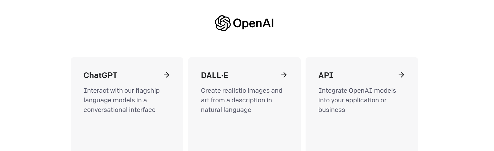

## 动机、参考资料、涉及内容

动机

- 梳理 ChatGPT 与 GPT4 的使用
- 为学习 LangChain 等利用大模型做应用做准备

**参考资料**

- openai官网: [https://openai.com/](https://openai.com/)
- openai API 文档: [https://platform.openai.com/docs](https://platform.openai.com/docs)
- **使用示例(公共维护)**: [https://github.com/openai/openai-cookbook](https://github.com/openai/openai-cookbook)
- **使用示例教程(公共维护)**: [https://cookbook.openai.com/](https://cookbook.openai.com/)
- openai官方 Python API 封装仓库: [https://github.com/openai/openai-python](https://github.com/openai/openai-python)
- chatml: [https://github.com/openai/openai-python/blob/main/chatml.md](https://github.com/openai/openai-python/blob/main/chatml.md), 备注: 这个[提交](https://github.com/openai/openai-python/commit/08b8179a6b3e46ca8eb117f819cc6563ae74e27d)已移除
- tiktoken 仓库: [https://github.com/openai/tiktoken](https://github.com/openai/tiktoken)
- token 数量估算网页: [https://platform.openai.com/tokenizer](https://platform.openai.com/tokenizer)


涉及内容

- OpenAI 账号申请
- gpt3.5/gpt4 的网页版使用及 API 调用
- gpt3.5/gpt4 模型版本及调用量约束等
- 代理相关的网络知识简单理解(可能会误解)

## 功能对比

<table>
<tr>
  <th>入口</th>
  <th>模型</th>
  <th>生成参数控制</th>
  <th>工具</th>
  <th>上下文长度限制</th>
</tr>
<tr>
  <td>ChatComplete API</td>
  <td>全部: gpt-3.5-turbo, gpt-4-turbo 等</td>
  <td>top_p, temperature 等</td>
  <td>function call</td>
  <td>固定长度限制 8k/16k/128k</td>
</tr>
<tr>
  <td>Assistant API/playground</td>
  <td>全部: gpt-3.5-turbo, gpt-4-turbo 等</td>
  <td>无</td>
  <td>function call, retrieval, code interpreter</td>
  <td>无限长度(自动截断或其他处理)</td>
</tr>
<tr>
  <td>ChatGPT Free</td>
  <td>gpt-3.5</td>
  <td>无</td>
  <td>无</td>
  <td>固定长度限制</td>
</tr>
<tr>
  <td>ChatGPT Plus</td>
  <td>gpt-3.5/gpt-4</td>
  <td>无</td>
  <td>第三方插件, function call, retrieval, code interpreter</td>
  <td>固定长度限制?</td>
</tr>
<tr>
  <td>ChatGPT Plus (Assistant)</td>
  <td>gpt3.5/gpt-4</td>
  <td>无</td>
  <td>第三方插件?, function call, retrieval, code interpreter</td>
  <td>无限长度(自动截断或其他处理)</td>
</tr>
</table>

## 流程梳理

- 网页对话机器人(ChatGPT): [https://chat.openai.com/chat](https://chat.openai.com/chat)
- API 调用:

注册 OpenAI 账号:
- 注册过程中需要绑定一个手机号, 会通过手机验证码来验证
- 注册成功后会送 5 美元 (无论是否绑定银行卡), 注意 5 美元额度会有过期时间
- 如果需要充值, 则需要绑定银行卡

ChatGPT的使用及收费方式如下(截至至2023/07/24):
- 前置条件: 注册 OpenAI 账号
- 使用方式: 通过网页对话框的方式进行对话
- 收费方式:
  - 不充值: 可以使用 GPT3.5 (暂不确定究竟是哪个模型)
  - 充值【待确认】: 每月20美元, 可以使用 GPT4 (暂不确定究竟是哪个模型), 可以使用插件?

API 调用的使用及收费方式如下:
- 前置条件: 注册 OpenAI 账号, 如果注册后不绑定银行卡, 则只能使用赠送的 5 美元额度
- 使用方式: 参考 API 文档, 可以直接构造 HTTP 请求进行调用, 也可以使用 OpenAI 官方封装的 python 包进行调用
- 收费方式: 按输入输出 token 数计费, 优先使用赠送的 5 美元额度. token 消耗量获取方式有几种
  - 可以在账号页面查看费用, 大致估算总体使用量
  - API 响应参数里会包含 token 数信息
  - 可以使用这个网页或者 tiktoken 包进行计算确认

## OpenAI 账号相关


## 网页版对话

略

## API

API官方文档:

- [https://platform.openai.com/](https://platform.openai.com/)

设置代理:

```python
# 方法1
import os
os.environ["http_proxy"] = "http://127.0.0.1:7890"
os.environ["https_proxy"] = "http://127.0.0.1:7890"

# 方法2
import openai
openai.proxy = "http://127.0.0.1:7890"
```

设置 API KEY:

```python
# 方法1
import os
os.environ["OPENAI_API_KEY"] = "sk-xxxx"

# 方法2
import openai
openai.api_key = "sk-xxxx"
```

### Raw HTTP

#### stream 的用法 (2024/01/18 update)

```python
import requests
data = dict(
    model="gpt-3.5-turbo-1106",
    messages=[
        {"role": "system", "content": "You are a helpful assistant."},
        {"role": "user", "content": "Who won the world series in 2020?"},
        {"role": "assistant", "content": "The Los Angeles Dodgers won the World Series in 2020."},
        {"role": "user", "content": "Where was it played?"}
    ],
    stream=True
)
url = "	https://api.openai.com/v1/chat/completions"
headers = {
    'Authorization': 'Bearer sk-xxx',
    'Content-Type': 'application/json',
  }
resp = requests.post(
    url,
    headers=headers,
    json=data
)
for line in resp.iter_lines():
    print(line)
```

#### Lagacy Completion 接口 openai-python 用法的底层实现 (仅供参考, zhe'li)

下面的例子演示了 `stream=True`, 本质上是打开了 `openai.Completion.create` 的细节, 适用于 `openai-python==0.27.10` 版本, 仅供理解

本质上是

```python
import requests
resp = requests.post(url, headers=headers, data=data)
for line in resp.iter_lines():
    process_str_or_bytes(line)  # 处理数据
```

示例

```python
import openai
import os
openai.api_key = "sk-xxx"

kwargs = {
    "prompt": "1+1",
    "model": "text-davinci-003",
    "max_tokens": 1965,
    "temperature": 1.0,
    "top_p": 1.0,
    "n": 3,
    "stream": True,
    "stop": [
        "\n20",
        "20.",
        "20."
    ],
    "presence_penalty": 0.0,
    "frequency_penalty": 0.0,
    "suffix": None,
    "logprobs": 5,
    "echo": True,
    "logit_bias": {
        "50256": -100
    }
}
# 这里用了 python 的 name mangling 来调用双下划线开头的方法, 非常规方式
(
    deployment_id,
    engine,
    timeout,
    stream,
    headers,
    request_timeout,
    typed_api_type,
    requestor,
    url,
    params,
) = openai.Completion._EngineAPIResource__prepare_create_request(**kwargs)

# ===== 以下内容下面会继续展示细节 ======
response, _, api_key = requestor.request(
    "post",
    url,
    params=params,  # 在这个例子中, params 和最开始设置的 kwargs 完全一致
    headers=headers,
    stream=stream,
    request_id=None,
    request_timeout=request_timeout,
)
# response 是一个生成器: generator
lines = [line for line in response]

# lines[0].data 是一个字典, 在 openai.Completion.create 中, 实际上还会进一步封装为 OpenAIObject
lines[0].data
```

以下内容是 `requestor.request` 的执行步骤

```python
import requests
import json
from openai.openai_response import OpenAIResponse

def parse_stream_helper(line):
    if line:
        if line.strip() == b"data: [DONE]":
            return None
        if line.startswith(b"data: "):
            line = line[len(b"data: "):]
            return line.decode("utf-8")
        else:
            return None
    return None


def parse_stream(rbody):
    for line in rbody:
        _line = parse_stream_helper(line)
        if _line is not None:
            yield _line


def _interpret_response_line(
    rbody: str, rcode: int, rheaders, stream: bool
):
    if rcode == 204:
        return OpenAIResponse(None, rheaders)
    if 'text/plain' in rheaders.get('Content-Type', ''):
        data = rbody
    else:
        data = json.loads(rbody)
    resp = OpenAIResponse(data, rheaders)
    return resp

# 这一步骤主要的把 url 加上 base_url, 加上必要的 headers, 请求参数转为字节类型
abs_url, headers, data = requestor._prepare_request_raw(
    url, headers, "post", params, files=None, request_id=None
)

# abs_url:
# https://api.openai.com/v1/completions

# headers:
# {'X-OpenAI-Client-User-Agent': '{"bindings_version": "0.28.1", "httplib": "requests", "lang": "python", "lang_version": "3.9.16", "platform": "Linux-5.10.16.3-microsoft-standard-WSL2-x86_64-with-glibc2.31", "publisher": "openai", "uname": "Linux 5.10.16.3-microsoft-standard-WSL2 #1 SMP Fri Apr 2 22:23:49 UTC 2021 x86_64"}', 'User-Agent': 'OpenAI/v1 PythonBindings/0.28.1', 'Authorization': 'Bearer sk-xxxx', 'Content-Type': 'application/json'}

# data
# b'{"prompt": "count number from 1 to 30: 1,2,3,4,5,", "model": "gpt-3.5-turbo-instruct", "max_tokens": 1965, "temperature": 1.0, "top_p": 1.0, "n": 3, "stream": true, "stop": ["20", "20,", ",20"], "presence_penalty": 0.0, "frequency_penalty": 0.0, "suffix": null, "echo": true}'

result = requests.request(
    "post",
    abs_url,
    headers=headers,
    data=data,
    files=None,
    stream=stream,
    timeout=600
)


resp = (
    _interpret_response_line(
        line, result.status_code, result.headers, stream=True
    )
    for line in parse_stream(result.iter_lines())
)

lines = list(resp)
print("".join([x.data['choices'][0]['text'] for x in lines]))
```

### openai-python

```python
import openai
import os

openai.proxy = "http://127.0.0.1:7890"
openai.api_key = "sk-xxxx"

completion = openai.ChatCompletion.create(
  model="gpt-3.5-turbo",
  messages=[
    {"role": "system", "content": "You are a helpful assistant."},
    {"role": "user", "content": "Hello!"}
  ]
)

print(completion.choices[0].message)
print()
print(completion)  # json.loads(str(completion)) 似乎更好?
# completion 是 openai.openai_object.OpenAIObject 对象, 重载了 __repr__ 

completion.to_dict_recursive()  # 转化为字典
```

```
<OpenAIObject at 0x151ffd04d08> JSON: {
  "role": "assistant",
  "content": "Hello! How can I assist you today?"
}

<OpenAIObject chat.completion id=chatcmpl-7ffC8bop9PLLFxkEkGK0oEFFRLKQL at 0x151ffd046a8> JSON: {
  "id": "chatcmpl-7ffC8bop9PLLFxkEkGK0oEFFRLKQL",
  "object": "chat.completion",
  "created": 1690164156,
  "model": "gpt-3.5-turbo-0613",
  "choices": [
    {
      "index": 0,
      "message": {
        "role": "assistant",
        "content": "Hello! How can I assist you today?"
      },
      "finish_reason": "stop"
    }
  ],
  "usage": {
    "prompt_tokens": 19,
    "completion_tokens": 9,
    "total_tokens": 28
  }
}
```

这里分析一下上面的代码经过“解封装”后实际的执行内容为

```python
import requests
MAX_CONNECTION_RETRIES = 2

proxy = "http://127.0.0.1:7890"
s = requests.Session()
proxies = {"http": proxy, "https": proxy}
if proxies:
    s.proxies = proxies
s.mount(
    "https://",
    requests.adapters.HTTPAdapter(max_retries=MAX_CONNECTION_RETRIES),
)

abs_url = 'https://api.openai.com/v1/chat/completions'
api_key = "sk-sggs"

# openai/api_requestor.py:APIRequestor:request_headers
headers = {
    # lang_version 是 python 版本号: platform.python_version()
    # platform 是系统版本号: platform.platform()
    # uname 是机器信息, 去除了node信息
    # 其余均是写死的参数
    # uname=" ".join(v for k, v in platform.uname()._asdict().items() if k != "node")
    # platform.uname() 包含6条信息:
    # 'system': "Windows"         # 系统信息,
    # 'node': "DESKTOP-XXXX"      # 计算机的网络名称(Win10可以设置->重命名电脑)
    # 'release': '10',            # 大版本号
    # 'version': '10.0.22621',    # 详细版本号
    # 'machine': 'AMD64',         # 芯片型号
    # 'processor': 'Intel64 Family 6 Model 142 Stepping 10, GenuineIntel'  # 详细型号
    'X-OpenAI-Client-User-Agent': '{"bindings_version": "0.27.8", "httplib": "requests", "lang": "python", "lang_version": "3.7.7", "platform": "Windows-10-10.0.22621-SP0", "publisher": "openai", "uname": "Windows 10 10.0.22621 AMD64 Intel64 Family 6 Model 142 Stepping 10, GenuineIntel"}',
    # 0.27.8 是 python-openai 的版本号, 定义于: openai/version.py:VERSION
    'User-Agent': 'OpenAI/v1 PythonBindings/0.27.8',
    'Authorization': f'Bearer {api_key}', 
    'Content-Type': 'application/json'，
    # 这些在上面例子中没有
    # "OpenAI-Organization": ""
    # "OpenAI-Version"
},

data = b'{"model": "gpt-3.5-turbo", "messages": [{"role": "system", "content": "You are a helpful assistant."}, {"role": "user", "content": "Hello!"}]}'


result = s.request(
    "POST",
    abs_url,
    headers=headers,
    data=data,
    files=None,
    stream=False,
    timeout=request_timeout if request_timeout else TIMEOUT_SECS,  # 600
    proxies={},
    )

# body (bytes): result.content
data = result.json()
# data:
# {
#     'id': 'chatcmpl-7fknMajmdyXElkaWO5nGZZtnCfT4f',
#     'object': 'chat.completion',
#     'created': 1690185684,
#     'model': 'gpt-3.5-turbo-0613',  # 注意调用时用的是gpt-3.5-turbo,说明它实际指向0613版本
#     'choices': [
#         {
#             'index': 0,
#             'message': {'role': 'assistant', 'content': 'Hello! How can I assist you today?'},
#             'finish_reason': 'stop'
#         }
#     ],
#     'usage': {'prompt_tokens': 19, 'completion_tokens': 9, 'total_tokens': 28}
# }

response_header = result.header
# response_header:
# {
#     'Date': 'Mon, 24 Jul 2023 08:01:25 GMT',
#     'Content-Type': 'application/json',
#     'Transfer-Encoding': 'chunked',
#     'Connection': 'keep-alive',
#     'access-control-allow-origin': '*',
#     'Cache-Control': 'no-cache, must-revalidate',
#     'openai-model': 'gpt-3.5-turbo-0613',
#     'openai-organization': 'user-8osqpz0rjgwewdswfrt4gxxg',
#     'openai-processing-ms': '865',
#     'openai-version': '2020-10-01',
#     'strict-transport-security': 'max-age=15724800; includeSubDomains', 'x-ratelimit-limit-requests': '200',
#     'x-ratelimit-limit-tokens': '40000',
#     'x-ratelimit-remaining-requests': '21',
#     'x-ratelimit-remaining-tokens': '39973',
#     'x-ratelimit-reset-requests': '21h26m17.041s',
#     'x-ratelimit-reset-tokens': '40ms',
#     'x-request-id': '087e715601dc95810344c235a963f543',
#     'CF-Cache-Status': 'DYNAMIC',
#     'Server': 'cloudflare',
#     'CF-RAY': '7ebaa2911a9e2ac3-LAX',
#     'Content-Encoding': 'gzip',
#     'alt-svc': 'h3=":443"; ma=86400'
# }

response = openai.openai_response.OpenAIResponse(data, response_header)
completion = openai.util.convert_to_openai_object(response, api_key, ...)
```


### token 数量

此处的记录可能会发生变化, 最准确的是接口返回显示的 token 数.

官方解释:
- chatml: [https://github.com/openai/openai-python/blob/main/chatml.md](https://github.com/openai/openai-python/blob/main/chatml.md)
- 官方在线计算: [https://platform.openai.com/tokenizer](https://platform.openai.com/tokenizer)

其他参考:

- openai-cookbook
  - [https://github.com/openai/openai-cookbook/blob/main/examples/How_to_format_inputs_to_ChatGPT_models.ipynb](https://github.com/openai/openai-cookbook/blob/main/examples/How_to_format_inputs_to_ChatGPT_models.ipynb)
  - [https://github.com/openai/openai-cookbook/blob/5e050080abf3b5bbed340d8d6e9b812dbe3a00e8/examples/How_to_count_tokens_with_tiktoken.ipynb](https://github.com/openai/openai-cookbook/blob/5e050080abf3b5bbed340d8d6e9b812dbe3a00e8/examples/How_to_count_tokens_with_tiktoken.ipynb)
- 博客及讨论
  - 一篇2023/07/23发布的博客: [https://hmarr.com/blog/counting-openai-tokens/](https://hmarr.com/blog/counting-openai-tokens/)

## ChatComplete

(2023/11/08 API)

### 入参

**prompt 部分**

- `messages`: 必选参数, 表示历史对话信息, 格式如下, 目前为止一共有这些类型:
  - `role="system"`, 一般位于最开头, 代表全局指令
  - `role="user"`, 用户问
  - `role="assistant"`, 代表模型的返回结果, 又进一步细分为直接返回文本, 又或者是模型认为需要调用工具, 此时模型返回工具的入参
  - `role="tool"`, 用户自行调用外部接口的得到返回值, 此类型也需要用户组装成字典作为一条 message 作为模型的入参
  
  ```python
  # 这个例子展示了所有可能的情况
  messages = [
    {"role": "system", "content": "you are gpt4-turbo"},
    {"role": "user", "content": "1+1=?"},
    {"role": "assistant", "content": "1+1=2"}  # 模型直接返回文本
    {
      "role": "assistant",  # 模型认为应该调用外部函数时, 模型的返回
      "content": None,
      "tool_calls": [
        {
          'id': 'call_lx9L74YaHsBImVhiWrV4SH3s',  # 注意后面的 role="tool" 的 message 里的 id 需与此处对应
          'function': {
            'arguments': '{"location": "San Francisco", "unit": "celsius"}',
            'name': 'get_current_weather'
          },
          'type': 'function'  # type 目前仅支持 function, 整条信息表示模型给出的需要调用的函数参数
        },
        {
          'id': 'call_HsvCeSeRSA4CjpweN8zwMAXQ',
          'function': {
            'arguments': '{"location": "Tokyo", "unit": "celsius"}',
            'name': 'get_current_weather'
            },
          'type': 'function'
        },
        {
          'id': 'call_LXERDksVUexvEmvDBxcsoi6n',
          'function': {
            'arguments': '{"location": "Paris", "unit": "celsius"}',
            'name': 'get_current_weather'},
            'type': 'function'
        }
      ]
    },
    {
      'role': 'tool',
      'name': 'get_current_weather',
      'tool_call_id': 'call_lx9L74YaHsBImVhiWrV4SH3s',
      'content': '{"location": "San Francisco", "temperature": "72", "unit": "fahrenheit"}'
    },
    {
      'role': 'tool',
      'name': 'get_current_weather',
      'tool_call_id': 'call_HsvCeSeRSA4CjpweN8zwMAXQ',
      'content': '{"location": "Tokyo", "temperature": "10", "unit": "celsius"}'
    },
    {
      'tool_call_id': 'call_LXERDksVUexvEmvDBxcsoi6n',
      'role': 'tool',
      'name': 'get_current_weather',
      'content': '{"location": "Paris", "temperature": "22", "unit": "celsius"}'
    }
  ]

  # 多轮对话示例(伪代码, 可执行的例子见后面的示例 1)
  response = openai.chat.completions.create(messages, model, tools)  # 每次调用都是独立的, 因此总需要由用户决定是否可能要使用工具
  message: ChatCompletionMessage = response.choices[0].message
  messages.append(message)
  # 如果模型的返回是说需要使用函数调用, 用户需自行调用函数并将结果追加到 messages 里, 参考后面的示例
  messages.append({"role": "user", "content": "1+1=?"})
  response = openai.chat.completions.create(messages, model)  # 本轮不使用工具
  ```

**模型选择**

- `model`: 必选参数, 注意如果传入 `gpt-3.5-turbo`, `gpt-4` 这种, 那么它们会指向一个具体的模型(一般是最新的模型), 例如: `gpt-3.5-turbo-0613` 和 `gpt-3.5-turbo-0301`, 至于具体调用了哪一个, 主要看返回参数.

**生成质量调节参数**

- `seed`: 随机数种子, 可以与返回参数 `system_fingerprint` 进一步确认可复现性, 详情参考[openai-cookbook 例子](https://cookbook.openai.com/examples/deterministic_outputs_with_the_seed_parameter)
- `frequency_penalty`: 浮点数, 默认值为 0, 取值范围为 `[-2.0, 2.0]`, `frequency_penalty` 大于 0 则降低已经出现的 token 的生成概率
- `presence_penalty`: 浮点数, 默认值为 0, 取值范围为 `[-2.0, 2.0]`, `presence_penalty` 大于 0 表示会提升没有出现的 token 的生成概率
- `logit_bias`: 字典, 默认为 `None`, 键是 `token_id`, 值是 `bias`, `bias` 小于 0, 表示降低该 `token_id` 出现的次数, `bias`一般设置在 `[-1, 1]`, 如果将它设置为 `-100`, 那么基本上表示永远不会生成这个 `token_id` 了, 参考[alpaca的例子](https://github.com/tatsu-lab/stanford_alpaca/blob/main/generate_instruction.py#172)
  ```python
  logit_bias = {"50256": -100}
  ```
- `temperature`: 浮点数, 默认值为 0, 取值范围为 `[0, 2]`, `temperature` 越大表示每个 step 的 token 之间的概率差异会变得越小, 表现的更随机
- `top_p`: 浮点数, 默认值为 1, 取值范围为 `[0, 1]`, 表示采样范围只在最大概率累积和在 `top_p` 的范围内选取, 因此 `top_p` 越大, 表现的更随机, **官方推荐只修改 `temperature` 和 `top_p` 中的一个, 不要同时修改**
- `max_token`: 整数, 最大 token 数, 指**输入+输出** token 总数
- `stop`: 字符串或字符串数组或 `None`, 至多可以设置 **4** 组结束字符串, 参考[alpaca例子](https://github.com/tatsu-lab/stanford_alpaca/blob/main/generate_instruction.py#164)
  ```python
  stop=["\n20", "20.", "20."]  # 表示知道生成了这些字符串就停止生成, 注意返回结果不包含这些结束的字符串
  # 例如本来的生成结果应该是 "19. 20.", 那么使用 stop 后, 结果将变成 "19. "
  ```
- `response_format`: 字典, 例子如下, 取值可以是 `text` (默认值) 或 `json_object`
  ```python
  response_format = {"type": "json_object"}
  ```

**工具**

- `tools`: 描述可以使用的工具, 具体写法[官网文档](https://platform.openai.com/docs/api-reference/chat/create)推荐参考[json-schema](https://json-schema.org/understanding-json-schema)
  ```python
  tools = [
      {
          "type": "function",  # 目前仅支持 function
          "function": {
              "name": "get_current_weather",
              "description": "Get the current weather in a given location",  # 可选项
              "parameters": {
                  "type": "object",
                  "properties": {
                      "location": {
                          "type": "string",
                          "description": "The city and state, e.g. San Francisco, CA",
                      },
                      "unit": {"type": "string", "enum": ["celsius", "fahrenheit"]},
                  },
                  "required": ["location"],
              },
          },
      }
  ]
  ```
- `tool_choice`: 本次调用只允许使用哪些工具
  ```python
  # tool_choice 的可能取值
  tool_choice = "auto"  # 默认使用全部工具
  tool_choice = "none"  # 不使用工具
  tool_choice = [       # 限定只使用部分工具
    {
      "type": "function"
      "function": {"name": "get_current_weather"}
    }
  ]
  ```

**其他**
- `n`: 生成的回答数量
- `stream`: 布尔类型, 默认为 `False`, 是否流式生成, 具体看后面的例子


### 出参

```python
response = openai.chat.completions.create(...)
# 情况 1: 文本输出
# 因此通常的做法是 response.choices[0].message
response = {
  "id": "chatcmpl-123",  # 请求唯一性id
  "object": "chat.completion",
  "created": 1677652288,         # 时间戳
  "model": "gpt-3.5-turbo-0613", # 使用的模型
  "system_fingerprint": "fp_44709d6fcb",  # 服务端的一些配置以及入参的配置合起来的"指纹"值
  "usage": {
    "prompt_tokens": 9,      # 输入 token 数量
    "completion_tokens": 12, # 输出 token 数量
    "total_tokens": 21       # token 总量 (注意, 所谓的 8k/128k 上下文, 是指这个合计 token 数)
  }
  "choices": [
    {
      "index": 0,
      "finish_reason": "stop",
      "message": {
        "role": "assistant",
        "content": "\n\nHello there, how may I assist you today?",
      }
    }
  ],
}

# 情况2: 模型认为需要调用函数
response = {
  'id': 'chatcmpl-8IYqDHvXV05LCfeMY4dlyZDP28kVO',
  'object': 'chat.completion',
  'created': 1699434525,
  'model': 'gpt-3.5-turbo-1106',
  'system_fingerprint': 'fp_eeff13170a',
  'usage': {
    'completion_tokens': 77,
    'prompt_tokens': 88,
    'total_tokens': 165
  },
  'choices': [
    {
      'index': 0,
      'finish_reason': 'tool_calls',
      'message': {
        'content': None,
        'role': 'assistant',
        'function_call': None,
        'tool_calls': [
          {
            'id': 'call_lx9L74YaHsBImVhiWrV4SH3s',
            'function': {
              'arguments': '{"location": "San Francisco", "unit": "celsius"}',
              'name': 'get_current_weather'
            },
            'type': 'function'
          },
          {
            'id': 'call_HsvCeSeRSA4CjpweN8zwMAXQ',
            'function': {
              'arguments': '{"location": "Tokyo", "unit": "celsius"}',
              'name': 'get_current_weather'
            },
            'type': 'function'
          },
          {
            'id': 'call_LXERDksVUexvEmvDBxcsoi6n',
            'function': {
              'arguments': '{"location": "Paris", "unit": "celsius"}',
              'name': 'get_current_weather'
            },
            'type': 'function'
          }
        ]
      }
    }
  ]
}
```


### 示例 1: 调用工具

关于调用工具的例子, 参考官网的[示例](https://platform.openai.com/docs/guides/function-calling)

```python
import openai
import json

# Example dummy function hard coded to return the same weather
# In production, this could be your backend API or an external API
def get_current_weather(location, unit="fahrenheit"):
    """Get the current weather in a given location"""
    if "tokyo" in location.lower():
        return json.dumps({"location": location, "temperature": "10", "unit": "celsius"})
    elif "san francisco" in location.lower():
        return json.dumps({"location": location, "temperature": "72", "unit": "fahrenheit"})
    else:
        return json.dumps({"location": location, "temperature": "22", "unit": "celsius"})

# Step 1: send the conversation and available functions to the model
messages = [{"role": "user", "content": "What's the weather like in San Francisco, Tokyo, and Paris?"}]
tools = [
    {
        "type": "function",
        "function": {
            "name": "get_current_weather",
            "description": "Get the current weather in a given location",
            "parameters": {
                "type": "object",
                "properties": {
                    "location": {
                        "type": "string",
                        "description": "The city and state, e.g. San Francisco, CA",
                    },
                    "unit": {"type": "string", "enum": ["celsius", "fahrenheit"]},
                },
                "required": ["location"],
            },
        },
    }
]
response = openai.chat.completions.create(
    model="gpt-3.5-turbo-1106",
    messages=messages,
    tools=tools,
    tool_choice="auto",  # auto is default, but we'll be explicit
)
response_message = response.choices[0].message

# response_message 的内容如下: 可以使用 response_message.model_dump() 转化为普通的json字典
# ChatCompletionMessage(
#   content=None,
#   role='assistant',
#   function_call=None,
#   tool_calls=[
#     ChatCompletionMessageToolCall(
#       id='call_lx9L74YaHsBImVhiWrV4SH3s',
#       function=Function(
#         arguments='{"location": "San Francisco", "unit": "celsius"}',
#         name='get_current_weather'
#       ),
#       type='function'
#     ),
#     ChatCompletionMessageToolCall(
#       id='call_HsvCeSeRSA4CjpweN8zwMAXQ',
#       function=Function(
#         arguments='{"location": "Tokyo", "unit": "celsius"}',
#         name='get_current_weather'
#       ),
#       type='function'
#     ),
#     ChatCompletionMessageToolCall(
#       id='call_LXERDksVUexvEmvDBxcsoi6n',
#       function=Function(
#         arguments='{"location": "Paris", "unit": "celsius"}',
#         name='get_current_weather'
#       ),
#       type='function'
#     )
#   ]
# )

tool_calls = response_message.tool_calls
# Step 2: check if the model wanted to call a function
if tool_calls:
    # Step 3: call the function
    # Note: the JSON response may not always be valid; be sure to handle errors
    available_functions = {
        "get_current_weather": get_current_weather,
    }  # only one function in this example, but you can have multiple
    # 经测试: 这里用于 append 的 response_message 不能是转化为 json 字典的
    messages.append(response_message)  # extend conversation with assistant's reply
    # Step 4: send the info for each function call and function response to the model
    for tool_call in tool_calls:
        function_name = tool_call.function.name
        function_to_call = available_functions[function_name]
        function_args = json.loads(tool_call.function.arguments)
        function_response = function_to_call(
            location=function_args.get("location"),
            unit=function_args.get("unit"),
        )
        messages.append(
            {
                "tool_call_id": tool_call.id,
                "role": "tool",
                "name": function_name,
                "content": function_response,
            }
        )  # extend conversation with function response
    second_response = openai.chat.completions.create(
        model="gpt-3.5-turbo-1106",
        messages=messages,
    )  # get a new response from the model where it can see the function response
```

### 示例 2: 流式返回

参考 [openai-cookbook 流式例子](https://cookbook.openai.com/examples/how_to_stream_completions)

> with the streaming request, we received the first token after 0.18 seconds, and subsequent tokens every ~0.01-0.02 seconds.

```python
import time
import openai

start_time = time.time()

# send a ChatCompletion request to count to 100
response = openai.chat.completions.create(
    model='gpt-3.5-turbo-1106',
    messages=[
        {'role': 'user', 'content': 'Count to 100, with a comma between each number and no newlines. E.g., 1, 2, 3, ...'}
    ],
    temperature=0,
    stream=True
)

# create variables to collect the stream of chunks
collected_chunks = []
collected_messages = []
# iterate through the stream of events
for chunk in response:
    chunk_time = time.time() - start_time  # calculate the time delay of the chunk
    collected_chunks.append(chunk)  # save the event response
    chunk_message = chunk.choices[0].delta  # extract the message
    collected_messages.append(chunk_message)  # save the message
    # print(f"Message received {chunk_time:.2f} seconds after request: {chunk_message}")  # print the delay and text

print(collected_chunks[1])

# 输出:
# ChatCompletionChunk(
#   id='chatcmpl-8JFZpTIBHiTa6y4umwGN8AR9nH0I2',
#   choices=[
#     Choice(
#       delta=ChoiceDelta(
#         content='1',
#         function_call=None,
#         role=None,
#         tool_calls=None
#       ),
#       finish_reason=None,  # 注意最后一个 finish_reason 是非 None 的
#       index=0
#     )
#   ],
#   created=1699598801,  # 时间戳在各个chunk里是一致的
#   model='gpt-3.5-turbo-1106',
#   object='chat.completion.chunk',
#   system_fingerprint='fp_eeff13170a'
# )

print(collected_chunks[-1])

# 输出:
# ChatCompletionChunk(
#   id='chatcmpl-8JFZpTIBHiTa6y4umwGN8AR9nH0I2',
#   choices=[
#     Choice(
#       delta=ChoiceDelta(content=None, function_call=None, role=None, tool_calls=None),  # content 有可能是 None
#       finish_reason='stop',
#       index=0
#     )
#   ],
#   created=1699598801,
#   model='gpt-3.5-turbo-1106',
#   object='chat.completion.chunk',
#   system_fingerprint='fp_eeff13170a'
# )

# print the time delay and text received
print(f"Full response received {chunk_time:.2f} seconds after request")
full_reply_content = ''.join([m.content for m in collected_messages if m.content is not None])
print(f"Full conversation received: {full_reply_content}")
```

### 更多示例

- **openai-cookbook 仓库**: [https://github.com/openai/openai-cookbook](https://github.com/openai/openai-cookbook)
- **openai-cookbook 网页**: [https://cookbook.openai.com/](https://cookbook.openai.com/)


## Assistants【TODO】

Assistants 包含如下组件:

- `Assistant`: 理解为原始大模型加上指令, 成为一个专才机器人(`Assistant`)
- `Thread`: 一个对话历史(`Thread`), 可以持久化保存一段时间
  - `Message`: 对话历史有一条条对话信息(`Message`)构成
- `Run`: 在构建好 `Thread` 之后, 调用大模型解决用户问, 称为一次 `Run`, 大模型会自行决定是否使用工具, 因此一次 `Run` 可能会拆解为多个子过程(`RunStep`), 每个 `RunStep` 可能是一次大模型调用, 也可能是工具使用.
  - `RunStep`: `Run` 的子过程

注意: `Message` 必须要依附于一个 `Thread` 而不能独立存在, 并且 `Message` 只能以追加的形式添加到 `Thread` 中, 不允许修改内容(但允许修改 `metadata`)/任意位置插入. `Thread` 可以独立存在. `Assistant` 可以独立存在. `Run` 在创建时必须指定 `Thread` 和 `Assistant`, 而 `RunStep` 如果是调用工具, 似乎不会作为 `Message`?

【以下待续】

<table>
<tr>
  <th>接口名</th>
  <th>endpoint</th>
</tr>
<tr>
  <td>List Assistants</td>
  <td>https://api.openai.com/v1/assistants GET</td>
</tr>
<tr>
  <td>Create Assistant</td>
  <td>https://api.openai.com/v1/assistants POST</td>
</tr>
<tr>
  <td>Retrieve Assistant</td>
  <td>https://api.openai.com/v1/assistants/{assistant_id} GET</td>
</tr>
<tr>
  <td>Modify Assistant</td>
  <td>https://api.openai.com/v1/assistants/{assistant_id} POST</td>
</tr>
<tr>
  <td>Delete Assistant</td>
  <td>https://api.openai.com/v1/assistants/{assistant_id} DELETE</td>
</tr>
</table>

## 潘多拉

项目地址: [https://github.com/pengzhile/pandora.git](https://github.com/pengzhile/pandora.git)

使用此项目将网页版 ChatGPT 功能转化为使用接口调用 (原理是模拟网页版浏览器的行为). 因此, 由于 ChatGPT 网页版可以免费使用 gpt-3.5-turbo, 所以相当于免费的 API 接口.

## 附录: OpenAI

**关注点 1: OpenAI 官网**

[https://openai.com/](https://openai.com/)

官网(2023/07/25)包含了如下入口:

```
Research  # 可以从这里看 OpenAI 发的文章
Product   # 产品介绍, 一般是一篇产品介绍文章
  - ChatGPT
  - GPT-4
  - DALL·E 2
  - API data privacy
  - Pricing  # 售价
Developer  # 开发者文档, 即本文前面涉及的内容
Safety     # 未知, 大概是 OpenAI 未来计划的重要方向
Company
  - Blog   # 博客, 这个也可以时常关注
  - ...
Log in
Sign up
```


关于 OpenAI 的账号与收费问题 (Log in 入口)



可以看到这里一共有三个入口:
- ChatGPT: 一个对话机器人窗口, gpt-3.5-turbo 免费使用, 每月 20 美元付费版可以使用 GPT4 以及插件功能, 功能更新相对频繁 (例如最新发布的代码解释器功能).
- DALL·E (这个中间的点号是 `middle dot (U+0087)`): 图像生成一个产品, 没有仔细探索过玩法.
- API: 各个模型的 API 接口, 语言模型一般按 token 收费, 图像生成模型按分辨率及张数收费, ... 似乎[playground](https://platform.openai.com/playground)是不收费的

三个入口的账号均共享 (OpenAI 账号, 即注册时的邮箱), 但收费以及免费额度各自独立.

**关注点 2: OpenAI 官方 GitHub 组织**

[https://github.com/openai](https://github.com/openai)

- evals: [https://github.com/openai/evals](https://github.com/openai/evals), 似乎是一个评价 LLM 的仓库, 应该很有参考意义, 但国内各种公众号啥的似乎宣传的不多?
- openai-python: [https://github.com/openai/openai-python](https://github.com/openai/openai-python), API 调用的封装包, 个人觉得国内环境下也许避免使用?(使用这个封装的包在发请求时可能会暴露一些机器信息, 引起封号?)
- openai-cookbook: [https://github.com/openai/openai-cookbook](https://github.com/openai/openai-cookbook), 一些 API 调用的样例, 由社区维护, 可以参考.
- triton: [https://github.com/openai/triton](https://github.com/openai/triton)
- ...
