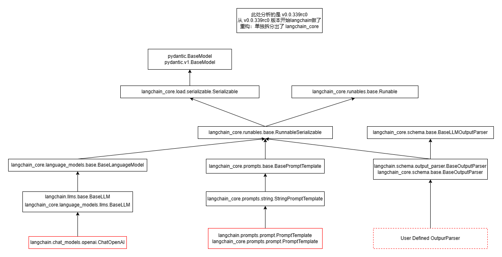
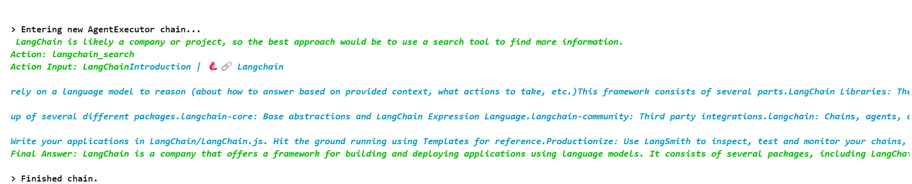
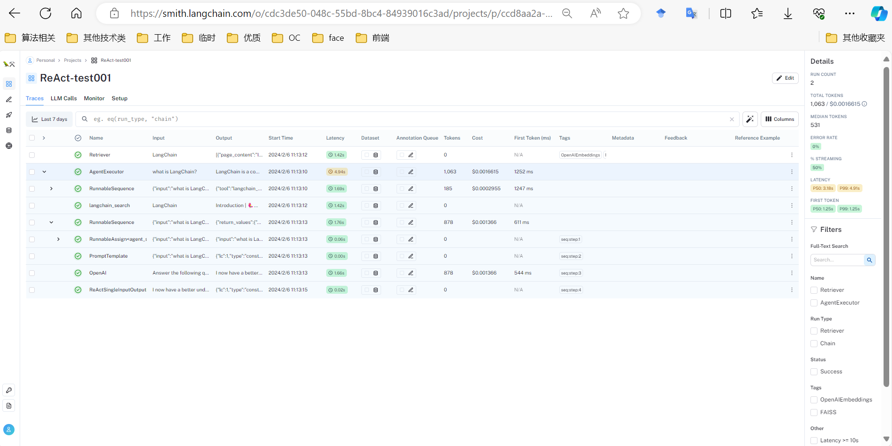

## 涉及内容

- [langchain v0.1.0 preview blog (2023/12/12)](https://blog.langchain.dev/the-new-langchain-architecture-langchain-core-v0-1-langchain-community-and-a-path-to-langchain-v0-1/)
- [langchain v 0.1.0 blog (2024/01/08)](https://blog.langchain.dev/langchain-v0-1-0/), 里面也提及了许多使用 Langchain 来构建的项目.

[引用](https://blog.langchain.dev/the-new-langchain-architecture-langchain-core-v0-1-langchain-community-and-a-path-to-langchain-v0-1/)

> `langchain-core` contains simple, core abstractions that have emerged as a standard, as well as LangChain Expression Language as a way to compose these components together. This package is now at version 0.1 and all breaking changes will be accompanied by a minor version bump.

> `langchain-community` contains all third party integrations. We will work with partners on splitting key integrations out into standalone packages over the next month.

> `langchain` contains higher-level and use-case specific chains, agents, and retrieval algorithms that are at the core of your application's cognitive architecture. We are targeting a launch of a stable 0.1 release for langchain in early January.


```
libs/
  - langchain/
  - core/langchain_core/                  # 关键抽象, 尽量少包含三方库
  - community/langchain_community/        # ??
  - partners/
    - openai/langchain_openai/            # 集成组件, 一般是对三方库的简单包装
    - anthropic/langchain_anthropic/
  - cli/langchain_cli/
  - experimental/langchain_experimental/  # ?? 实验组件, 可忽略?
```

python `import` 语句的准则 (笔者观点):

- 自定义组件一般 `import langchain_core`
- 使用官方的组合组件的方式一般用 `import langchain`
- 官方已支持的第三方集成优先用 partner, 然后考虑 `langchain_community`

```python
from langchain_openai.chat_models import ChatOpenAI   # 最优先, 但不是每个第三方集成都会做成一个单独的包
from langchain_community.llms.openai import OpenAIChat  # 次优先
from langchain.llms.openai import OpenAIChat  # 本质上与第二种一致, 但这只是官方的兼容性保证的做法, 不推荐
```

## Tutorial

Langchain 的本质就是以一种作者认为的模块化的方式进行提示工程.

引用: [https://python.langchain.com/docs/get_started/quickstart](https://python.langchain.com/docs/get_started/quickstart)

<blockquote>
<p>LangChain provides many modules that can be used to build language model applications. Modules can be used as standalones in simple applications and they can be composed for more complex use cases. Composition is powered by <b>LangChain Expression Language (LCEL)</b>, which defines a unified <code>Runnable</code> interface that many modules implement, making it possible to seamlessly chain components.</p>

<p>The simplest and most common chain contains three things:</p>

<li><b>LLM/Chat Model</b>: The language model is the core reasoning engine here. In order to work with LangChain, you need to understand the different types of language models and how to work with them.</li>
<li><b>Prompt Template</b>: This provides instructions to the language model. This controls what the language model outputs, so understanding how to construct prompts and different prompting strategies is crucial.</li>
<li><b>Output Parser</b>: These translate the raw response from the language model to a more workable format, making it easy to use the output downstream.</li>
</blockquote>

理解这段话需要借助一下继承关系图



继承关系图说明: 以红色作为框线的方框代表的是实际可运行的类(其余均为抽象类), 由于 `langchain>=0.0.339rc0` (2023/11/22) 开始, langchain 代码库进行了一些重构, 主要是将一部分内容单独抽出来放在了 `langchain_core` 模块中, 同一个框中的两个类是别名关系.

LLM/Chat Model 的一个实际例子是 `ChatOpenAI` 类, Prompt Template 的一个实际例子是 `PromptTemplate` 类, 而 Output Parser 需要用户自己继承自 `BaseOutputParser`. 而这三类东西都继承自 `Runable` 抽象类, 这种继承自 `Runable` 的类都称为 LCEL. 所以如果希望研究源码, 可以先研究 `Runable` 抽象类. 在此之前先看一些例子:

以下例子参考: [https://python.langchain.com/docs/get_started/quickstart](https://python.langchain.com/docs/get_started/quickstart)

### 例子1 (llm, prompt, output parser, LCEL basics)

参考自: [https://python.langchain.com/docs/get_started/quickstart#llm-chain](https://python.langchain.com/docs/get_started/quickstart#llm-chain)

```python
from langchain_core.prompts import ChatPromptTemplate
from langchain_openai import ChatOpenAI
from langchain_core.output_parsers import StrOutputParser

prompt = ChatPromptTemplate.from_messages([
    ("system", "You are world class technical documentation writer."),
    ("user", "{input}")
])
llm = ChatOpenAI(openai_api_key="sk-xx")
output_parser = StrOutputParser()
chain = prompt | llm | output_parser  # LCEL
s: str = chain.invoke({"input": "how can langsmith help with testing?"})
chain.first  # prompt
chain.last   # output_parser
chain.middle # [llm]
chain.steps  # [prompt, llm, output_parser]
```

### 例子 2 (模型自定义, langserve)

```bash
pip install langchain langserve sse_starlette
```

使用 `python serve.py` 运行, 界面在 `http://localhost:8000/chain/playground/`

```python
#!/usr/bin/env python
# serve.py
from typing import Any, List, Mapping, Optional
from fastapi import FastAPI
from langchain.schema import BaseOutputParser
from langserve import add_routes
from langchain.callbacks.manager import CallbackManagerForLLMRun
from langchain.llms.base import LLM
from langchain.prompts import PromptTemplate

class CustomLLM(LLM):
    n: int

    @property
    def _llm_type(self) -> str:
        return "custom"

    def _call(
        self,
        prompt: str,
        stop: Optional[List[str]] = None,
        run_manager: Optional[CallbackManagerForLLMRun] = None,
        **kwargs: Any,
    ) -> str:
        if stop is not None:
            raise ValueError("stop kwargs are not permitted.")
        return prompt[:self.n]

    @property
    def _identifying_params(self) -> Mapping[str, Any]:
        """Get the identifying parameters."""
        return {"n": self.n}

class CustomOutputParser(BaseOutputParser[str]):
    """Parse the output of an LLM call to a comma-separated list."""

    def parse(self, text: str) -> str:
        """Parse the output of an LLM call."""
        return text

prompt_template = PromptTemplate.from_template("instruction: {instruction}\nquestion{q}")
llm = CustomLLM(n=30)
parser = CustomOutputParser()
chain = prompt_template | llm | parser
# chain.invoke({"instruction": "1234567890123", "q": "qa"})


# 2. App definition
app = FastAPI(
  title="LangChain Server",
  version="1.0",
  description="A simple api server using Langchain's Runnable interfaces",
)

# 3. Adding chain route
add_routes(
    app,
    chain,
    path="/chain",
)

if __name__ == "__main__":
    import uvicorn
    uvicorn.run(app, host="localhost", port=8000)
```

### 例子 3 (index, RAG)

参考自: [https://python.langchain.com/docs/get_started/quickstart#retrieval-chain](https://python.langchain.com/docs/get_started/quickstart#retrieval-chain)

**PART 1**

```python
# pip install beautifulsoup4 faiss-cpu
from langchain_openai import OpenAIEmbeddings
from langchain_openai import ChatOpenAI
embeddings = OpenAIEmbeddings()
llm = ChatOpenAI()

from langchain_core.documents.base import Document
from typing import List
from langchain_community.document_loaders import WebBaseLoader
from langchain_community.vectorstores import FAISS
from langchain.text_splitter import RecursiveCharacterTextSplitter
loader = WebBaseLoader("https://docs.smith.langchain.com/overview")
# Document has two attrs: page_content: str, metadata: Dict
docs: List[Document] = loader.load()  # metadata keys: ['source', 'title', 'description', 'language']
text_splitter = RecursiveCharacterTextSplitter()
documents: List[Document] = text_splitter.split_documents(docs)  # metadata keys: ['source', 'title', 'description', 'language']
vector = FAISS.from_documents(documents, embeddings)
# vector.docstore._dict: Dict[str, Document]  # {"ass": Document(...), "bss": Document(...)}
# vector.index_to_docstore_id: Dict[int, str]  # {0: "ass", 1: "bss"}
# vector.index: faiss.swigfaiss_avx2.IndexFlatL2
```

继承关系图

```
# vector: FAISS
langchain_core.vectorstores.VectorStore(ABC):
langchain_community.vectorstores.FAISS(VectorStore)

# vector.docstore: InMemoryDocstore
langchain_community.docstore.base.AddableMixin(ABC): search, delete
langchain_community.docstore.base.Docstore(ABC): add
langchain_community.docstores.in_memory.InMemoryDocstore(Docstore, AddableMixin)
```

**PART 2**

```python
# pip install grandalf
from langchain.chains.combine_documents import create_stuff_documents_chain
from langchain_core.prompts import ChatPromptTemplate
import langchain_core

prompt = ChatPromptTemplate.from_template("""Answer the following question based only on the provided context:

<context>
{context}
</context>

Question: {input}""")

document_chain: langchain_core.runnables.base.RunnableBinding = create_stuff_documents_chain(llm, prompt)

# 一些探索
document_chain.get_graph().nodes
document_chain.get_graph().edges
print(document_chain.get_graph().draw_ascii())
```

输出

```
# nodes:

{'10df13934301478abd3ba5dd8de10598': Node(id='10df13934301478abd3ba5dd8de10598', data=<class 'pydantic.v1.main.RunnableParallel<context>Input'>),
 'a087b655b2cd4fb49951b3170874329d': Node(id='a087b655b2cd4fb49951b3170874329d', data=<class 'pydantic.v1.main.RunnableParallel<context>Output'>),
 '24444bcbd4e04ac3b6b7a9b75ea70b2d': Node(id='24444bcbd4e04ac3b6b7a9b75ea70b2d', data=PromptTemplate(input_variables=['page_content'], template='{page_content}')),
 '87f1b6b35bed4f128ecafb41c328ae45': Node(id='87f1b6b35bed4f128ecafb41c328ae45', data=RunnablePassthrough()),
 '706cdd684df24146b0b8985fedf4312e': Node(id='706cdd684df24146b0b8985fedf4312e', data=ChatPromptTemplate(input_variables=['context', 'input'], messages=[HumanMessagePromptTemplate(prompt=PromptTemplate(input_variables=['context', 'input'], template='Answer the following question based only on the provided context:\n\n<context>\n{context}\n</context>\n\nQuestion: {input}'))])),
 '19fc2995c60745509e4bdebc951e74f9': Node(id='19fc2995c60745509e4bdebc951e74f9', data=ChatOpenAI(client=<openai.resources.chat.completions.Completions object at 0x7f25b1e9f820>, async_client=<openai.resources.chat.completions.AsyncCompletions object at 0x7f25b1ebbcd0>, openai_api_key='sk-xxx', openai_proxy='')),
 '82c0eea4218b4ba8ab35dc8a08364f6b': Node(id='82c0eea4218b4ba8ab35dc8a08364f6b', data=StrOutputParser()),
 'e82fa2229583412eaf4cea0d32818487': Node(id='e82fa2229583412eaf4cea0d32818487', data=<class 'pydantic.v1.main.StrOutputParserOutput'>)}

# edges:

[Edge(source='418e866578f840c8b9e8954000a16883', target='e77a1ecf38c14457bd6606305bbf040b'),
 Edge(source='e77a1ecf38c14457bd6606305bbf040b', target='09a9f05f03e540c3afb008d7eb4bcdfa'),
 Edge(source='418e866578f840c8b9e8954000a16883', target='a424ccc59e3b4b4197333c6e2ee8dcf7'),
 Edge(source='a424ccc59e3b4b4197333c6e2ee8dcf7', target='09a9f05f03e540c3afb008d7eb4bcdfa'),
 Edge(source='09a9f05f03e540c3afb008d7eb4bcdfa', target='497f4a32536440319ad796fe51d26b47'),
 Edge(source='497f4a32536440319ad796fe51d26b47', target='9ded27aa029d41a6a51e9a5af9600955'),
 Edge(source='1fd84bd773be42a1911a64a1424af96c', target='ddf23954923f433ba714f6a29e2670d8'),
 Edge(source='9ded27aa029d41a6a51e9a5af9600955', target='1fd84bd773be42a1911a64a1424af96c')]

# draw_ascii:
           +------------------------+            
           | Parallel<context>Input |            
           +------------------------+            
                ***            ***               
              **                  **             
            **                      **           
+----------------+              +-------------+  
| PromptTemplate |              | Passthrough |  
+----------------+              +-------------+  
                ***            ***               
                   **        **                  
                     **    **                    
           +-------------------------+           
           | Parallel<context>Output |           
           +-------------------------+           
                        *                        
                        *                        
                        *                        
             +--------------------+              
             | ChatPromptTemplate |              
             +--------------------+              
                        *                        
                        *                        
                        *                        
                 +------------+                  
                 | ChatOpenAI |                  
                 +------------+                  
                        *                        
                        *                        
                        *                        
               +-----------------+               
               | StrOutputParser |               
               +-----------------+               
                        *                        
                        *                        
                        *                        
            +-----------------------+            
            | StrOutputParserOutput |            
            +-----------------------+            
```


**PART 3**

```python
from langchain_core.documents import Document

answer: str = document_chain.invoke({
    "input": "how can langsmith help with testing?",
    "context": [Document(page_content="langsmith can let you visualize test results")]
})  # answer: "Langsmith can help with testing by allowing users to visualize test results."


from langchain.chains import create_retrieval_chain
# VectorStoreRetriever 也继承自 langchain_core.runnables.base.Runnable
retriever: langchain_core.vectorstores.VectorStoreRetriever = vector.as_retriever()
retrieval_chain: langchain_core.runnables.base.RunnableBinding = create_retrieval_chain(retriever, document_chain)

response = retrieval_chain.invoke({"input": "how can langsmith help with testing?"})
print(response["answer"])
# "LangSmith can help with testing by providing various features ..."
print(retrieval_chain.get_graph().draw_ascii())
```

图示

```
                               +------------------------+                            
                               | Parallel<context>Input |                            
                               +------------------------+                            
                                ***                   ***                            
                            ****                         ***                         
                          **                                ****                     
       +------------------------------+                         **                   
       | Lambda(lambda x: x['input']) |                          *                   
       +------------------------------+                          *                   
                       *                                         *                   
                       *                                         *                   
                       *                                         *                   
           +----------------------+                       +-------------+            
           | VectorStoreRetriever |                       | Passthrough |            
           +----------------------+                      *+-------------+            
                                ***                   ***                            
                                   ****           ****                               
                                       **       **                                   
                              +-------------------------+                            
                              | Parallel<context>Output |                            
                              +-------------------------+                            
                                            *                                        
                                            *                                        
                                            *                                        
                                +-----------------------+                            
                                | Parallel<answer>Input |                            
                                +-----------------------+*                           
                                 ****                     *****                      
                              ***                              *****                 
                            **                                      ******           
           +------------------------+                                     ***        
           | Parallel<context>Input |                                       *        
           +------------------------+                                       *        
                ***            ***                                          *        
              **                  **                                        *        
            **                      **                                      *        
+----------------+              +-------------+                             *        
| PromptTemplate |              | Passthrough |                             *        
+----------------+              +-------------+                             *        
                ***            ***                                          *        
                   **        **                                             *        
                     **    **                                               *        
           +-------------------------+                                      *        
           | Parallel<context>Output |                                      *        
           +-------------------------+                                      *        
                        *                                                   *        
                        *                                                   *        
                        *                                                   *        
             +--------------------+                                         *        
             | ChatPromptTemplate |                                         *        
             +--------------------+                                         *        
                        *                                                   *        
                        *                                                   *        
                        *                                                   *        
                 +------------+                                             *        
                 | ChatOpenAI |                                             *        
                 +------------+                                             *        
                        *                                                   *        
                        *                                                   *        
                        *                                                   *        
               +-----------------+                                  +-------------+  
               | StrOutputParser |                                  | Passthrough |  
               +-----------------+                             *****+-------------+  
                                 ****                     *****                      
                                     ***            ******                           
                                        **       ***                                 
                               +------------------------+                            
                               | Parallel<answer>Output |                            
                               +------------------------+                            
```

### 例子 4 (langchainhub)

```python
from langchain import hub
prompt = hub.pull("hwchase17/openai-functions-agent")

import pickle
with open("openai-functions-agent.pkl", "wb") as fw:
    pickle.dump(prompt, fw)

import pickle
with open("openai-functions-agent.pkl", "rb") as fr:
    reload_prompt = pickle.load(fr)
```

### 例子 5 (async & stream)

**Python 脚本中**

```python
from langchain.chat_models import ChatOpenAI
import asyncio

async def main():
    model = ChatOpenAI()

    chunks = []
    async for chunk in model.astream("hello. tell me something about yourself"):
        chunks.append(chunk)
        print(chunk.content, end="|", flush=True)

asyncio.run(main())
# 基本等价于:
# asyncio.get_event_loop().run_until_complete(main())
```

**Jupyter 环境**

jupyter 环境里可以直接将 `async` 关键字写在外层

```python
from langchain.chat_models import ChatOpenAI
model = ChatOpenAI()

chunks = []
async for chunk in model.astream("hello. tell me something about yourself"):
    chunks.append(chunk)
    print(chunk.content, end="|", flush=True)
```

### 例子 6 (callbacks, TODO: 待解释)

参考: [https://python.langchain.com/docs/expression_language/how_to/functions#accepting-a-runnable-config](https://python.langchain.com/docs/expression_language/how_to/functions#accepting-a-runnable-config)

```python
from langchain_core.output_parsers import StrOutputParser
from langchain_core.runnables import RunnableConfig, RunnableLambda

import json


def parse_or_fix(text: str, config: RunnableConfig):
    fixing_chain = (
        ChatPromptTemplate.from_template(
            "Fix the following text:\n\n```text\n{input}\n```\nError: {error}"
            " Don't narrate, just respond with the fixed data."
        )
        | ChatOpenAI()
        | StrOutputParser()
    )
    for _ in range(3):
        try:
            return json.loads(text)
        except Exception as e:
            text = fixing_chain.invoke({"input": text, "error": e}, config)
    return "Failed to parse"

from langchain.callbacks import get_openai_callback

with get_openai_callback() as cb:
    output = RunnableLambda(parse_or_fix).invoke(
        "{foo: bar}", {"tags": ["my-tag"], "callbacks": [cb]}
    )
    print(output)
    print(cb)
```

输出:

```
{'foo': 'bar'}
Tokens Used: 65
	Prompt Tokens: 56
	Completion Tokens: 9
Successful Requests: 1
Total Cost (USD): $0.00010200000000000001
```

### 例子 7 (LCEL Memory, redis)

参考: [https://python.langchain.com/docs/expression_language/how_to/message_history](https://python.langchain.com/docs/expression_language/how_to/message_history)


```python
from typing import Optional

from langchain_community.chat_message_histories import RedisChatMessageHistory
from langchain_community.chat_models import ChatOpenAI
from langchain_core.chat_history import BaseChatMessageHistory
from langchain_core.prompts import ChatPromptTemplate, MessagesPlaceholder
from langchain_core.runnables.history import RunnableWithMessageHistory

REDIS_URL = "redis://localhost:6379/0"

prompt = ChatPromptTemplate.from_messages(
    [
        ("system", "You're an assistant who's good at {ability}"),
        MessagesPlaceholder(variable_name="history"),
        ("human", "{question}"),
    ]
)

chain = prompt | ChatOpenAI()

chain_with_history = RunnableWithMessageHistory(
    chain,
    lambda session_id: RedisChatMessageHistory(session_id, url=REDIS_URL, ttl=600),  # 设置失效时间为 600 秒
    input_messages_key="question",
    history_messages_key="history",
)

chain_with_history.invoke(
    {"ability": "math", "question": "What does cosine mean?"},
    config={"configurable": {"session_id": "foobar"}},
)

# 可以尝试直接调 chain, 不会写 history
# messages = chain_with_history.get_session_history("foobar").messages
# chain.invoke(
#     {
#         "ability": "math",
#         "question": "What's its inverse",
#         "history": chain_with_history.get_session_history("foobar").messages  # List[BaseMessage]
#     }
# )

chain_with_history.invoke(
    {"ability": "math", "question": "What's its inverse"},
    config={"configurable": {"session_id": "foobar"}},
)
```


备注: 这个例子里 redis 侧实际发生的事情如下: langchain 的实现是用 `lpush/lrange` 来存储/获取键值对, 而不是使用 `set/get` 的方式

```python
# docker run -d -p 6379:6379 -p 8001:8001 redis/redis-stack:latest
import redis
import json
from langchain_core.messages import messages_from_dict, message_to_dict
from langchain_core.messages import HumanMessage, AIMessage

REDIS_URL = "redis://localhost:6379/0"
redis_client = redis.from_url(url=REDIS_URL)

prefix = "message_store:"
session_id = "foobar"

# 追加历史:
message = HumanMessage(content='What does cosine mean?')
redis_client.lpush(prefix+session_id, json.dumps(message_to_dict(message)))

message = AIMessage(content='In mathematics, cosine (abbreviated as cos) is a trigonometric function that relates the angle of a right triangle to the ratio of the length of the adjacent side to the hypotenuse. It is defined as the ratio of the length of the side adjacent to an acute angle in a right triangle to the length of the hypotenuse. The cosine function is commonly used in geometry, physics, and engineering to solve problems related to angles and triangles.')
redis_client.lpush(prefix+session_id, json.dumps(message_to_dict(message)))

# 获取历史:
_items = redis_client.lrange(prefix+session_id, 0, -1)
items = [json.loads(m.decode("utf-8")) for m in _items[::-1]]
messages = messages_from_dict(items)
```

备注: 可以通过如下方式去掉对 redis 的依赖:

```python
from langchain_community.chat_message_histories.in_memory import ChatMessageHistory
message_history = ChatMessageHistory()
chain_with_history = RunnableWithMessageHistory(
    chain,
    lambda session_id: message_history,
    input_messages_key="question",
    history_messages_key="history",
)
# invoke 之后可以通过这两种方案来看现有的历史
chain_with_history.get_session_history("foobar").messages  # 通过 chain_with_history 拿到历史的做法
message_history.messages
```

## Cookbook

### ConversationalRetrievalChain (TODO)

### Agents

不同的 Agent 一般只是 prompt 和 output parser 不太相同, 而默认的 prompt 一般外挂在 langchain hub, 默认的 output parser 位于 langchain 代码库内

`structured_chat` vs `ReAct`: `ReAct` 的工具都只能接收字符串作为输入, 而 `structured_chat` 的工具可以接收多个参数作为输入, 区别主要是

- prompt 不同
- output parser 不同: `structured_chat` 是 `JSONAgentOutputParser`, `ReAct` 是 `ReActSingleInputOutputParser`
- tool 的调用格式不同 (`tool.run(tool_input=tool_input)`): `structured_chat` 的输入参数 `tool_input` 可以是一个字典, 而 `ReAct` 所使用的工具只能是字符串
    ```python
    # 可适用于 structured_chat
    @langchain.tools.tool
    def search(q: str, p: str) -> str:
        """Look up things online."""
        return q + p
    search.run(tool_input={"q": "1", "p": "2"})

    # 既可适用于 structured_chat, 又可适用于 ReAct
    @langchain.tools.tool
    def search(q: str) -> str:
        """Look up things online."""
        return q
    search.run(tool_input="1")
    search.run(tool_input={"q": "1"})
    ```

```python
def create_structured_chat_agent(
    llm: BaseLanguageModel, tools: Sequence[BaseTool], prompt: ChatPromptTemplate
) -> Runnable:
    prompt = prompt.partial(
        tools=render_text_description_and_args(list(tools)),  # 注意这里还包含args的描述, 即: tool.name, tool.description, tool.args
        tool_names=", ".join([t.name for t in tools]),
    )
    llm_with_stop = llm.bind(stop=["Observation"])
    agent = (
        RunnablePassthrough.assign(
            agent_scratchpad=lambda x: format_log_to_str(x["intermediate_steps"]),
        )
        | prompt
        | llm_with_stop
        | JSONAgentOutputParser()  # 这里用的是 JSONAgentOutputParser, 用于解析 json 字符串, 从而拿到 action (string) 和 action_input (dict)
    )
    return agent

def create_react_agent(llm, tools, prompt):
    prompt = prompt.partial(
        tools=render_text_description(list(tools)),
        tool_names=", ".join([t.name for t in tools]),
    )
    llm_with_stop = llm.bind(stop=["\nObservation"])
    agent = (
        RunnablePassthrough.assign(agent_scratchpad=lambda x: format_log_to_str(x["intermediate_steps"]),)
        | prompt
        | llm_with_stop
        | ReActSingleInputOutputParser()  # 这里用的是 ReActSingleInputOutputParser, 用于提取 Action: 和 Action Input: 后面的内容
    )
    return agent
```

## Concept

### `Runnable` vs `Chain`

```python
from langchain_openai import ChatOpenAI
from langchain_core.prompts import ChatPromptTemplate
from langchain_core.output_parsers import StrOutputParser

# llm, prompt, output_parser 都是 Runnable, 是最小单元
llm = ChatOpenAI()
prompt = ChatPromptTemplate.from_messages([
    ("system", "You are world class technical documentation writer."),
    ("user", "{input}")
])
output_parser = StrOutputParser()

# chain 是 Chain, 其本身也是符合(继承) Runnable 协议的
chain = prompt | llm | output_parser
```

`Chain` 分为旧式的和新式的, TODO: 把这个例子的省略号完善

```python
from langchain.chains.combine_documents.stuff import create_stuff_documents_chain
from langchain.chains.combine_documents.stuff import StuffDocumentsChain

# 旧式 Chain: 采用继承的方式串接各个 runnable 组件, 继承关系如下
# StuffDocumentsChain -> BaseCombineDocumentsChain -> Chain -> RunnableSerializable -> (Serializable, Runnable)
chain = StuffDocumentsChain(...)

# 新式 Chain: 直接用 | 以及 RunnableParallel, RunnablePassThrough 等串接各个 runnable 组件, 内部实现大致如下
# (RunnablePassthrough.assign(**{DOCUMENTS_KEY: format_docs}).with_config(...) | prompt | llm | _output_parser).with_config(...)
chain = create_stuff_documents_chain(...)
```

### Memory (For Legacy Chain vs For LCEL)

官方文档中提到大部分出于 Beta 状态, 不是很理解: [https://python.langchain.com/docs/modules/memory/](https://python.langchain.com/docs/modules/memory/)

> Most of memory-related functionality in LangChain is marked as beta. This is for two reasons:
> - Most functionality (with some exceptions, see below) are not production ready
> - Most functionality (with some exceptions, see below) work with Legacy chains, not the newer LCEL syntax.

- 新类似乎是这里: `BaseChatMessageHistory`, 一般用于 `RunnableWithMessageHistory`, 见这个[例子](https://python.langchain.com/docs/expression_language/how_to/message_history) 和这个[例子](https://python.langchain.com/docs/modules/agents/quick_start#adding-in-memory). 而 `RunnableWithMessageHistory` 接收的参数之一是 `get_session_history` , 其类型是 `Callable[..., BaseChatMessageHistory]`, 而 `BaseChatMessageHistory` 的子类见[这里](https://python.langchain.com/docs/integrations/memory)
    ```python
    # 与 LCEL 兼容指的是这种用法: 使用 RunnableWithMessageHistory 包住 runnable 和 BaseChatMessageHistory
    
    from langchain_community.chat_message_histories import ChatMessageHistory
    # from langchain_community.chat_message_histories import RedisChatMessageHistory
    from langchain_core.runnables.history import RunnableWithMessageHistory
    message_history = ChatMessageHistory()  # 新 memory, 主要是包含 messages 属性以及 add_message 方法
    runnable_with_chat_history = RunnableWithMessageHistory(
        runnable,
        lambda session_id: message_history,
        # lambda session_id: RedisChatMessageHistory(session_id, url=REDIS_URL, ttl=600),  # 设置失效时间为 600 秒
        input_messages_key="input",
        history_messages_key="chat_history",
    )
    ```
- 旧类似乎是这里: `ConversationBufferMemory`, `ConversationBufferWindowMemory`, 所有的子类及用法见[这里](https://python.langchain.com/docs/modules/memory/types/)
    ```python
    # 旧的 Memory 与旧的 Chain 兼容, 指的是这种用法:
    from langchain_openai import OpenAI
    from langchain.chains import ConversationChain  # 旧 Chian
    conversation_with_summary = ConversationChain(
        llm=OpenAI(temperature=0),
        memory=ConversationBufferWindowMemory(k=2),  # 旧 memory, 主要实现了 load_memory_variables 和 save_context 方法
        verbose=True
    )
    conversation_with_summary.predict(input="Hi, what's up?")
    ```

### Tool, Agent, AgentExecutor

Agent 也分为新式的与旧式的 (旧式的用法 LangChain 计划于 `0.2.0` 版本弃用)

- 旧式的: 使用 `Agent.from_llm_and_tools`, 这种用法似乎已经在官方文档上找不到例子了:
    ```python
    # langchain/agents/react/base.py
    # 以下均被标记为: deprecated("0.1.0", removal="0.2.0")
    class ReActDocstoreAgent(Agent): ...
    class DocstoreExplorer: ...
    class ReActTextWorldAgent(ReActDocstoreAgent): ...
    class ReActChain(AgentExecutor): ...  # 注意 ReActChain 将被弃用, 但 AgentExecutor 依然会是主要 API
    ```
- 新式的: 使用 `create_*_agent` 构造 LCEL 链, 然后用 `AgentExecutor` 包裹一层, 以下例子参考自 [https://python.langchain.com/docs/modules/agents/agent_types/react](https://python.langchain.com/docs/modules/agents/agent_types/react)
    ```python
    from langchain.agents import AgentExecutor, create_react_agent
    agent = create_react_agent(llm, tools, prompt)
    agent_executor = AgentExecutor(agent=agent, tools=tools, verbose=True)
    agent_executor.invoke({"input": "what is LangChain?"})
    ```
    而 `create_react_agent` 的实质是:
    ```python
    def create_react_agent(llm, tools, prompt):
        prompt = prompt.partial(
            tools=render_text_description(list(tools)),
            tool_names=", ".join([t.name for t in tools]),
        )
        llm_with_stop = llm.bind(stop=["\nObservation"])
        agent = (
            RunnablePassthrough.assign(agent_scratchpad=lambda x: format_log_to_str(x["intermediate_steps"]),)
            | prompt
            | llm_with_stop
            | ReActSingleInputOutputParser()
        )
        return agent
    ```

新式的 Agent 实际上就是 LCEL 链, 与 Chain 没有区别, AgentExecutor (也是 LCEL) 会用 AgentRunnable (非 LCEL) 包裹 Agent

疑问: 为什么要包 `AgentExecutor` 这一层: [https://python.langchain.com/docs/modules/agents/concepts#agentexecutor](https://python.langchain.com/docs/modules/agents/concepts#agentexecutor), `AgentExecutor` 大体上是如下

```python
next_action = agent.get_action(...)
while next_action != AgentFinish:
    observation = run(next_action)
    next_action = agent.get_action(..., next_action, observation)
return next_action
```

## Code

### Utilities

`ChatPromptTemplate` 似乎没有很好的打印方式, 可以使用如下代码段

```python
from langchain import hub
from langchain_core.utils.input import get_colored_text

def print_chat_prompt_template(chat_prompt_template):
    for message in chat_prompt_template.messages:
        message_type = message.__class__.__name__
        print(get_colored_text(message_type, "green"))
        if message_type == "MessagesPlaceholder":
            print(message)
        else:
            print(message.prompt.template)

structured_chat_prompt = hub.pull("hwchase17/structured-chat-agent")
print_chat_prompt_template(structured_chat_prompt)
```


### Custom Components

调试时有可能需要制造一些假的组件

**Custom LLM**

[https://python.langchain.com/docs/modules/model_io/llms/custom_llm](https://python.langchain.com/docs/modules/model_io/llms/custom_llm)

官方也提供了一个 FakeListLLM: [https://github.com/langchain-ai/langchain/blob/master/libs/community/langchain_community/llms/fake.py](https://github.com/langchain-ai/langchain/blob/master/libs/community/langchain_community/llms/fake.py)

```python
from typing import Any, List, Mapping, Optional, Iterator
from langchain.callbacks.manager import CallbackManagerForLLMRun
from langchain_core.outputs import GenerationChunk
from langchain.llms.base import LLM

class FixedReturnLLM(LLM):
    fixed_return_string: str

    @property
    def _llm_type(self) -> str:
        return "custom"

    def _call(
        self,
        prompt: str,
        stop: Optional[List[str]] = None,
        run_manager: Optional[CallbackManagerForLLMRun] = None,
        **kwargs: Any,
    ) -> str:
        return self.fixed_return_string

    def _stream(self,
        prompt: str,
        stop: Optional[List[str]] = None,
        run_manager: Optional[CallbackManagerForLLMRun] = None,
        **kwargs: Any,
    ) -> Iterator[GenerationChunk]:
        for s in self.fixed_return_string:
            yield GenerationChunk(text=s)
    
    @property
    def _identifying_params(self) -> Mapping[str, Any]:
        """Get the identifying parameters."""
        return {"fixed_return_string": self.fixed_return_string,}

fake_llm = FixedReturnLLM(fixed_return_string="Final Answer: yyy")
fake_llm.invoke("x")        # "Final Answer: yyy"
list(fake_llm.stream("x"))  # ['F', 'i', 'n', 'a', 'l', ' ', 'A', 'n', 's', 'w', 'e', 'r', ':', ' ', 'y', 'y', 'y']
```

**Custom Retriever**

[https://python.langchain.com/docs/modules/data_connection/retrievers/#custom-retriever](https://python.langchain.com/docs/modules/data_connection/retrievers/#custom-retriever)

```python
from langchain_core.retrievers import BaseRetriever
from langchain_core.callbacks import CallbackManagerForRetrieverRun
from langchain_core.documents import Document
from typing import List
from langchain.tools.retriever import create_retriever_tool


class FixedReturnRetriever(BaseRetriever):
    fixed_return_documents: List[str]
    
    def _get_relevant_documents(
        self, query: str, *, run_manager: CallbackManagerForRetrieverRun
    ) -> List[Document]:
        return [Document(page_content=doc) for doc in self.fixed_return_documents]

fake_retriever = FixedReturnRetriever(fixed_return_documents=["foobar"])
fake_retriever.get_relevant_documents("bar")  # [Document(page_content='foobar')]

fake_retriever_tool = create_retriever_tool(
    fake_retriever,
    "fake tool",
    "This is fake tool's description",
)
fake_tools = [fake_retriever_tool]
```

**Agent**

TODO: 参考下文 LangSmith 里的例子

```python
from langchain.agents import AgentExecutor, create_react_agent
from langchain import hub
prompt = hub.pull("hwchase17/react")
fake_agent = create_react_agent(fake_llm, fake_tools, prompt)
fake_agent_executor = AgentExecutor(agent=fake_agent, tools=fake_tools, verbose=True)

fake_agent_executor.invoke({"input": "x"})  # {'input': 'x', 'output': 'xxx'}

# 控制台输出
# > Entering new AgentExecutor chain...
# Final Answer: xxx

# > Finished chain.
# 直接对 agent 调用
fake_agent.invoke({"input": "x", "intermediate_steps": []})  # AgentFinish(return_values={'output': 'xxx'}, log='Final Answer: xxx')
```

### Message

```python
from langchain_core.messages.base import BaseMessage, BaseMessageChunk
# 以下都继承自 BaseMessage
from langchain_core.messages.ai import AIMessage, AIMessageChunk
from langchain_core.messages.chat import ChatMessage, ChatMessageChunk  # 可以指定角色为任意字符串, 用的不多
from langchain_core.messages.function import FunctionMessage, FunctionMessageChunk  # 代表用户自行调用函数后得到的结果
from langchain_core.messages.human import HumanMessage, HumanMessageChunk
from langchain_core.messages.system import SystemMessage, SystemMessageChunk
from langchain_core.messages.tool import ToolMessage, ToolMessageChunk  # 代表用户自行调用工具后得到的结果
```

### Runnable (LCEL) (TODO)

本节内容作为 [https://python.langchain.com/docs/expression_language/](https://python.langchain.com/docs/expression_language/) 的补充与解释

```python
# langchain_openai.chat_models.base.ChatOpenAI: public class
class ChatOpenAI(BaseChatModel):
    def _stream(...): ...
    def _generate(...): ...
    async def _astream(...): ...
    async def _agenerate(...): ...

class BaseChatModel(BaseLanguageModel[BaseMessage], ABC):
    # invoke, ainvoke, stream, astream, generate, agenerate, generate_prompt, agenerate_prompt

class BaseLanguageModel(RunnableSerializable[LanguageModelInput, LanguageModelOutputVar], ABC):
    # @abstractmethod: generate_prompt, agenerate_prompt

class RunnableSerializable(Serializable, Runnable[Input, Output]):
    # configurable_fields, configurable_alternatives

class Runnable:
    # 包含对外接口: invoke, ainvoke, stream, astream, batch, abatch, astream_log, astream_events
    # 参考文档: https://python.langchain.com/docs/expression_language/interface
```

`langchain_core` 目录下所有以 `"Runnable"` 开头的类

```
Runnable
RunnableSerializable
RunnableSequence
RunnableParallel
RunnableLambda
RunnableEachBase
RunnableEach
RunnableBindingBase
RunnableBinding

RunnableBranch

RunnableConfig  # 仅仅类似一个字典, 不是 runnable
RunnableConfigurableFields
RunnableConfigurableAlternatives

RunnableWithFallbacks

RunnableWithMessageHistory

RunnablePassthrough
RunnableAssign
RunnablePick

RunnableRetry

RunnableAgent
RunnableMultiActionAgent
```

<table>
<tr>
    <th>Runnable方法名</th>
    <th>返回类型(粗略)</th>
    <th>说明</th>
    <th>文档链接</th>
</tr>
<tr>
    <td>assign</td>
    <td>RunnableSerializable: (self | RunnableAssign)</td>
    <td>添加字段</td>
    <td>https://python.langchain.com/docs/expression_language/how_to/passthrough</td>
</tr>
<tr>
    <td>pipe</td>
    <td>RunnableSequence</td>
    <td></td>
    <td></td>
</tr>
<tr>
    <td>pick</td>
    <td>RunnableSerializable: (self | RunnablePick)</td>
    <td></td>
    <td></td>
</tr>
<tr>
    <td>bind</td>
    <td>RunnableBinding</td>
    <td></td>
    <td>https://python.langchain.com/docs/expression_language/how_to/binding</td>
</tr>
<tr>
    <td>with_config, configurable_fields, configurable_alternatives</td>
    <td>RunnableBinding</td>
    <td></td>
    <td>https://python.langchain.com/docs/expression_language/how_to/configure</td>
</tr>
<tr>
    <td>with_listeners</td>
    <td>RunnableBinding</td>
    <td>用于 RunnableWithMessageHistory</td>
    <td>https://python.langchain.com/docs/expression_language/how_to/message_history</td>
</tr>
<tr>
    <td>with_types</td>
    <td>RunnableBinding</td>
    <td></td>
    <td></td>
</tr>
<tr>
    <td>with_retry</td>
    <td>RunnableRetry</td>
    <td></td>
    <td></td>
</tr>
<tr>
    <td>map</td>
    <td>RunnableEach</td>
    <td></td>
    <td></td>
</tr>
<tr>
    <td>with_fallbacks</td>
    <td>RunnableWithFallbacks</td>
    <td></td>
    <td></td>
</tr>
</table>

`RunnableBranch` 看起来是需要直接使用其构造函数的, 参考: [https://python.langchain.com/docs/expression_language/how_to/routing](https://python.langchain.com/docs/expression_language/how_to/routing)

#### Runnable.invoke

```python
class Runnable:
    @abstractmethod
    def invoke(self, input: Input, config: Optional[RunnableConfig] = None) -> Output: ...
```

#### Runnable.stream

疑问: LCEL 组合的时候, stream 的逻辑是什么? 以 `prompt | llm | output_parser` 为例, 中间的 `llm` 支持 `stream` (默认实现是用 `invoke` 来做的, 具体类会覆盖这个默认实现), 但是 `prompt` 和 `output_parser` 一般不支持, 看起来 `llm` 的后续环节也只能是等待, 如果中间有多个 `stream` 的体感不明显. 另外更大的疑问是整个链条调用 `stream` 时的具体执行流是怎样的 (调用每个模块的 `stream`?)

```python
from langchain_core.prompts import PromptTemplate
prompt = PromptTemplate.from_template("{text}")
prompt.__class__.stream is Runnable.stream  # True, 但这个实现就只是 yield self.invoke(...)
```

#### Runnable.with_config, configurable_fields, configurable_alternatives

参考: [https://python.langchain.com/docs/expression_language/how_to/configure](https://python.langchain.com/docs/expression_language/how_to/configure)

- `configurable_fields` 用于将 Runnable 的一些参数暴露给 `with_config` 或 `invoke` 调节
- `configurable_alternatives` 用于将 Runnable 串接为 Chain 后, 将某个 Runnable 整个进行替换, 暴露给 `with_config` 或 `invoke` 调节

**模板**

```python
# 必须先 configurable_fields 或 configurable_alternatives, 再使用 with_config
runnable = runnable.configurable_fields(...)  # 不同的 runnable 有不同的可设置 key, key 不能乱配
runnable = runnable.configurable_alternatives(...)  # 配置可以替换整个runnable为其他runnable
runnable.with_config(configurable={"foo": 0.9})
```

**例子**

```python
from langchain.prompts import PromptTemplate
from langchain_core.runnables.configurable import ConfigurableField
runnable = PromptTemplate.from_template("This is history: {history}, This is content: {content}")
runnable = runnable.configurable_fields(template=ConfigurableField(id="custom_template"))  # "template" in runnable.__fields__.keys()
runnable.with_config(configurable={"custom_template": "{history} {content}"}).invoke({"history": "1", "content": "2"})
```

三种在 `invoke` 时设置 config 的做法:

```python
prompt = PromptTemplate.from_template("Tell me a joke about {topic}").configurable_alternatives(
    ConfigurableField(id="prompt_choice"),
    default_key="joke",
    poem=PromptTemplate.from_template("Write a short poem about {topic}"),
)

prompt.with_config(config={"configurable": {"prompt_choice": "poem"}}).invoke({"topic": "book"})
prompt.with_config(configurable={"prompt_choice": "poem"}).invoke({"topic": "book"})
prompt.invoke({"topic": "book"}, config={"configurable": {"prompt_choice": "poem"}})
# prompt.invoke({"topic": "book"}, configurable= {"prompt_choice": "poem"})  # ERROR: 不能用 configurable={"prompt_choice": "poem"}
```

**一个 Chain 的例子**

也可以混合使用 `configurable_fields` 和 `configurable_alternatives`, 参考上面的文档即可

```python
from langchain.prompts import PromptTemplate
from langchain_core.runnables import RunnableParallel, RunnablePassthrough
from langchain_core.runnables.configurable import ConfigurableField

runnable = PromptTemplate.from_template("This is history: {history}, This is content: {content}")
runnable2 = PromptTemplate.from_template("context: {context}")
params = {"history": "1", "content": "2"}

# 必须对每个 runnable 组件设置 configurable_fields, 并且 id 必须不同, 否则会冲突
runnable = runnable.configurable_fields(template=ConfigurableField(id="custom_template1"))
runnable2 = runnable2.configurable_fields(template=ConfigurableField(id="custom_template2"))

chain = (runnable | (lambda x: {"context": x.text}) | runnable2)

# 注意对 chain 本身设置 configurable_fields 只能设置 ['name', 'first', 'middle', 'last']
# chain.configurable_fields(template=ConfigurableField(id="custom_template"))  # ERROR! only support: ['name', 'first', 'middle', 'last']
chain.with_config(
    configurable={
        "custom_template1": "custom_template1 {history} {content}",
        "custom_template2": "custom_template2 {context}"
    }
).invoke(params)
```

**一个与 langserver 结合的例子**

```python
from langchain_core.retrievers import BaseRetriever
from langchain_core.callbacks import CallbackManagerForRetrieverRun
from langchain_core.documents import Document
from typing import List
from langchain.tools.retriever import create_retriever_tool
from langchain_core.runnables.configurable import ConfigurableField


class CustomRetriever(BaseRetriever):
    prefix: str = "retriever"
    k: int = 4
    method: str = "L2"
    def _get_relevant_documents(
        self, query: str, *, run_manager: CallbackManagerForRetrieverRun
    ) -> List[Document]:
        return [Document(page_content=doc) for doc in [f"{self.prefix}: {query}-{self.k}-{self.method}"]]

fake_retriever = CustomRetriever()
configurable_fake_retriever = fake_retriever.configurable_fields(
    prefix=ConfigurableField(id="retriever_prefix"),
    k=ConfigurableField(id="retriever_k"),
    method=ConfigurableField(id="retriever_method"),
)
# configurable_fake_retriever.invoke(input="bar")


from langchain.prompts import PromptTemplate
prompt = PromptTemplate.from_template("This is history: {history}, This is content: {content}")

configurable_prompt = prompt.configurable_alternatives(
    ConfigurableField(id="prompt_choice"),
    default_key="default",
    kv=PromptTemplate.from_template("{history}: {content}"),
)

# configurable_prompt.invoke({"history": "h", "content": "c"})

chain = (configurable_prompt | configurable_fake_retriever)

# chain.invoke({"history": "h", "content": "c"})
# chain.invoke({"history": "h", "content": "c"}, config={
#     "configurable": {
#         "prompt_choice": "kv",
#         "retriever_prefix": "this is retriever",
#         "retriever_k": 20,
#         "retriever_method": "COSINE",
#     }
# })

# fake_retriever 的 k 参数在 chain.invoke 之后会被复原
```

使用 `python ls_test.py` 启动, 在 `http://localhost:8000/chain/playground/` 页面可配置上面设定的配置项

```python
from fastapi import FastAPI
from langchain.schema import BaseOutputParser
from langserve import add_routes

app = FastAPI(
  title="LangChain Server",
  version="1.0",
  description="A simple api server using Langchain's Runnable interfaces",
)

# 3. Adding chain route
add_routes(
    app,
    chain,
    path="/chain",
)

if __name__ == "__main__":
    import uvicorn
    uvicorn.run(app, host="localhost", port=8000)
```

#### RunnableConfig

继承自字典类型, TODO: 具体包含的 key

#### RunnableLambda

参考文档 [https://python.langchain.com/docs/expression_language/how_to/functions](https://python.langchain.com/docs/expression_language/how_to/functions)

```python
# RunnableLambda 实现的大略逻辑如下
class RunnableLambda(Runnable[Input, Output]):
    def __init__(
        self,
        func: Union[
                Callable[[Input], Output],
                Callable[[Input], Iterator[Output]],
                Callable[[Input, RunnableConfig], Output],
                Callable[[Input, CallbackManagerForChainRun], Output],
                Callable[[Input, CallbackManagerForChainRun, RunnableConfig], Output],
        ],
        afunc = None,
        name: Optional[str] = None,
    ) -> None:
        ...

    def _invoke(
        self,
        input: Input,
        run_manager: CallbackManagerForChainRun,
        config: RunnableConfig,
        **kwargs: Any,
    ) -> Output:
        output = call_func_with_variable_args(
            self.func, input, config, run_manager, **kwargs
        )
        return cast(Output, output)
```

**例子**

```python
from langchain_core.runnables import RunnableLambda, RunnableConfig

def func1(x):
    return x

def func2(x, config: RunnableConfig):
    return x["num"] + config["configurable"]["total"]

RunnableLambda(func1).invoke({"num": 1})  # {'num': 1}
RunnableLambda(func2).invoke({"num": 1}, config={"configurable": {"total": 100}})  # 101
RunnableLambda(func2).invoke({"num": 1}, config={"configurable": {"total": 100}, "foo": 2})  # 也 OK: 101
```

备注: `RunnableLambda` 没有继承自 `RunnableSerializable` 因此没有 `configurable_fields`, `configurable_alternatives` 方法, 并且 `with_config` 方法也不能设置 `configurable`

### Memory (For Legacy Chain)

以这个例子为例: [https://python.langchain.com/docs/modules/memory/types/buffer_window](https://python.langchain.com/docs/modules/memory/types/buffer_window)

```python
from langchain.memory import ConversationBufferWindowMemory
from langchain_openai import OpenAI
from langchain.chains import ConversationChain
conversation_with_summary = ConversationChain(
    llm=OpenAI(temperature=0),
    # We set a low k=2, to only keep the last 2 interactions in memory
    memory=ConversationBufferWindowMemory(k=2),
    verbose=True
)

conversation_with_summary.predict(input="Hi, what's up?")
conversation_with_summary.predict(input="What's their issues?")
conversation_with_summary.predict(input="Is it going well?")
conversation_with_summary.predict(input="What's the solution?")
```

这里稍微展开一下 `ConversationChain.predict` 的逻辑: 首先 `ConversationChain` 应该是属于所谓的 lagacy chains, `predict` 方法应该也会在 langchain 的后续版本完全被 `invoke` 方法取代, 而 `invoke` 方法的主要执行流程为:

```python
# ConversationChain -> LLMChain -> Chain
# 以下均为大体流程
input = {"input": "Hi, what's up?"}
def invoke(self, input):
    inputs = self.prep_inputs(input)  # Chain 中定义
    outputs = self._call(inputs)      # LLMChain 中定义
    final_outputs: Dict[str, Any] = self.prep_outputs(inputs, outputs)  # Chain 中定义
    return final_outputs

def prep_inputs(self, inputs)
    if self.memory is not None:
        external_context = self.memory.load_memory_variables(inputs)
        inputs = dict(inputs, **external_context)
    return inputs

def prep_outputs(self, inputs, outputs):
    if self.memory is not None:
        self.memory.save_context(inputs, outputs)
    # 严格地说, prep_outputs 还包含一个 return_only_outputs 的入参, 默认值为 False, 此参数可以在 invoke 的时候进行传递
    return {**inputs, **outputs}

def _call(inputs):
    prompts, stop = self.prep_prompts(input_list, run_manager=run_manager)
    self.llm.xxx(...)
    return self.create_outputs(...)
```

从上面可以看出, 只需要关注 `load_memory_variables` 和 `save_context` 方法即可 (因为调用来自于 `Chain` 这个父类)

### Agent, AgentExecutor, RunnableAgent, RunnableMultiActionAgent

**TL;DR**: `AgentExecutor` 的入参 `agent` 需要满足的条件是

```python
result = agent.invoke(
    {
        "input": "xxx",
        "intermediate_steps": [
            (AgentAction(...), observation),
        ]
    }
)
result: Union[AgentAction, AgentFinish, List[AgentAction]]
```

继承关系

```
# RunnableAgent 和 RunnableMultiActionAgent 会在 AgentExecutor 初始化时包裹 LCEL
RunnableAgent -> BaseSingleActionAgent -> BaseModel
RunnableMultiActionAgent -> BaseMultiActionAgent -> BaseModel

LLMSingleActionAgent -> BaseSingleActionAgent  # 弃用
Agent -> BaseSingleActionAgent  # 弃用, 因此不分析

AgentExecutor -> Chain
```

`AgentExecutor` 在初始化时对入参 `agent` 进行了一层包裹:

```python
class AgentExecutor(Chain):
    # 注意传入的 agent 参数被转换为了 RunnableAgent 或 RunnableMultiActionAgent
    @root_validator(pre=True)
    def validate_runnable_agent(cls, values: Dict) -> Dict:
        """Convert runnable to agent if passed in."""
        agent = values["agent"]
        if isinstance(agent, Runnable):
            try:
                output_type = agent.OutputType
            except Exception as _:
                multi_action = False
            else:
                multi_action = output_type == Union[List[AgentAction], AgentFinish]

            if multi_action:
                values["agent"] = RunnableMultiActionAgent(runnable=agent)
            else:
                values["agent"] = RunnableAgent(runnable=agent)
        return values
```

TODO: 参考下文中的 LangSmith 为例

```python
fake_agent_executor = AgentExecutor(
    agent=agent,
    tools=tools,
    verbose=True,  # 默认为 False
    handle_parsing_errors=True  # 默认为 False
)
```

TODO: remove This

```python
# output_parser 主要关注 parse 方法, invoke 一般也会回落到 parse 方法
agent.last.invoke(" LangChain is likely a company or project, so the best approach would be to use a search tool to find more information.\nAction: langchain_search\nAction Input: LangChain")
# AgentAction(
#     tool='langchain_search',
#     tool_input='LangChain',
#     log=' LangChain is likely a company or project, so the best approach would be to use a search tool to find more information.\nAction: langchain_search\nAction Input: LangChain'
# )
```

`AgentExecutor` 直接继承自 `Chain`, 按上一节分析, 只需要关注 `prep_inputs`, `_call`, `prep_outputs` 方法即可, 而此处没有用到 `memory`, 所以 `prep_inputs` 和 `prep_outputs` 相当于直接跳过, 因此只关注 `AgentExecutor._call` 方法即可

```python
class AgentExecutor(Chain):
    # _call 的完整源码如下:
    def _call(
        self,
        inputs: Dict[str, str],
        run_manager: Optional[CallbackManagerForChainRun] = None,
    ) -> Dict[str, Any]:
        """Run text through and get agent response."""
        # Construct a mapping of tool name to tool for easy lookup
        name_to_tool_map = {tool.name: tool for tool in self.tools}
        # We construct a mapping from each tool to a color, used for logging.
        color_mapping = get_color_mapping(
            [tool.name for tool in self.tools], excluded_colors=["green", "red"]
        )
        intermediate_steps: List[Tuple[AgentAction, str]] = []
        # Let's start tracking the number of iterations and time elapsed
        iterations = 0
        time_elapsed = 0.0
        start_time = time.time()
        # We now enter the agent loop (until it returns something).
        while self._should_continue(iterations, time_elapsed):
            next_step_output = self._take_next_step(
                name_to_tool_map,
                color_mapping,
                inputs,
                intermediate_steps,
                run_manager=run_manager,
            )
            # next_step_output 的类型是 Union[AgentFinish, List[Tuple[AgentAction, str]]]
            # 如果是后一种情况, 每个 tuple 的第 2 项是工具的输出内容
            if isinstance(next_step_output, AgentFinish):
                return self._return(
                    next_step_output, intermediate_steps, run_manager=run_manager
                )

            intermediate_steps.extend(next_step_output)
            if len(next_step_output) == 1:  # 此处含义不明!!! 为什么需要这个长度为 1 的判断, 遍历一遍只要遇到有 return_direct 的工具就返回不行吗?
                next_step_action = next_step_output[0]
                # See if tool should return directly
                # 所有的 tool 都继承自 BaseTool, 包含一个 return_direct 字段 (默认是 False)
                # 如果某个 tool 的 return_direct 字段设置为 True, 那么只要调用了这个工具就直接把 observation 返回
                # tool_return 的类型是 Optional[AgentFinish]
                tool_return = self._get_tool_return(next_step_action)
                if tool_return is not None:
                    return self._return(
                        tool_return, intermediate_steps, run_manager=run_manager
                    )
            iterations += 1
            time_elapsed = time.time() - start_time
        # 此处表示超时或达到最大迭代次数, self.early_stopping_method 默认为 "force", 行为是
        # output = AgentFinish(return_values={"output": "Agent stopped due to max iterations."}, log="")
        output = self.agent.return_stopped_response(
            self.early_stopping_method, intermediate_steps, **inputs
        )
        # 这里主要是触发 run_manager.on_agent_finish, 以及将结果处理成 output.return_values.update("intermediate_steps": intermediate_steps)
        # 备注: 是否包含 intermediate_steps 视 self.return_intermediate_steps True/False 决定
        return self._return(output, intermediate_steps, run_manager=run_manager)
```

`_take_next_step` 的实际运作逻辑大体如下, 实际实现还包了几层内部函数: `_iter_next_step`, `_consume_next_step`

```python
def _take_next_step(...) -> Union[AgentFinish, List[Tuple[AgentAction, str]]]:
    # self.agent 可能是 RunnableAgent 或 RunnableMultiActionAgent, 见下面说明
    output: Union[AgentFinish, AgentAction, List[AgentAction]] = self.agent.plan(intermediate_steps,**inputs)
    actions: List[AgentAction]

    if isinstance(output, AgentFinish):
        return output
    else:
        if isinstance(output, AgentAction):
            actions = [output]
        else:
            actions = output

        result: List[Tuple(AgentAction, str)]
        for agent_action in actions:
            if agent_action.tool in name_to_tool_map:
                tool = name_to_tool_map[agent_action.tool]
                observation: str = tool.run(agent_action.tool_input, ...)  # 调用 tool 的 run 方法
            else:
                observation = InvalidTool().run(
                    {
                        "requested_tool_name": agent_action.tool,
                        "available_tool_names": list(name_to_tool_map.keys()),
                    }, ...
                )
            result.append((agent_action, observation))
        return result
```

`self.agent.plan` 是 `RunnableAgent.plan` 或 `RunnableMultiActionAgent.plan`, 去掉注释的源码如下 (本质上实现一模一样), 底层都是通过内部的 `runnable.stream` 方法来实现的, 而这个 `runnable` 就是前面提到的 `AgentExecutor` 构造方法的入参, 也即 `create_*_agent` 的返回结果. 

```python
class RunnableAgent(BaseSingleActionAgent):
    def plan(self, intermediate_steps: List[Tuple[AgentAction, str]],
        callbacks: Callbacks = None, **kwargs: Any,
    ) -> Union[AgentAction, AgentFinish]:
        inputs = {**kwargs, **{"intermediate_steps": intermediate_steps}}
        final_output: Any = None
        for chunk in self.runnable.stream(inputs, config={"callbacks": callbacks}):
            if final_output is None:
                final_output = chunk
            else:
                final_output += chunk
        return final_output

class RunnableMultiActionAgent(BaseMultiActionAgent):
    def plan(self, intermediate_steps: List[Tuple[AgentAction, str]],
        callbacks: Callbacks = None, **kwargs: Any,
    ) -> Union[List[AgentAction], AgentFinish]:
        inputs = {**kwargs, **{"intermediate_steps": intermediate_steps}}
        final_output: Any = None
        for chunk in self.runnable.stream(inputs, config={"callbacks": callbacks}):
            if final_output is None:
                final_output = chunk
            else:
                final_output += chunk
        return final_output
```

### Callback (tracing, visibility, labeling, ...)

开箱即用的: [https://python.langchain.com/docs/integrations/callbacks](https://python.langchain.com/docs/integrations/callbacks)

- Argilla: feedback 标注, 应该可完全私有化部署, [langchain文档](https://python.langchain.com/docs/integrations/callbacks/argilla), [官网](https://argilla.io/)
- Comet: tracing, 似乎不可私有部署, [langchain文档](https://python.langchain.com/docs/integrations/callbacks/comet_tracing), [官网](https://www.comet.com/site/)
- Confident
- Context
- Infino
- Label Studio
- LLMonitor
- PromptLayer
- SageMaker Tracking
- Streamlit
- Trubrics

模块介绍参考这里: [https://python.langchain.com/docs/modules/callbacks/](https://python.langchain.com/docs/modules/callbacks/)

```python
class RetrieverManagerMixin:
    def on_retriever_error(self, error: BaseException, *, run_id: UUID, parent_run_id: Optional[UUID] = None, **kwargs: Any,) -> Any: ...
    def on_retriever_end(self, documents: Sequence[Document], *, run_id: UUID, parent_run_id: Optional[UUID] = None, **kwargs: Any,) -> Any: ...

class LLMManagerMixin:
    def on_llm_new_token(
        self, token: str, *,
        chunk: Optional[Union[GenerationChunk, ChatGenerationChunk]] = None,
        run_id: UUID, parent_run_id: Optional[UUID] = None, **kwargs: Any,
    ) -> Any:
        """Run on new LLM token. Only available when streaming is enabled.

        Args:
            token (str): The new token.
            chunk (GenerationChunk | ChatGenerationChunk): The new generated chunk,
            containing content and other information.
        """
    def on_llm_end(self, response: LLMResult, *, run_id: UUID, parent_run_id: Optional[UUID] = None, **kwargs: Any,) -> Any:""
    def on_llm_error(self, error: BaseException, *, run_id: UUID, parent_run_id: Optional[UUID] = None, **kwargs: Any,) -> Any:

class ChainManagerMixin:
    def on_chain_end(self, outputs: Dict[str, Any], *, run_id: UUID, parent_run_id: Optional[UUID] = None, **kwargs: Any,) -> Any:
    def on_chain_error(self, error: BaseException, *, run_id: UUID, parent_run_id: Optional[UUID] = None, **kwargs: Any,) -> Any:
    def on_agent_action(self, action: AgentAction, *, run_id: UUID, parent_run_id: Optional[UUID] = None, **kwargs: Any,) -> Any:
    def on_agent_finish(self, finish: AgentFinish, *, run_id: UUID, parent_run_id: Optional[UUID] = None, **kwargs: Any,) -> Any:

class ToolManagerMixin:
    def on_tool_end(self, output: str, *, run_id: UUID, parent_run_id: Optional[UUID] = None, **kwargs: Any,) -> Any:
    def on_tool_error(self, error: BaseException, *, run_id: UUID, parent_run_id: Optional[UUID] = None, **kwargs: Any,) -> Any:

class CallbackManagerMixin:
    def on_llm_start(self, serialized: Dict[str, Any], prompts: List[str], *, run_id: UUID, parent_run_id: Optional[UUID] = None,
        tags: Optional[List[str]] = None, metadata: Optional[Dict[str, Any]] = None, **kwargs: Any,
    ) -> Any: ...

    def on_chat_model_start(self, serialized: Dict[str, Any], messages: List[List[BaseMessage]], *, run_id: UUID, parent_run_id: Optional[UUID] = None,
        tags: Optional[List[str]] = None, metadata: Optional[Dict[str, Any]] = None, **kwargs: Any,
    ) -> Any: ...

    def on_retriever_start(self, serialized: Dict[str, Any], query: str, *, run_id: UUID, parent_run_id: Optional[UUID] = None,
        tags: Optional[List[str]] = None, metadata: Optional[Dict[str, Any]] = None, **kwargs: Any,
    ) -> Any: ...

    def on_chain_start(self, serialized: Dict[str, Any], inputs: Dict[str, Any], *, run_id: UUID, parent_run_id: Optional[UUID] = None,
        tags: Optional[List[str]] = None, metadata: Optional[Dict[str, Any]] = None, **kwargs: Any,
    ) -> Any: ...

    def on_tool_start(self, serialized: Dict[str, Any], input_str: str, *, run_id: UUID, parent_run_id: Optional[UUID] = None,
        tags: Optional[List[str]] = None, metadata: Optional[Dict[str, Any]] = None, inputs: Optional[Dict[str, Any]] = None, **kwargs: Any,
    ) -> Any: ...


class RunManagerMixin:
    def on_text(self, text: str, *, run_id: UUID, parent_run_id: Optional[UUID] = None, **kwargs: Any,) -> Any: ...
    def on_retry(self, retry_state: RetryCallState, *, run_id: UUID, parent_run_id: Optional[UUID] = None, **kwargs: Any,) -> Any: ...


class BaseCallbackHandler(
    LLMManagerMixin,
    ChainManagerMixin,
    ToolManagerMixin,
    RetrieverManagerMixin,
    CallbackManagerMixin,
    RunManagerMixin,
):
    raise_error: bool = False
    run_inline: bool = False

    @property
    def ignore_llm(self) -> bool:
        """Whether to ignore LLM callbacks."""
        return False

    @property
    def ignore_retry(self) -> bool:
        """Whether to ignore retry callbacks."""
        return False

    @property
    def ignore_chain(self) -> bool:
        """Whether to ignore chain callbacks."""
        return False

    @property
    def ignore_agent(self) -> bool:
        """Whether to ignore agent callbacks."""
        return False

    @property
    def ignore_retriever(self) -> bool:
        """Whether to ignore retriever callbacks."""
        return False

    @property
    def ignore_chat_model(self) -> bool:
        """Whether to ignore chat model callbacks."""
        return False

class AsyncCallbackHandler(BaseCallbackHandler):
    # 全部定义为 async 版, 类似这种
    # async def on_agent_action(...): ...
```

目前共 18 个, 分类及触发位置大体如下:

- LLM (`langchain_core.language_models.chat_models.BaseChatModel`, `langchain_core.language_models.llms.BaseLLM`)
    - `on_llm_start`
    - `on_chat_model_start`
    - `on_llm_end`
    - `on_llm_error`
    - `on_llm_new_token`: 适用于 stream, 触发于得到 `new_token` 之后, TODO
- Retriever (`langchain_core.retrievers.BaseRetriever`):
    - `on_retriever_start`
    - `on_retriever_end`
    - `on_retriever_error`
- Tool (`langchain_core.tools.BaseTool`):
    - `on_tool_start`
    - `on_tool_end`
    - `on_tool_error`
- Chain (主要位于这几处: `langchain_core.runnables.base.Runnable`, `langchain_core.runnables.base.RunnableSequence`, `langchain.chains.base.Chain`, `langchain.chains.llm.LLMChain`, `langchain.agents.agent_iterator.AgentExecutorIterator`):
    - `on_chain_start`
    - `on_chain_end`
    - `on_chain_error`
- AgentExecutor (`langchain.agents.agent.AgentExecutor`):
    - `on_agent_action`: 触发于 agent 确定了 action 之后, 具体调用 tool 之前
    - `on_agent_finish`: 触发于 agent 确定了结果是 finish 之后, 将结果返回之前
- 其他:
    - `on_text`: 最重要的入口位于 `LLMChain.prep_prompts` 方法里, 但也有许多具体的类也触发了这个 callback
    - `on_retry`:

### VectorStore

以下是最主要的抽象接口, 简单地说, 需要实现 创建, 增, 删, 查 这几个功能, 而 `as_retriever` 得到的 `VectorStoreRetriever` 继承自 `BaseRetriever`, 其能力完全来自于 `VectorStore`

```python
# langchain_core/vectorstores.py
class VectorStore(ABC):
    # 主要接口
    @property
    def embedding(self): ...  # embedding 模型
    def add_documents(self, documnets: List[Document], ...): ...  # aadd_documents
    def delete(self, ids, ...): ...  # adelete
    def search(self, query: str, search_type: str, **kwargs) -> List[Document]: ...  # asearch
    @classmethod
    def from_documents(...): ...  # afrom_documents

    # 位于 langchain_community/vectore_stores/*.py 里的 VectorStore 的子类一般很少会重载 as_retriever.
    def as_retriever(self, **kwargs: Any) -> VectorStoreRetriever:
        # kwargs 一般只能包含 search_type 和 search_kwargs
        tags = kwargs.pop("tags", None) or []
        tags.extend(self._get_retriever_tags())
        return VectorStoreRetriever(vectorstore=self, **kwargs, tags=tags)


    # 底层接口, 继承大多需要重写这些底层方法
    @abstractmethod
    def add_text(self, texts, metadatas, ...): ...  # aadd_texts
    @abstractmethod
    def similarity_search(...): ...
    def similarity_search_with_score(...): ...  # asimilarity_search_with_score
    def similarity_search_with_relevance_scores(...): ... # asimilarity_search_with_relevance_scores
    def max_marginal_relevance_search(...): ... # amax_marginal_relevance_search
    @classmethod
    @abstractmethod
    def from_texts(...):  # afrom_texts

    # 其他接口
    ...

# 注意: search_type 和 search_kwargs 写在类属性里而不放在 _get_relevant_documents 的, 这样方便用 Runnable.with_config, configurable_fields
class VectorStoreRetriever(BaseRetriever):
    vectorstore: VectorStore
    search_type: str = "similarity"
    search_kwargs: dict = Field(default_factory=dict)
    allowed_search_types: ClassVar[Collection[str]] = ("similarity", "similarity_score_threshold", "mmr")

    def _get_relevant_documents(self, query: str, *, run_manager: CallbackManagerForRetrieverRun) -> List[Document]:
        if self.search_type == "similarity":
            docs = self.vectorstore.similarity_search(query, **self.search_kwargs)
        elif self.search_type == "similarity_score_threshold":
            docs_and_similarities = (
                self.vectorstore.similarity_search_with_relevance_scores(
                    query, **self.search_kwargs
                )
            )
            docs = [doc for doc, _ in docs_and_similarities]
        elif self.search_type == "mmr":
            docs = self.vectorstore.max_marginal_relevance_search(
                query, **self.search_kwargs
            )
        else:
            raise ValueError(f"search_type of {self.search_type} not allowed.")
        return docs
    
    # add_documents 不是 BaseRetriever 所需要的接口, 而是 VectorStoreRetriever 特有的接口
    def add_documents(self, documents: List[Document], **kwargs: Any) -> List[str]:
        """Add documents to vectorstore."""
        return self.vectorstore.add_documents(documents, **kwargs)
```

### Retriever

TL;DR: 目前版本继承自 `BaseRetriever` 的类, 只需要重载 `_get_relevant_documents` (如有必要, 重载 `_aget_relevant_documents` 方法) 即可, 而不能去重载 `get_relevant_documents`. 否则会在 `__init_subclass__` 的检查中报警告. `_get_relevant_documents` 的重载方式为:

```python
def _get_relevant_documents(self, query: str, *, run_manager: CallbackManagerForRetrieverRun)-> List[Document]:
    ...
# 以下这种不推荐: 不太好配合 Runnable.with_config, configurable_fields 使用
def _get_relevant_documents(self, query: str, *, run_manager: CallbackManagerForRetrieverRun, k, **kwargs)-> List[Document]:
    ...
```

BaseRetriever 的关键代码如下

```python
class BaseRetriever(RunnableSerializable[RetrieverInput, RetrieverOutput], ABC):
    # _new_arg_supported 和 _expects_other_args 会在子类继承时就会自动设定好
    _new_arg_supported: bool = False
    _expects_other_args: bool = False
    tags: Optional[List[str]] = None
    metadata: Optional[Dict[str, Any]] = None

    def __init_subclass__(cls, **kwargs: Any) -> None:
        super().__init_subclass__(**kwargs)
        # Version upgrade for old retrievers that implemented the public methods directly.
        if cls.get_relevant_documents != BaseRetriever.get_relevant_documents:
            warnings.warn("Retrievers must implement abstract `_get_relevant_documents` method instead of `get_relevant_documents`", DeprecationWarning)
            swap = cls.get_relevant_documents
            cls.get_relevant_documents = BaseRetriever.get_relevant_documents
            cls._get_relevant_documents = swap
        if (hasattr(cls, "aget_relevant_documents") and cls.aget_relevant_documents != BaseRetriever.aget_relevant_documents):
            warnings.warn(
                "Retrievers must implement abstract `_aget_relevant_documents` method instead of `aget_relevant_documents`", DeprecationWarning)
            aswap = cls.aget_relevant_documents
            cls.aget_relevant_documents = BaseRetriever.aget_relevant_documents
            cls._aget_relevant_documents = aswap
        parameters = signature(cls._get_relevant_documents).parameters
        cls._new_arg_supported = parameters.get("run_manager") is not None
        cls._expects_other_args = (len(set(parameters.keys()) - {"self", "query", "run_manager"}) > 0)

    # ainvoke, 在内部调用 get_relevant_documents
    def invoke(
        self, input: str, config: Optional[RunnableConfig] = None, **kwargs: Any
    ) -> List[Document]:
        config = ensure_config(config)
        return self.get_relevant_documents(
            input,
            callbacks=config.get("callbacks"),
            tags=config.get("tags"),
            metadata=config.get("metadata"),
            run_name=config.get("run_name"),
            **kwargs,
        )

    # aget_relevant_documents, 本质上就是 call hook + _get_relevant_documents
    def get_relevant_documents(
        self,
        query: str,
        *,
        callbacks: Callbacks = None,
        tags: Optional[List[str]] = None,
        metadata: Optional[Dict[str, Any]] = None,
        run_name: Optional[str] = None,
        **kwargs: Any,
        ) -> List[Document]:
        
        run_manager = callback_manager.on_retriever_start(...)
        try:
            _kwargs = kwargs if self._expects_other_args else {}
            if self._new_arg_supported:
                result = self._get_relevant_documents(query, run_manager=run_manager, **_kwargs)
            else:
                result = self._get_relevant_documents(query, **_kwargs)
        except Exception as e:
            run_manager.on_retriever_error(e)
            raise e
        else:
            run_manager.on_retriever_end(result)
            return result
  
    # 继承自 BaseRetriever 的子类只要重载 _get_relevant_documents 即可
    @abstractmethod
    def _get_relevant_documents(self, query: str, *, run_manager: CallbackManagerForRetrieverRun)-> List[Document]: ...  # _aget_relevant_documents
```

### Tool

#### 装饰函数

```python
from langchain_core.tools import tool

@tool
def query_arxiv(query: str, k: int = 5) -> List[str]:
    """query arxiv data

    Args:
        query (str): query
        k (int): nums of papers to query
    
    Returns:
        List[str]: paper title list
    """
    return [f"{query}-result_{i}" for i in range(k)]

query_arxiv.invoke({"query": "abc", "k": 3})

# !!! Error!!!!
# configurable_query_arxiv = query_arxiv.configurable_fields(
#     k=ConfigurableField(id="tool_k")
# )
```

#### retriever tool

```python
from langchain_core.retrievers import BaseRetriever
from langchain_core.callbacks import CallbackManagerForRetrieverRun
from langchain_core.documents import Document
from typing import List
from langchain.tools.retriever import create_retriever_tool
from langchain_core.runnables.configurable import ConfigurableField


class CustomRetriever(BaseRetriever):
    prefix: str = "retriever"
    k: int = 4
    method: str = "L2"
    def _get_relevant_documents(
        self, query: str, *, run_manager: CallbackManagerForRetrieverRun
    ) -> List[Document]:
        return [Document(page_content=doc) for doc in [f"{self.prefix}: {query}-{self.k}-{self.method}"]]

fake_retriever = CustomRetriever()
configurable_fake_retriever = fake_retriever.configurable_fields(
    prefix=ConfigurableField(id="retriever_prefix"),
    k=ConfigurableField(id="retriever_k"),
    method=ConfigurableField(id="retriever_method"),
)
configurable_fake_retriever.invoke(input="bar")


from langchain.tools.retriever import create_retriever_tool
# !!!! Error !!!!
# fake_retriever_tool = create_retriever_tool(configurable_fake_retriever, name="my retriever", description="desc")
fake_retriever_tool = create_retriever_tool(fake_retriever, name="my retriever", description="desc")

# !!!! Error !!!!
# fake_retriever_tool.configurable_fields(
#     prefix=ConfigurableField(id="retriever_prefix")
# )
```


## LangSmith

LangSmith 可以脱离 Langchain 使用, 但服务端代码 LangChain 公司没有开源 (客户端代码开源), 因此不能本地部署.

使用只需要简单设置两行即可

```python
import os
os.environ["LANGCHAIN_TRACING_V2"]="true"
os.environ["LANGCHAIN_API_KEY"]="ls_xxx"
```

其原理是利用了 Callback 机制, 在 `invoke` 等方法被调用时自动添加 `langchain_core.tracers.langchain.LangChainTracer`, 而最终都会流向 `langsmith.client.Client` 的 `create_run` 与 `update_run` 方法上, 其中 `create_run` 都是在 `on_*_start` 时被触发, 而 `update_run` 都是在 `on_*_end` 和 `on_*_error` 时被触发, 注意 `LangChainTracer` 有 5 个 callback 没有实现, 分别是:

- `on_agent_action`: TODO, 看下面的例子似乎应该有这个 hook ?
- `on_agent_finish`
- `on_text`
- `on_retry`
- `on_llm_new_token`


例子:

结合 [https://python.langchain.com/docs/modules/agents/agent_types/react](https://python.langchain.com/docs/modules/agents/agent_types/react) 和 [https://python.langchain.com/docs/modules/agents/quick_start](https://python.langchain.com/docs/modules/agents/quick_start)

```python
import os
os.environ["OPENAI_API_KEY"] = "sk-xx"
os.environ["LANGCHAIN_TRACING_V2"] = "true"
os.environ["LANGCHAIN_API_KEY"] = "ls__yy"
os.environ["LANGCHAIN_PROJECT"] = "ReAct-test001"

from langchain.text_splitter import RecursiveCharacterTextSplitter
from langchain_community.document_loaders import WebBaseLoader
from langchain_community.vectorstores import FAISS
from langchain_openai import OpenAIEmbeddings

loader = WebBaseLoader("https://python.langchain.com/docs/get_started/introduction")
docs = loader.load()
documents = RecursiveCharacterTextSplitter(
    chunk_size=1000, chunk_overlap=200
).split_documents(docs)
vector = FAISS.from_documents(documents, OpenAIEmbeddings())
retriever = vector.as_retriever()

from langchain.tools.retriever import create_retriever_tool
retriever_tool = create_retriever_tool(
    retriever,
    "langchain_search",
    "Search for information about LangChain. For any questions about LangChain, you must use this tool!",
)
tools = [retriever_tool]


from langchain import hub
from langchain.agents import AgentExecutor, create_react_agent
from langchain_openai import OpenAI

prompt = hub.pull("hwchase17/react")
# Choose the LLM to use
llm = OpenAI()  # !!! 这里不知道为啥用的不是 Chat 模型
# Construct the ReAct agent
agent = create_react_agent(llm, tools, prompt)

# Create an agent executor by passing in the agent and tools
agent_executor = AgentExecutor(agent=agent, tools=tools, verbose=True)

agent_executor.invoke({"input": "what is LangChain?"})
```

**控制台输出 (文本)**

```
> Entering new AgentExecutor chain...
 LangChain is likely a company or project, so the best approach would be to use a search tool to find more information.
Action: langchain_search
Action Input: LangChainIntroduction | 🦜️🔗 Langchain

rely on a language model to reason (about how to answer based on provided context, what actions to take, etc.)This framework consists of several parts.LangChain Libraries: The Python and JavaScript libraries. Contains interfaces and integrations for a myriad of components, a basic run time for combining these components into chains and agents, and off-the-shelf implementations of chains and agents.LangChain Templates: A collection of easily deployable reference architectures for a wide variety of tasks.LangServe: A library for deploying LangChain chains as a REST API.LangSmith: A developer platform that lets you debug, test, evaluate, and monitor chains built on any LLM framework and seamlessly integrates with LangChain.Together, these products simplify the entire application lifecycle:Develop: Write your applications in LangChain/LangChain.js. Hit the ground running using Templates for reference.Productionize: Use LangSmith to inspect, test and monitor your chains, so that you can

up of several different packages.langchain-core: Base abstractions and LangChain Expression Language.langchain-community: Third party integrations.langchain: Chains, agents, and retrieval strategies that make up an application's cognitive architecture.Get started​Here’s how to install LangChain, set up your environment, and start building.We recommend following our Quickstart guide to familiarize yourself with the framework by building your first LangChain application.Read up on our Security best practices to make sure you're developing safely with LangChain.noteThese docs focus on the Python LangChain library. Head here for docs on the JavaScript LangChain library.LangChain Expression Language (LCEL)​LCEL is a declarative way to compose chains. LCEL was designed from day 1 to support putting prototypes in production, with no code changes, from the simplest “prompt + LLM” chain to the most complex chains.Overview: LCEL and its benefitsInterface: The standard interface for LCEL

Write your applications in LangChain/LangChain.js. Hit the ground running using Templates for reference.Productionize: Use LangSmith to inspect, test and monitor your chains, so that you can constantly improve and deploy with confidence.Deploy: Turn any chain into an API with LangServe.LangChain Libraries​The main value props of the LangChain packages are:Components: composable tools and integrations for working with language models. Components are modular and easy-to-use, whether you are using the rest of the LangChain framework or notOff-the-shelf chains: built-in assemblages of components for accomplishing higher-level tasksOff-the-shelf chains make it easy to get started. Components make it easy to customize existing chains and build new ones.The LangChain libraries themselves are made up of several different packages.langchain-core: Base abstractions and LangChain Expression Language.langchain-community: Third party integrations.langchain: Chains, agents, and retrieval strategies I now have a better understanding of what LangChain is and its various components and packages.
Final Answer: LangChain is a company that offers a framework for building and deploying applications using language models. It consists of several packages, including LangChain Libraries, LangChain Templates, LangServe, and LangSmith, which provide tools for developing, testing, and monitoring chains and agents. LangChain also offers an Expression Language (LCEL) for composing chains and third-party integrations for added functionality.

> Finished chain.
```

**控制台输出 (带颜色)**



**LangSmith**

分享链接: [AgentExecutor](https://smith.langchain.com/public/91a4d4cd-c8b0-476b-b406-dcfceffb18ad/r), [Retriever](https://smith.langchain.com/public/6cb15fa2-c9a1-45c2-80e3-88bcac96c34f/r), 截图如下



## LangServe (TODO)

涉及到 langchain-cli

```bash
langchain serve
langchain app
langchain template
```
