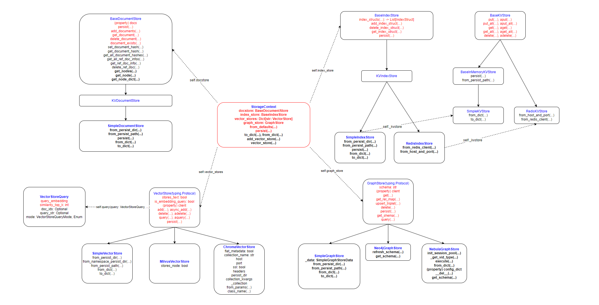
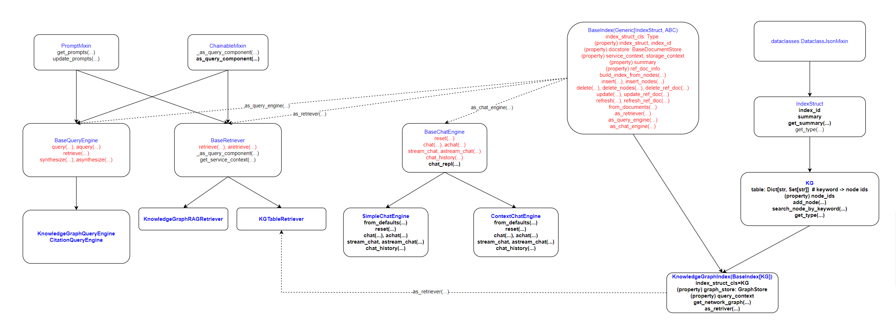

## 动机、参考资料、涉及内容

涉及内容: 本篇博客主要记录 `llama_index` 的整体框架, 并适量记录一些用例配以说明

不涉及内容: 过于细致的 prompt, rag 技巧

## 目录结构

TODO (初次看可以酌情跳过本节, 主要用于回顾): 子目录非常多, 但层数不深, 慢慢补全 

## 总体概述

一个伪代码例子 (尽可能牵涉到重点 class)

```python
store1 = Store1(...)
store2 = Store2(...)
# 实际常使用 from_defaults 这个 classmethod 来构造
storage_context = StorageContext(store1, store2)

llm = LLM(...)
embed_model = EmbedModel(...)
prompt_helper = PromptHelper(...)
transformation = Transformation(...)
# 实际常使用 from_defaults 这个 classmethod 来构造
service_context = ServiceContext(llm, embed_model, prompt_helper, transformation)

# 实际常使用 from_documents 这个 classmethod 来构造
index = Index(
    documents,
    storage_context=storage_context,
    service_context=service_context,
    ...
)

query_engine: QueryEngine = index.as_query_engine()
query_engine.query("what is 1")
chat_engine: ChatEngine = index.as_chat_engine()
chat_engine.chat("2+2")
```

**ServiceContext (TODO)**

**StorageContext**

TODO: BaseKVStore 还包含 IndexStruct, 待加上



**Index**

TODO: `index.as_chat_engine()` 的返回结果也可能会是 `BaseAgent`, `BaseAgent` 同时继承自 `BaseChatEngine` 和 `BaseQueryEngine`



**Demo 1: 探索 storage context**

完整内容参见 [https://github.com/BuxianChen/snippet/tree/master/llama_index/storage_context_example](https://github.com/BuxianChen/snippet/tree/master/llama_index/storage_context_example)

```python
import os
os.environ["OPENAI_API_KEY"] = "sk-xxx"
from llama_index import SimpleDirectoryReader
documents = SimpleDirectoryReader("./txt_data").load_data()
from llama_index import VectorStoreIndex
index = VectorStoreIndex.from_documents(documents)
print(index.to_dict())
```

```python
storage_context = index.storage_context
storage_context.vector_store._data  # SimpleVectorStore 特有方法, 返回所有向量
storage_context.vector_store.get('ef34824e-ae70-4a7e-a12d-a6092cdfe6ff')  # 返回 embeding 向量: 长度为 1536 个浮点数的列表
```

## 模块

### StorageContext

官方文档中大量存在 `StorageContext.from_defaults` 的使用, `StorageContext` 本质上只是一个字典, 没有更多东西

```python
from llama_index.storage.storage_context import StorageContext
storage_context = StorageContext.from_defaults(graph_store=graph_store)
```

`llama_index.storage.Storage` 的源代码 (v0.9.27) 如下:

```python
# llama_index/storage/storage_context.py

DEFAULT_PERSIST_DIR = "./storage"
IMAGE_STORE_FNAME = "image_store.json"
IMAGE_VECTOR_STORE_NAMESPACE = "image"

@dataclass
class StorageContext:
    docstore: BaseDocumentStore
    index_store: BaseIndexStore
    vector_stores: Dict[str, VectorStore]
    graph_store: GraphStore

    @classmethod
    def from_defaults(
        cls,
        docstore: Optional[BaseDocumentStore] = None,
        index_store: Optional[BaseIndexStore] = None,
        vector_store: Optional[Union[VectorStore, BasePydanticVectorStore]] = None,
        image_store: Optional[VectorStore] = None,
        vector_stores: Optional[Dict[str, Union[VectorStore, BasePydanticVectorStore]]] = None,
        graph_store: Optional[GraphStore] = None,
        persist_dir: Optional[str] = None,
        fs: Optional[fsspec.AbstractFileSystem] = None,
    ) -> "StorageContext":
        if persist_dir is None:
            docstore = docstore or SimpleDocumentStore()
            index_store = index_store or SimpleIndexStore()
            graph_store = graph_store or SimpleGraphStore()
            image_store = image_store or SimpleVectorStore()

            if vector_store:
                vector_stores = {DEFAULT_VECTOR_STORE: vector_store}
            else:
                vector_stores = vector_stores or {DEFAULT_VECTOR_STORE: SimpleVectorStore()}
            if image_store:
                vector_stores[IMAGE_VECTOR_STORE_NAMESPACE] = image_store  # append image store to vector stores
        else:
            docstore = docstore or SimpleDocumentStore.from_persist_dir(persist_dir, fs=fs)
            index_store = index_store or SimpleIndexStore.from_persist_dir(persist_dir, fs=fs)
            graph_store = graph_store or SimpleGraphStore.from_persist_dir(persist_dir, fs=fs)

            if vector_store:
                vector_stores = {DEFAULT_VECTOR_STORE: vector_store}
            elif vector_stores:
                vector_stores = vector_stores
            else:
                vector_stores = SimpleVectorStore.from_namespaced_persist_dir(persist_dir, fs=fs)
            if image_store:
                vector_stores[IMAGE_VECTOR_STORE_NAMESPACE] = image_store  # append image store to vector stores

        return cls(docstore=docstore, index_store=index_store, vector_stores=vector_stores, graph_store=graph_store,)

    def to_dict(self) -> dict: ...  # 略

    @classmethod
    def from_dict(cls, save_dict: dict) -> "StorageContext": ...  # 略

    @property
    def vector_store(self) -> VectorStore: ...  # 略

    def add_vector_store(self, vector_store: VectorStore, namespace: str) -> None:
        self.vector_stores[namespace] = vector_store
```

我们可以看到, `StorageContext` 的重点在于以下四类 **Store**, `StorageContext.from_defaults` 方法对这 4 类 Store 的默认类如下:

- `docstore: BaseDocumentStore`: `SimpleDocumentStore`
- `index_store: BaseIndexStore`: `SimpleIndexStore`
- `vector_stores: Dict[str, VectorStore]`: `SimpleVectorStore`
- `graph_store: GraphStore`: `SimpleGraphStore`

#### 持久化保存 (TODO: Unclear)

例子:

```python
# llama_index==0.9.16
from llama_index import StorageContext, ServiceContext
from llama_index import VectorStoreIndex

persist_dir = "./index"
origin_dir = "./data"
if os.path.exists(persist_dir):
    document = []
    storage_context = StorageContext.from_defaults(persist_dir=persist_dir)

    # Method 1:
    # Error: storage_context.vector_store.stores_text is False
    index = VectorStoreIndex.from_vector_store(
        vector_store=storage_context.vector_store,
        service_context=service_context
    )
    index.storage_context = storage_context

    # Method 2:
    # Error: No documnet
    index = VectorStoreIndex.from_document(
        document = [],
        service_context=service_context,
        storage_context=storage_context
    )

    # Method 3: OK
    # 跟 Method 4 一致: storage_context.index_store.index_structs() is a list
    index = VectorStoreIndex(
        index_struct = storage_context.index_store.get_index_struct(),
        service_context=service_context,
        storage_context=storage_context
    )

    # Method 4: OK
    index = load_index_from_storage(storage_context=storage_context, service_context=service_context)
else:
    # OK
    documents = SimpleDirectoryReader(origin_dir).load_data()  # List[Document]
    storage_context = StorageContext.from_defaults()
    index = from_document(
        documents = documents,
        service_context=service_context,
        storage_context=storage_context
    )

# 也可直接转换为 as_query_engine, as_chat_engine
# https://docs.llamaindex.ai/en/stable/understanding/querying/querying.html
retriever = index.as_retriever()
retriever.retrieve("xxx")
```

内部细节:

- `load_index_from_storage` 的本质是使用 `storage_context.index_store` 获取其内部的 `IndexStruct` 构造函数所需的参数, 从而先构造出 `IndexStruct`, 然后再用这个 `IndexStruct` 构造出 `IndexStore`
- `IndexStore` 包含 `KVStore`, `KVStore` 又包含 `IndexStruct`


```python
def load_index_from_storage(storage_context, ...):
    indices = load_indices_from_storage(...)
    assert len(indices) == 0
    return indices[0]

def load_indices_from_storage(storage_context, index_ids=None, **kwargs):
    if index_ids is None:
        index_structs = storage_context.index_store.index_structs()
    else:
        index_structs = [storage_context.index_store.get_index_struct(index_id) for index_id in index_ids]
    indices = []
    for index_struct in index_structs:
        # type_: IndexStructType.VECTOR_STORE, 即字符串 "vector_store"
        type_ = index_struct.get_type()   # index_struct: IndexDict
        index_cls = llama_index.indices.registry.INDEX_STRUCT_TYPE_TO_INDEX_CLASS[type_]  # index_cls: VectorStoreIndex
        index = index_cls(
            index_struct=index_struct, storage_context=storage_context, **kwargs
        )
        indices.append(index)
    return indices

def json_to_index_struct(struc_dict):
    type = struct_dict["__type__"]       # type 是 llama_index.data_structs.data_structs.IndexDict, 继承自 IndexStruct
    cls = llama_index.index_structs.registry.INDEX_STRUCT_TYPE_TO_INDEX_STRUCT_CLASS[type]
    data_dict = struct_dict["__data__"]  # 实际上是 str
    return cls.from_json(data_dict)      # `from_json` 是 from json dict str, 这个构造方法只是普通的变量赋值

class KVIndexStore(BaseIndexStore):  # SimpleIndexStore 继承自 KVIndexStore
    def index_structs(self):
        # self._kvstore 是 SimpleKVStore, 它简单来说是一个字典 (这个字典实际上保存在 self._kvstore._data 中)
        # {"collection_id": {"struct_id": {"__type__": "vector_store", "__data__": "{...}"}}}
        # 一个 collection 有一个或多个 index_struct
        jsons = self._kvstore.get_all(collection=self._collection)
        return [json_to_index_struct(json) for json in json.values()]
    def index_struct(self, struct_id):
        json = self._kvstore.get(struct_id, collection=self._collection)
        return json_to_index_struct(json)
```


#### GraphStore

继承关系:

`typing.Generic` -> `typing.Protocol` -> `llama_index.graph_stores.types.GraphStore` (抽象类) -> `llama_index.graph_stores.Neo4jGraphStore` (对 neo4j-python 的简单包装, 不涉及大模型)


<table style="width: 100%; table-layout: fixed;">
  <tr>
    <td style="width: 100%; word-wrap: break-word; padding=5px; border: 1px solid #ccc; vertical-align: top;"><div markdown="1">
使用 Neo4jGraphStore

```python
from llama_index.graph_stores import Neo4jGraphStore

username = "neo4j"
password = "12345678"
url = "bolt://localhost:7687"
database = "neo4j"

graph_store = Neo4jGraphStore(
    username=username,
    password=password,
    url=url,
    database=database,
    # node_label = "Entity"  # default
)

records = graph_store.get(subj)
print(records)
```
</div></td>
    <td style="width: 100%; word-wrap: break-word; padding=5px; border: 1px solid #ccc; vertical-align: top;"><div markdown="1">
直接使用原生的 neo4j

```python
import neo4j

username = "neo4j"
password = "12345678"
url = "bolt://localhost:7687"
database = "neo4j"
node_label = "Entity"

driver = neo4j.GraphDatabase.driver(url, auth=(username, password))
query = """
    MATCH (n1:%s)-[r]->(n2:%s)
    WHERE n1.id = $subj
    RETURN type(r), n2.id;
"""
prepared_statement = query % (node_label, node_label)

subj = "Saldaña"
with driver.session(database=database) as session:
    data = session.run(prepared_statement, {"subj": subj})
    records = [record.values() for record in data]
print(records)
```
</div></td>
  </tr>
</table>

结果:

```
[
    ['SAID','she would like to see Gamora portrayed as "the most lethal woman in the galaxy"'],
    ['SAID', 'she would like to see Gamora rejoin the Guardians'],
    ['SAID', "Gamora's fate would depend on the plans that Marvel and Gunn have for Vol. 3"],
    ['RETURNED', 'to play a younger version in Endgame'],
    ['ASKED_ABOUT', 'her role in the film'],
    ['SIGNED_TO_PLAY', 'Gamora in one film'],
    ['STATED_THAT', 'Vol. 3 would be the final time she would portray Gamora']
]
```

### ServiceContext

`ServiceContext` 也类似于 `StorageContext`, 仅仅是 LLM, PromptHelper, Embedding Model, transformations 的集合

```python
@dataclass
class ServiceContext:
    llm_predictor: BaseLLMPredictor
    prompt_helper: PromptHelper
    embed_model: BaseEmbedding
    transformations: List[TransformComponent]
    llama_logger: LlamaLogger  # 准备弃用
    callback_manager: CallbackManager

    # 入参与field的对应关系见注释
    @classmethod
    def from_defaults(
        cls,
        llm_predictor: Optional[BaseLLMPredictor] = None,          # 准备弃用参数, 使用 llm 参数: llm_predictor
        llm: Optional[LLMType] = "default",                        # llm_predictor
        prompt_helper: Optional[PromptHelper] = None,              # prompt_helper
        embed_model: Optional[Any] = "default",                    # embed_model
        node_parser: Optional[NodeParser] = None,                  # transformation
        text_splitter: Optional[TextSplitter] = None,              # transformation
        transformations: Optional[List[TransformComponent]] = None,# transformation
        llama_logger: Optional[LlamaLogger] = None,                # llama_logger
        callback_manager: Optional[CallbackManager] = None,        # callback_manager, transformation
        system_prompt: Optional[str] = None,                       # llm_predictor
        query_wrapper_prompt: Optional[BasePromptTemplate] = None, # llm_predictor
        # pydantic program mode (used if output_cls is specified)
        pydantic_program_mode: PydanticProgramMode = PydanticProgramMode.DEFAULT,  # llm_predictor
        # node parser kwargs
        chunk_size: Optional[int] = None,                          # transformation
        chunk_overlap: Optional[int] = None,                       # transformation
        # prompt helper kwargs
        context_window: Optional[int] = None,                      # prompt_helper
        num_output: Optional[int] = None,                          # prompt_helper
        # deprecated kwargs
        chunk_size_limit: Optional[int] = None,                    # 准备弃用参数, 使用 chunk_size 参数: transformation
    ) -> "ServiceContext": ... # 略

    # 其余均略去
```

### LLM, Embedding Model

LLM 的继承关系主要是: `BaseLLM` -> `LLM` -> `OpenAI`, 主要方法是 `chat`, `complete` (以及对应的 stream/async 方法), 而 `predict` (以及 `stream` 和对应的 async 方法) 方法实际上是根据 `self.metadata.is_chat_model` 的取值回归到 `chat` 或 `complete` 上来, 而 `chat` 与 `complete` 就只是分别对应 ChatCompletion 和 Completion 的 OpenAI API 接口.

### PromptTemplate

PromptTemplate 的继承关系主要是: `BasePromptTemplate` -> `PromptTemplate`, `ChatPromptTemplate`, `SelectorPromptTemplate`, `LangchainPromptTemplate`, 其中最主要的方法是:
- `get_template`: 返回 str 类型, 用于查看 prompt
- `format`: 返回 str 类型, 用于将输入数据及 prompt 模板转换为送入 CompletionLLM 的输入
- `format_messages`: 返回 str 类型, 用于将输入数据及 prompt 模板转换为送入 ChatLLM 的输入

一些比较骚的操作可以参考: [https://docs.llamaindex.ai/en/stable/examples/prompts/advanced_prompts.html](https://docs.llamaindex.ai/en/stable/examples/prompts/advanced_prompts.html)

### TextNode (Node), Document

基本上就是带一些验证逻辑的 `pydantic.v1.BaseModel`, 用了几层的继承: `pydantic.v1.BaseModel` -> `BaseComponent` -> `BaseNode` -> `TextNode` -> `Document`, 这里只简单看下字段

```python
# BaseComponent: 没有字段
# BaseNode:
id_: str = Field(default_factory=lambda: str(uuid.uuid4()), description="Unique ID of the node.")
embedding: Optional[List[float]] = Field(default=None, description="Embedding of the node.")
metadata: Dict[str, Any] = Field(default_factory=dict, description="A flat dictionary of metadata fields", alias="extra_info",)
excluded_embed_metadata_keys: List[str] = Field(default_factory=list, description="Metadata keys that are excluded from text for the embed model.",)
excluded_llm_metadata_keys: List[str] = Field(default_factory=list, description="Metadata keys that are excluded from text for the LLM.",)
relationships: Dict[NodeRelationship, RelatedNodeType] = Field(default_factory=dict, description="A mapping of relationships to other node information.",)
hash: str = Field(default="", description="Hash of the node content.")
# TextNode (Node = TextNode)
text: str = Field(default="", description="Text content of the node.")
start_char_idx: Optional[int] = Field(default=None, description="Start char index of the node.")
end_char_idx: Optional[int] = Field(default=None, description="End char index of the node.")
text_template: str = Field(default=DEFAULT_TEXT_NODE_TMPL, description="Template for how text is formatted, with {content} and {metadata_str} placeholders.",)
metadata_template: str = Field(default=DEFAULT_METADATA_TMPL, description="Template for how metadata is formatted, with {key} and {value} placeholders.",)
metadata_seperator: str = Field(default="\n", description="Separator between metadata fields when converting to string.",)
# Document:
id_: str = Field(default_factory=lambda: str(uuid.uuid4()), description="Unique ID of the node.", alias="doc_id",)
_compat_fields = {"doc_id": "id_", "extra_info": "metadata"}
```

`metadata` 用于存储元信息, 例如使用 `documents = SimpleDirectoryReader("./data").load_data()` 时, 返回的每一个 `Document` 会包含文件位置, 文件大小, 创建时间等元信息

```python
text_template = "{metadata_str}\n\n{content}"  # DEFAULT_TEXT_NODE_TMPL
metadata_template = "{key}: {value}"           # DEFAULT_METADATA_TMPL
metadata_seperator = "\n"

class MetadataMode(str, Enum):
    ALL = auto()
    EMBED = auto()
    LLM = auto()
    NONE = auto()

# Document.get_content 函数的主体内容
# 与 MetadataMode 有关, 如果是 ALL, 则会使用所有的 matadata, 如果是 EMBED, 则不使用 excluded_embed_metadata_keys, 如果是 None, 则 metadata_str 为空字符串
matadata_str = "\n".join([metadata_template.format(key=key, value=str(value)) for key, value in self.metadata])
content = text_template.format(metadata_str=metadata_str, content=self.text) if metadata else self.text
```

`relationships` 字段适用于后续从 `Document` 中分割出 `Node`, 用于表示节点与节点间的关系

```python
class NodeRelationship(str, Enum):
    SOURCE = auto()    # "1", NodeRelationship.SOURCE == "1"
    PREVIOUS = auto()  # "2"
    NEXT = auto()      # "3"
    PARENT = auto()    # "4"
    CHILD = auto()     # "5"

class RelatedNodeInfo(BaseComponent):
    node_id: str
    node_type: Optional[ObjectType] = None
    metadata: Dict[str, Any] = Field(default_factory=dict)
    hash: Optional[str] = None

    @classmethod
    def class_name(cls) -> str:
        return "RelatedNodeInfo"

RelatedNodeType = Union[RelatedNodeInfo, List[RelatedNodeInfo]]

relationships = {
    NodeRelationship.SOURCE: RelatedNodeInfo(...),       # 来源只能有一个
    NodeRelationship.PREVIOUS: RelatedNodeInfo(...),     # 在原始文本的前一个 chunk 
    NodeRelationship.NEXT: RelatedNodeInfo(...),         # 在原始文本的后一个 chunk 
    NodeRelationship.PARENT: RelatedNodeInfo(...),       # 父节点只能有一个, 什么是父节点?
    NodeRelationship.CHILD: [RelatedNodeInfo(...), ...]  # 子节点可以有若干个, 什么是子节点?
}

@property
BaseNode.[source_node,previous_node,next_node,parent_node,child_nodes]
```

### Index, QueryEngine, Retriever, ChatEngine, Agent

#### ResponseMode

`index.as_query_engine()` 或 `index.as_chat_engine()` 时实际上会默认设置这个

`llama_index.response_synthesizeers.type.PesponseMode`, `llama_index.get_response_synthesize`

```python
# get_response_synthesize 实现里可以看出这种对应关系, 位于 llama_index/response_synthesize
modes = [
    "refine",            # Refine
    "compact",           # CompactAndRefine
    "simple_summarize",  # SimpleSummarize
    "tree_summarize",    # TreeSummarize
    "generation",        # Generation
    "no_text",           # CompactAndAccumulate
    "accumulate"         # Accumulate
    "compact_accumulate" # NoText
]
```

#### ChatMode

`index.as_chat_engine()` 时会设置这个

`llama_index.chat_engine.types.ChatMode`

```python
# BaseIndex.as_chat_engine 的实现可以看出这种对应关系: llama_index/agent/*.py, llama_index/chat_engine/*.py
modes = [
    "simple",                 # SimpleChatEngine
    "condense_question",      # CondenseQuestionChatEngine
    "context",                # ContextChatEngine
    "condense_plus_context",  # CondensePlusContextChatEngine
    "react",                  # ReActAgent
    "openai",                 # OpenAIAgent, 适用于支持 function_call 的模型, 大部分大模型不支持
    "best",                   # 自动决定, 但只会回落到 react 和 openai, 这说明官方觉得用 react 比较 OK?
]
```

#### KnowledgeGraphIndex

用法可参考这个 Colab [https://colab.research.google.com/drive/1tLjOg2ZQuIClfuWrAC2LdiZHCov8oUbs#scrollTo=AQp9z4hRqNpy](https://colab.research.google.com/drive/1tLjOg2ZQuIClfuWrAC2LdiZHCov8oUbs#scrollTo=AQp9z4hRqNpy) 以及参考根据以上 Colab 的整理 [https://github.com/BuxianChen/material/tree/master/project/llama_index](https://github.com/BuxianChen/material/tree/master/project/llama_index) (目前为私有库, 待后续挪至 snippet 仓库)

### 可视化

- Simple: 打印
- DeepEval: 似乎需要登录
- Weights and Biases Prompts: 似乎需要登录
- OpenLLMetry: 需要登录
- Arize Phoenix: 可以本地部署
- OpenInference: ??
- TruEra TruLens: ??
- HoneyHive: ??
- PromptLayer: ??

实现上是通过 hook 机制来实现的, (TODO, 以 Arize Phoenix 为例)


## 未归类的杂录

默认 Prompt: [https://github.com/run-llama/llama_index/blob/v0.9.30/llama_index/prompts/default_prompts.py](https://github.com/run-llama/llama_index/blob/v0.9.30/llama_index/prompts/default_prompts.py)