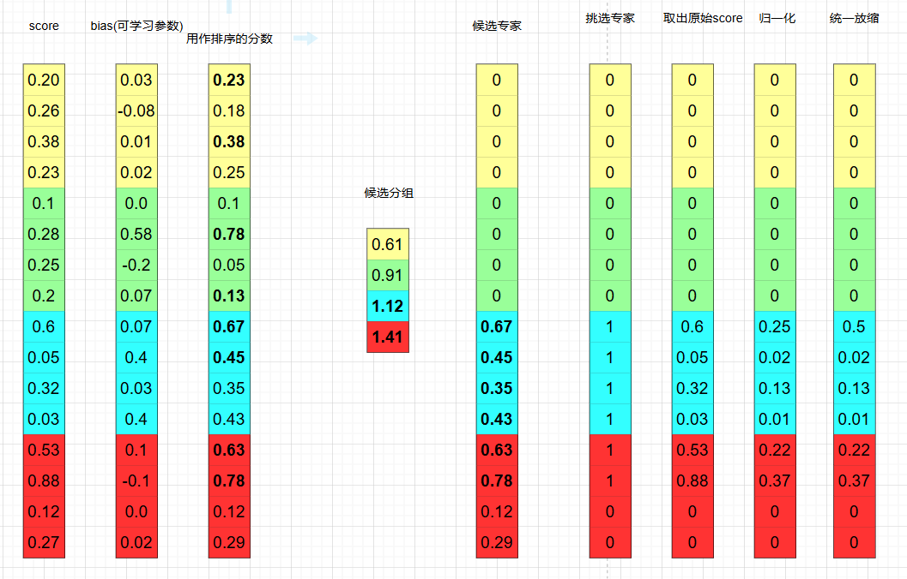

## DeepSeek-V3:MoE

transformer 中的 MLP 结构最开始是两层的全连接层, 目前通常用这种结构:

```python
# DeepSeek-V3 里 hidden_size=7168, intermediate_size=18432
class DeepseekV3MLP(nn.Module):
    def __init__(self, config, hidden_size=None, intermediate_size=None):
        super().__init__()
        self.config = config
        self.hidden_size = config.hidden_size if hidden_size is None else hidden_size
        self.intermediate_size = (config.intermediate_size if intermediate_size is None else intermediate_size)

        self.gate_proj = nn.Linear(self.hidden_size, self.intermediate_size, bias=False)
        self.up_proj = nn.Linear(self.hidden_size, self.intermediate_size, bias=False)
        self.down_proj = nn.Linear(self.intermediate_size, self.hidden_size, bias=False)
        self.act_fn = ACT2FN[config.hidden_act]

    def forward(self, x):
        down_proj = self.down_proj(self.act_fn(self.gate_proj(x)) * self.up_proj(x))
        return down_proj
```

MoE 结构其实就是替换 MLP 组件的: 也就是输入形状和输出形状都是 `(B, L, C)`, 在 Mixtral-7B 中, MoE 的具体操作逻辑是:

可学习参数/层如下: 假设总共有 8 个专家, 每次只需要 2 个专家被激活, 那么需要一个 Linear 层 (输入维度是 `hidden_size`, 输出维度是总共的专家数 8), 以及 8 个普通的 MLP 层.

具体计算逻辑是对 `hidden_state` 使用前述 Linear 层, 得到 `(B, L, 8)` 形状的权重值, 然后取 top-2, 对于每个 token, 使用 top-2 权重对应的 MLP 层作用在原始的 `hidden_state`, 然后将结果按 softmax 之后的权重相加

在 DeepSeek-V3 中, 作者涉及了一个更加复杂一些的 MoE:

在挑选激活的专家上, 采用如下的流程 (假设总共的专家数为 16, 每个 token 需要激活的专家数是 6, 专家分为 4 组)



具体来说, 我们在经过原本 MoE 的 Linear 层后, 首先经过一个 sigmoid 得到原始的分数.

按上图逻辑: 首先加上 bias (可学习参数, 参数量等于专家数), 然后对专家分组, 按每组里的 top2 分数之和进行排序, 取前 2 的分组, 然后在这些分组里取出 top-6 专家, 然后使用原始分数归一化后再乘上一个统一的固定防缩系数作为权重, 接下来执行原本 MoE 的计算流程得到 `output`.

接下来, DeepSeek-V3 还引入了所谓的 shared-expert 的概念, 本质上 shared-expert 就是一个普通的 MLP: `output = output + shared_expert(hidden_state)`. 这便是 DeepSeek-V3 的完整计算流程.

在具体代码实现上, DeepSeek-V3 在计算上面的 MoE 流程时, 采用了这种优化:

```python
# 假设 B=2, L=3, 激活专家数是 4, 总共的专家数是 8
idxes = [
    [0, 1, 4, 5],
    [3, 7, 0, 2],
    [1, 0, 7, 4],
    [1, 0, 2, 3],
    [1, 2, 4, 0],
    [1, 5, 2, 3]
]
hidden_states = [x0, x1, x2, x3, x4, x5]
```

将 `[x0, x1, x2, x3, x4]` 送给专家 0, `[x0, x2, x3, x4, x5]` 送给专家 1, ..., 算完后再将结果汇总到每个 token 上, 得到每个 token 的 output.


## DeepSeek-V3: MLA

TODO